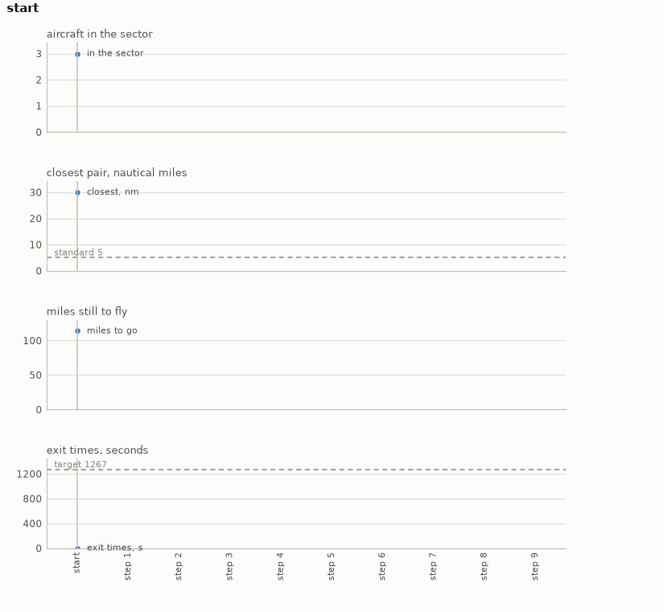

# Airspace

Crossing aircraft on BlueSky. Three or four aircraft enter a sector on a ring round its centre,
each bound for an exit on the far side, so their tracks cross in the middle at much the same
time. A controller's instruction a minute: a thirty-degree turn left or right for one aircraft,
a direct-to that puts an aircraft back on course for its exit, or nothing. The goal is everyone
out before the horizon, never closer than the separation standard on the way, and without
dawdling.

- **Import:** `from planiverse.environments.airspace.environment import AirspaceEnv`
- **Source:** [`planiverse/environments/airspace/environment.py`](../../planiverse/environments/airspace/environment.py)
- **Instances:** 100 sectors, indices `0` to `99`, all drawn by the generator at recorded seeds
- **Generator:** `generate_instance(seed, count=None, horizon=None, ...)`; see [Generating sectors](#generating-sectors)
- **Dependency:** `bluesky-simulator`, installed by `scripts/install_bluesky.sh`

## Context

The game here is the one a sector controller plays. A few aircraft are handed over at the edge
of the sector, each on a track for an exit on the far side. The tracks cross near the middle
within a minute or two of one another. Once a minute we may give one instruction: turn
one aircraft thirty degrees left or right, put one that is off course back on a direct track to
its exit, or say nothing. What makes it hard is that every instruction has two effects. A turn
takes the aircraft out of one conflict but off its course, so its exit comes later and its new
track may run into a third aircraft. A direct-to shortens the flight but points the aircraft
back at the crossing. The separation standard has to hold at every second, not only at the
minute marks. The turn rates, the speeds and the drift of a heading-held aircraft are the
simulator's, so where everyone is a minute later is only known by flying it.

[BlueSky](https://github.com/TUDelft-CNS-ATM/bluesky) (MIT; Hoekstra and Ellerbroek 2016,
"BlueSky ATC simulator project: an open data and open source approach", ICRAT) is TU Delft's
open air traffic simulator. It flies on the [OpenAP](https://github.com/junzis/openap)
performance model (LGPL-3.0; i.e., the model that gives each aircraft type its performance,
such as its speeds and turn rates) over its own navigation data (GPL-3.0). All three are dependencies installed from PyPI
by [`scripts/install_bluesky.sh`](../../scripts/install_bluesky.sh), which steps round a
requirement of the simulator's that no longer builds; nothing of them is included here. The
environment runs it with its own conflict resolution off, so the planner is the only thing
keeping the aircraft apart. The cost of a real flight model is time. BlueSky's state is a set
of module globals rather than an object, so a successor replays the sector from the aircraft's
entry; the Actions section below says what that costs.

The rules are four. First, the aircraft are A320s at flight level 300 and 230 to 270 knots,
created at the instance's positions and headings with a single waypoint at their exits and
lateral navigation on. Second, a decision is a minute. `turn(id, left|right)` sets a heading
thirty degrees off the current one, which takes the aircraft off course; `direct(id)` puts
lateral navigation back on for its exit; `hold` instructs nothing. An aircraft within two
nautical miles of its exit is out and leaves the sector. Third, any second at which two
aircraft are within five nautical miles and a thousand feet of each other is a loss of
separation, and the state is a dead end. Fourth, the goal is every aircraft out before the
horizon with the sum of their exit times under the target. The horizon passing with aircraft
still flying is a dead end, and so is everyone out over the target.

## Actions

| Action | Cost | Offered when | Effect |
|---|---|---|---|
| `turn(id, left)`, `turn(id, right)` | 1 | `id` is in the sector | `id` holds a heading thirty degrees left or right of its current one, and is off course |
| `direct(id)` | 1 | `id` is in the sector and off course | `id` navigates to its exit again, and is on course |
| `hold` | 1 | always | nothing is instructed |

`get_actions(state)` lists a left and a right turn for every aircraft still in the sector, a
direct-to for each of them that is off course, and `hold`. That is seven actions with three
aircraft on course and ten with all three turned. An instruction that is not on the list (i.e., a direct-to
for an aircraft already on course, or anything for one already out) leaves the state
unchanged. A goal or dead-end state has no successors at all. Applying an action puts the
instruction on BlueSky's command stack and flies sixty one-second steps. Each second the
environment measures the closest pair among aircraft within a thousand feet of one another and
flags a loss of separation. It also takes out any aircraft within two nautical miles of its
exit, adding the second it left to the sum of exit times. The minute stops at the second
separation is lost. Note that the successor is not obtained by advancing a copy of the running
simulation. BlueSky flies the same instructions to the same positions, but its state is module
globals, so the environment replays the sector from the aircraft's entry for every successor.
A minute of four aircraft takes about fifty milliseconds, so a deep state costs a second or so
to expand. [NOTES.md](../../NOTES.md) measured 1.4 seconds an expansion at the start, rising to
about 4 seconds at depth seven. That is why the aircraft are three or four and the horizons
twelve to fifteen minutes.

## Planning problem

An `AirspaceState` holds the instructions so far and the sector after them. For each aircraft
it carries the position, level, heading, distance to its exit, and whether it is out or on
course. For the sector as a whole it carries the closest any pair came, the sum of exit times,
and whether separation was lost. Two states are the same
state when their instructions are the same, because BlueSky flies the same instructions to the
same positions, so the instructions determine every reading. The literals name the decision
count and the closest approach in whole miles. For each aircraft in the sector they give its
heading, distance to go and level in bands (thirty degrees, four miles and a thousand feet).
`on_course(id)` marks one navigating to its exit and `out(id)` one that has left. The bands are
what the width-based planners' novelty tests see:

```
decision(3)
closest(5)
flying(AC1)
heading(AC1, 120)
to_go(AC1, 28)
level(AC1, 30)
on_course(AC2)
out(AC3)
```

`separation_lost` is added once separation has been lost. With `H` the horizon in decisions,
`E` the target in seconds, `flying(s)` the aircraft still in the sector and `n(s)` the
instructions given so far, the goal and the dead end are

```
goal(s)     ≡ ¬lost(s) ∧ flying(s) = ∅ ∧ n(s) ≤ H ∧ exit_sum(s) ≤ E
terminal(s) ≡ lost(s) ∨ (flying(s) = ∅ ∧ exit_sum(s) > E) ∨ (flying(s) ≠ ∅ ∧ n(s) ≥ H)
```

Note that the problem as a controller would state it is not an initial-to-goal problem but a
trajectory problem (i.e., one whose requirements hold over the whole run rather than at its
end). Separation must hold at every second, everyone must be out by the horizon, and nobody
should dawdle. We turn it into the goal above with the reduction the epidemic, traffic and
reservoir environments share, which [NOTES.md](../../NOTES.md) sets out in full, in three
moves. First, a constraint that must hold throughout becomes a dead end: the second that loses
separation makes its state terminal, so no plan through it exists. The horizon passing with
aircraft still in the sector is terminal too. A check over the whole trajectory thus
becomes a check at each state. Second, a quantity that accumulates becomes part of the state
and is bounded at the goal. The exit times are summed on the state as each aircraft leaves and
compared with the target once the sector is empty, which is what "without dawdling" becomes.
Third, the horizon becomes time in the state: the decision count is a state variable and a
decision is a minute, so "by the horizon" is a condition on a state, not on a trajectory. The cost of the reduction is that the goal depends on a target, and a target has
to come from somewhere. Here it is the sum of exit times of a scripted controller with a tenth
in hand (see [Generating sectors](#generating-sectors)), so every instance is solvable by
construction. The planner is asked to resolve the crossing at least as well as a simple rule.

The progress measure the width planners take (`planiverse.benchmark.measures.airspace`) is the
number of aircraft still in the sector plus the miles they have to go, the miles counted in
hundreds.

## An example

Instance `0` is a sector of three aircraft with a horizon of 15 decisions and a target of 1,267
seconds of exit time. `AC1` enters from the east on heading 272 at 270 knots, `AC2` from the
south on heading 356 at 230 knots and `AC3` from the south-west on heading 26 at 250 knots.
Each is about 38 nautical miles from its exit. Iterated BFWS, run as the benchmark runs it (i.e.,
with the measure above and a width bound of 1000), solved it in 18 expansions and 44.3
seconds. Its nine-instruction plan is

```
turn(AC2, right), turn(AC3, right), turn(AC2, right), direct(AC3), direct(AC2),
turn(AC1, left), hold, hold, hold
```

which turns the two aircraft converging from the south right onto the same heading, so that
they cross `AC1`'s track one behind the other and come no closer than 5.0 nautical miles, the
standard exactly. It then puts each back on course once the crossing is behind it and holds
while `AC2` flies out. The late turn of `AC1` changes nothing, since `AC1` is three miles from
its exit and out within that minute. `AC1` and `AC3` are out by the sixth minute and `AC2` at
512 seconds, for 1,172 seconds of exit time. Note that this is 20 seconds more than the
scripted controller's 1,152, and one instruction longer, but within the tenth the target
allows.



The render draws the readings of each state over the plan rather than the state's text, since a
state here is a handful of numbers. The panels are the aircraft still in the sector, the
closest pair against the separation standard, the miles still to fly and the exit times against
the target, minute by minute. A frame of the GIF is the chart up to its state, so the animation
grows a step at a time. The same plan is also a [sheet](../renders/airspace_chart.png), the
whole plan on one figure. There the action that produced each state runs along the bottom, the
target is a dashed line, and the goal is marked where the plan ends. Both were generated by
solving the instance and handing the trace to `render_trace`:

```python
from planiverse.environments.airspace.environment import AirspaceEnv
from planiverse.benchmark import measures
from planiverse.planners.width import IteratedBFWS

env = AirspaceEnv()
env.set_index(0)
state, info = env.reset()          # info: sector, aircraft, horizon, target, generated
print(state)                       # t=0s, closest 99.0 nm; AC1 hdg 272 FL300 38.3 nm to go on course; ...

result = IteratedBFWS(max_width=1000, progress=measures.airspace).solve(env)
trace = env.simulate(result.plan)

env.render_trace(trace, "airspace_chart.gif")                                   # animated
env.render_trace(trace, "airspace_chart.png", actions=result.plan, env=env)     # the sheet
```

Stateful play, as opposed to expansion, goes through `step`, which takes an action or its name
(e.g., `"turn(AC2, right)"`) and returns the state and the number of aircraft that left the
sector in the minute. `successors(state)` returns the action and state pairs for the
instructions `get_actions` offers. The readings each environment charts, and the panels they
go on, are in [`planiverse/rendering/readings.py`](../../planiverse/rendering/readings.py);
`charts=False` asks `render_trace` for the state's text instead, and
[docs/rendering.md](../rendering.md) covers the other output formats.

## Sectors

The hundred sectors are the generator's own draws, embedded in the module as the plain data
`set_instance` takes, with the seed each came from beside it. A sector is its `aircraft` (id,
latitude, longitude, heading, level, speed, exit latitude and longitude), its `horizon` in
decisions and its `target` in seconds. The instructions each was accepted on are in
`tests/data/airspace_solutions.json`.

## Generating sectors

`generate_instance` draws a sector, selects it, and returns it as the dict `set_instance` takes
back:

```python
env = AirspaceEnv()
sector = env.generate_instance(seed=7, count=4)
print(env.witness, env.witness_expansions)     # the controller's instructions, and the controllers tried
```

| Option | Default | What it does |
|---|---|---|
| `count` | 3 or 4 | aircraft |
| `horizon` | 12 or 15 | decisions (minutes) |
| `attempts` | 60 | draws before giving up with `GenerationError` |

A draw places the aircraft on a ring sixteen to twenty nautical miles from the centre at seeded
bearings at least twenty-five degrees apart. Each is bound for a point twenty miles out on the
far side, within twenty degrees of straight across. It is kept when flying straight loses
separation, so there is something to resolve, and a scripted controller gets everyone out. The
controller turns the lower-numbered aircraft of the first predicted conflict, right or left,
and puts aircraft back on course once nothing is predicted. The better of the right-turning and
the left-turning controller sets the target, its sum of exit times with a tenth in hand, and
its instructions are the witness. The same seed and options always give the same sector.

## Files

| File | Contents |
|---|---|
| [`environment.py`](../../planiverse/environments/airspace/environment.py) | `AirspaceAction`, `AirspaceState`, the geometry, `AirspaceEnv` with the scripted controller, `SECTORS` |
| [`scripts/install_bluesky.sh`](../../scripts/install_bluesky.sh) | Installs BlueSky and its data |
| [`tests/test_operational_four.py`](../../tests/test_operational_four.py) | Tests |
| [`tests/data/airspace_solutions.json`](../../tests/data/airspace_solutions.json) | The instructions each sector was accepted on |
