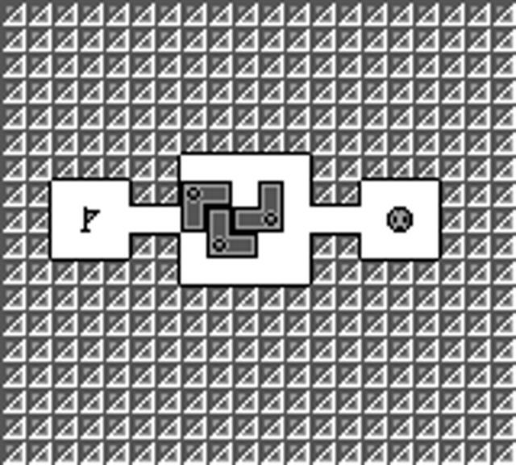

# Amazing Tater (Game Boy)

This environment plays Amazing Tater on the cartridge. It drives the Game Boy ROM inside
[PyBoy](https://github.com/Baekalfen/PyBoy) and reads the board out of the console's work RAM, so
the transition function is the game's own code rather than a reconstruction of its rules. States
are emulator save-states (i.e., the whole machine serialised to bytes), so search can branch by
rewinding the machine.

The sibling [`amazing_tater.py`](amazing-tater.md) re-implements the same game in Python over the
same 105 rooms, and documents the rules, the glyphs and the level numbering once, since they are
the same game. Use that one for a dependency-free benchmark, and this one for the cartridge's
actual behaviour.

- **Class:** `AmazingTaterGBEnv`
- **Import:** `from planiverse.environments.gameboy.amazing_tater_gb import AmazingTaterGBEnv, AmazingTaterGBAction`
- **Source:** [`planiverse/environments/gameboy/amazing_tater_gb.py`](../../planiverse/environments/gameboy/amazing_tater_gb.py)
- **Instances:** 105 rooms, indices `0`–`104`
- **Dependencies:** `pyboy` plus an `Amazing Tater (U).gb` ROM you supply; `pillow` for
  screenshots
- **Memory map:** [`amazing-tater-gb-memory-map.md`](amazing-tater-gb-memory-map.md)

## A solved instance



BFWS's plan for instance `0`: 38 moves, one frame per state. The same plan is also a
[contact sheet](../renders/amazing_tater_gb.png), captioned with the step number, the action that
produced it, and a note on the goal state. A cartridge frame is 640x576, so the sheet is
thinned to twelve frames rather than tiled in full; the captions keep the real step numbers,
so a thinned sheet still says which step is which.

Both were generated by solving the instance and handing the trace to `render_trace`:

```python
import os
from planiverse.environments.gameboy.amazing_tater_gb import AmazingTaterGBEnv
from planiverse.benchmark import measures
from planiverse.planners.width import IteratedBFWS

env = AmazingTaterGBEnv(romfile=os.environ["PLANIVERSE_AMAZING_TATER_ROM"])
env.fix_index(0)
env.reset()

result = IteratedBFWS(max_width=1000, progress=measures.amazing_tater_gb).solve(env)
trace = env.simulate(result.plan)

env.render_trace(trace, "amazing_tater_gb.gif")                                   # animated
env.render_trace(trace, "amazing_tater_gb.png", actions=result.plan, env=env,     # contact sheet
                 columns=4, max_states=12)
```

`render_trace` supplies this environment's own cartridge, so the frames are real console
screenshots rather than typeset text. See
[docs/rendering.md](../rendering.md) for the other output formats.

## The ROM

The repo ships no ROM, because Amazing Tater is Atlus's copyrighted work, so you supply your own
legally obtained dump and pass its path:

```python
env = AmazingTaterGBEnv("Amazing Tater (U).gb")
```

Every address below was read from one dump:

| | |
|---|---|
| File | `Amazing Tater (U).gb`, 65,536 bytes |
| MD5 | `53b746bff74c50cd3ebcf41161c66cf3` |
| Cartridge | MBC1, 64 KiB, no cartridge RAM; all state is in work RAM |

The addresses are revision-specific, so the constructor hashes the file and raises a `UserWarning`
when it is not that dump. Pass `verify_rom=False` to silence it.

## Quickstart

```python
from planiverse.environments.gameboy.amazing_tater_gb import AmazingTaterGBEnv

env = AmazingTaterGBEnv("Amazing Tater (U).gb", render=False)  # render=True opens a window
env.fix_index(0)                                               # choose the room before reset
state, info = env.reset()

print(state)
#       #####
#  ### #.....# ###
# #...##o+.+.##...#
# #.E...+++o....1.#
# #...##.o+..##...#
#  ### #.....# ###
#       #####

print(info)
# {'level_index': 0, 'level': 'A-01', 'mode': 0, 'size': (15, 5), 'taters': 1,
#  'block_squares': 0, 'pits': 0, 'intro_ticks': 60,
#  'calibration': Calibration(press_ticks=5, hold_window=(1, 9))}

for action, successor in env.successors(state):
    print(action, action.cost(), successor.taters_left)
# up_for_5 1 1
# right_for_5 1 1
# down_for_5 1 1
# left_for_5 1 1
```

## Rooms

`fix_index(n)` selects one of 105 rooms: indices 0 to 40 are PUZZLE MODE's `A-01` to `A-41`, and
41 to 104 are BEGINNER and ACTION MODE's `C-01` to `C-64`. The same index selects the same room on
the twin, and `env.label_for()` gives the cartridge's own name for it.

Selection works by hooking the level loader at `$08C0` and writing `HL`, the register it is
entered with. We tried the alternative of reversing the stage arithmetic and writing the stage
counters, and it does not survive contact with the cartridge: the arithmetic does not divide
either set evenly, and there is a `+2` fudge in the middle of set C.

`env.levels()` boots the cartridge to each of the 105 rooms in turn and returns the decoded
boards. It takes a minute or two, and it is where the twin's stored rooms came from.

## Booting

The front end is the title screen, then `SELECT MODE`, then either a tutor with several screens of
advice or an `ENTER PASSWORD` grid, depending on the mode. START advances all of them; only
`SELECT MODE` needs the d-pad, and `boot` uses `$D37D` to know when it is looking at it.

That byte holds `$80` while the title is up and a small number wherever a cursor exists, which
includes the password grid, whose row cursor it also is. A d-pad press aimed at the mode menu but
landing on the password grid walks the alphabet instead of choosing a mode, so `boot` stops
touching the d-pad the moment the mode is chosen.

`reset` then waits for the room to start listening. The loader fills the board buffer before the
room has finished announcing itself, so for about sixty frames the board is fully readable, and
settled, while every button is ignored. `wait_until_interactive` probes a snapshot at increasing
offsets until something answers and then replays only the waiting, so the state handed back is
still the one the loader built. Note that SELECT counts as an answer, and has to, because room
`A-14` opens with its first tater walled in on all four sides.

## Calibration

`reset` measures how the cartridge wants to be driven, once, and reports it in `info`:

```python
Calibration(press_ticks=5, hold_window=(1, 9))
```

`hold_window` is the closed range of hold lengths that move a tater exactly one cell. The upper
end is one frame short of the d-pad's auto-repeat, past which a single action walks two cells, and
in a game where a block shoved into the wrong pit is gone for good that is not a longer plan but a
different one. `press_ticks` is the middle of the window. Pass `calibrate=False` to skip the
couple of dozen probe presses and take the documented default.

## Settling

The settle predicate watches the board buffer and nothing else. Every other Game Boy environment
here also watches the shadow OAM, because in those games the piece in motion is a sprite and work
RAM says nothing while it slides. Here the opposite holds twice over. The board buffer is written
for every part of a move, and the tater's idle bob rewrites the OAM every eight frames for as long
as the game is running, so a predicate that included the OAM would never fire.

Twenty frames of stillness is the threshold, and it is measured rather than guessed. Nothing we
observed takes longer than sixteen frames of board writes, and the longest still spell inside an
unfinished move is eight, which is a block that has been shoved onto pits and is dissolving into
them.

`switch` waits out a lockout the board cannot show. The cartridge ignores anything pressed within
thirty-three frames of a SELECT, and handing the controls over changes no cell, so the ordinary
settle predicate is satisfied instantly. The next action would then arrive inside the lockout and
be dropped, turning two switches in a row into one and leaving the plan and the game with
different taters under the controls. `AmazingTaterGBAction.__settle__` ticks past it.

## State

`AmazingTaterGBState` carries the emulator save-state plus what was read out of work RAM at the
moment it was snapshotted: the decoded board, where each tater is, which one has the controls, how
many are still out, and where the blocks and open pits are.

| Member | What |
|---|---|
| `state.rows` | the board in the exact alphabet, the same tuple of strings the twin's `board()` returns |
| `str(state)` | the friendly view, the same one the twin prints |
| `state.literals` | a frozenset of strings, for planners |
| `state.is_consistent()` | do `$C2AD`'s bits and the taters drawn on the board name the same characters? |

Equality is on the board and who holds the controls. Depth and history are not part of it, so a
position reached two ways compares equal and search closes.

## Actions

Actions are `"button,ticks"` strings, and `AmazingTaterGBAction` parses them.

| Action | Console button | Cost |
|---|---|---|
| `up`, `right`, `down`, `left` | d-pad | 1 |
| `switch` | SELECT | 0 |

`A` is deliberately absent, because it opens the pause menu with its RETRY and QUIT, and a planner
that can retry can escape a block it has sunk into the wrong pit, which is precisely the thing
being planned around.

`env.get_actions()` returns the strings; `successors` builds them, applies each one and drops the
ones that change nothing.

## Goal and terminal

- **Goal** (`is_goal`): reads `$C2AD`, the cartridge's own record of which taters are still out,
  and is exact. It cannot read the board instead. A tater in mid-step is taken off the board map
  and drawn as a sprite until it arrives, so for a dozen frames after every press the board shows
  no tater at all, which the board alone cannot tell apart from a solved room.
- **Terminal** (`is_terminal`): always `False`. Amazing Tater has real dead ends, but recognising
  them needs reachability under moving turnstiles, which the board buffer does not answer, and the
  twin's test, that no move changes anything, would mean expanding the state, which calls back
  through `is_terminal`. Note that a position with nothing left in it expands to no successors,
  which search treats as a dead end anyway.

## Cost

One action costs one save-state load, one press and up to 180 emulator frames, which on a laptop
is a few hundred expansions a second. The twin does the same work about four orders of magnitude
faster, so the pattern worth using is to search the twin and then replay the plan here for the
cartridge's word for it. `tests/test_amazing_tater.py` does exactly that.

## Rendering

`str(state)` prints the friendly board, the same one the twin prints, and `state.rows` gives the
board in the exact alphabet.

`env.render()` returns the console's own screen for every position `step` has played through, as
one PIL image per de-duplicated step. `state.save(rom, path)` writes a PNG of a single state by
booting a throwaway emulator to it; it needs Pillow.

See [docs/rendering.md](../rendering.md) for the other output formats.

## Files

| Path | What |
|---|---|
| [`amazing_tater_gb.py`](../../planiverse/environments/gameboy/amazing_tater_gb.py) | `AmazingTaterGBEnv`, `AmazingTaterGBState`, `AmazingTaterGBAction` |
| [`amazing-tater-gb-memory-map.md`](amazing-tater-gb-memory-map.md) | Every address the environment reads |
| [`tests/test_amazing_tater_gb.py`](../../tests/test_amazing_tater_gb.py) | Tests |
