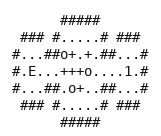

# Amazing Tater

Amazing Tater's rules, re-implemented in Python rather than emulated, over 100 of the cartridge's
rooms. A tater (i.e., a potato with legs) walks the four directions one cell at a time and has to
reach the exit flag. Some rooms hold more than one, and `switch` hands the controls to the next,
so the room is not finished until every tater has reached the flag. Nothing here is reversible: a
block shoved into the wrong pit is gone, and so is the room. The environment is one module with
the rooms in it, and it needs no ROM, no emulator and no dependency beyond the standard library.

- **Class:** `AmazingTaterGame`
- **Import:** `from planiverse.environments.games.amazing_tater import AmazingTaterGame`
- **Source:** [`planiverse/environments/games/amazing_tater.py`](../../planiverse/environments/games/amazing_tater.py)
- **Instances:** 100 rooms, indices `0` to `99`: the cartridge's 41 puzzle-mode rooms and the first 59 of its 64 beginner and action-mode rooms
- **Generator:** `generate_instance(seed, width=None, height=None, blocks=None, pits=None, turnstiles=None, ...)`; see [Generating rooms](#generating-rooms)
- **Dependencies:** none

## Context

Amazing Tater is a single-screen puzzle. A room is a walled patch of floor with an exit flag, some
open pits, some blocks of various shapes, some turnstiles (i.e., a fixed pivot with two to four
arms that swing round it) and one to four taters. A tater walks, shoves a block ahead of him,
turns a turnstile by walking into an arm, and leaves the board when he steps onto the flag. What
the player decides is the order of the shoves and the turns. A pit is only crossed by dissolving a
block into it, and a block that has settled into a pit cannot be shoved from that square. A
turnstile, for its part, only turns when every arm has room to swing. The rooms range from a 15 by
5 with three turnstiles and nothing else to an 18 by 16 with four taters, a dozen blocks and forty
pits.

The rules are eight. First, walls and the area outside the room refuse a step. Second, a pit
refuses a step: pits are crossed by filling them, not by walking over them. Third, a step into a
block shoves the whole block one cell, and it moves only if every square it would land on is
clear. Blocks come in several shapes (1 by 1, 1 by 5, 4 by 3 and L-shapes), a shape moves as one
piece, and two different blocks may sit flush against each other and still be two blocks. Fourth,
a block square that comes to rest over a pit has settled into it and cannot be shoved. A push has
to be aimed at a square of the block that is standing on floor, and the rest of the same block can
still be pushed from such a square. Fifth, when every square of a block sits over a pit, the block
dissolves: the pits it covered become floor, permanently, and the block is gone, which is the only
way to cross a pit. Sixth, a step into a turnstile arm turns the whole turnstile 90 degrees, in
whichever direction carries that arm the way the tater pushed. Pushing an arm along its own axis
does nothing, and neither does pushing one that is hanging over a pit. The turn needs room: every
square an arm lands on must be clear, and so must the diagonal each arm sweeps through on its way
there. Arms may swing over pits, and taters may not walk on them. Seventh, where the pusher ends
up depends on whether he is shut into a compartment. If another arm swings into the square he
pushed, the turnstile carries him round with it and his position rotates about the pivot. If
nothing swings in behind it, he steps into the square he pushed. Eighth, the pivot at the centre
of a turnstile is solid and never moves.

We re-implemented the game rather than run the cartridge, so a successor costs microseconds and
the rules are ours to read. The usual cost of that is fidelity, and here we know of no difference
from the cartridge. The rules above were established by walking this module and the cartridge
forward in lockstep (i.e., the same random press to both, then a cell-by-cell comparison of the
board) across every one of the cartridge's 105 rooms. Every stored solution the tests replay was
also replayed on the cartridge when it was found. Four of the eight rules are worded the way they
are because that comparison rejected a simpler guess. Rule 3's "still be two blocks", rule 4, rule
6's swept diagonal and rule 7's compartment were each a real disagreement with the cartridge
before they were a sentence here. What we do not model is anything outside the room itself. The
cartridge's move counter, its timer, the pause menu behind A with its RETRY and QUIT, and the
level counter that loads the next room over the top of a cleared one are all absent. Here a solved
room is simply terminal.

## Actions

| Action | Cost | Effect |
|---|---|---|
| `up`, `right`, `down`, `left` | 1 | step the controlled tater one cell, shoving a block or turning a turnstile in its way |
| `switch` | 0 | hand the controls to the next tater |

`switch` is free because it moves nobody. Charging for it would measure the cheapest plan for a
two-tater room partly in how often the controls were swapped, which is not a property of the
puzzle. A step is refused by a wall, the outside of the room, an open pit, a pivot and another
tater. A block refuses it when it has no room to move or is pushed on a settled square. An arm
refuses it when pushed along its axis, when it hangs over a pit, or when it has no room to swing.
`successors` drops any action the game refuses, so a returned action always changes the position;
in a one-tater room `switch` is never offered, and a solved room has no successors at all.

Applying a step runs the press and its whole consequence as one action. A shove moves every square
of the block and, when all of them come to rest over pits, dissolves it and fills those pits for
good. A turn swings every arm of the turnstile and either carries the tater round with it or lets
him step into the square he pushed. A step onto the flag takes the tater off the board and hands
the controls to the lowest-numbered tater still out. The board the planner sees is always the one
after the press has finished.

## Planning problem

An `AmazingTaterState` carries everything a move can change. That is where the taters still out
are, which of them has the controls and which are home, where every block is, how each turnstile
is turned, and which pits a dissolved block has filled. The level carries the walls, the flag and
the set of squares that were ever pits. Two states are the same state when the position and the
controls agree; depth and history are not part of it, so a position reached two ways compares
equal and search closes. The literals are:

| Literal | When |
|---|---|
| `taters-home(n)` | always |
| `at(taterN, r, c)`, `home(taterN)` | per tater still out, and per tater home |
| `controlled(taterN)` | while a tater holds the controls |
| `at(block, r, c)` | per block square on the board |
| `turnstile(r, c, m)` | per turnstile, at its pivot, with `m` its arm mask |
| `pit(r, c)` | per pit still open |
| `goal-reached` | every tater home |

With `out(s)` the taters still on the board of `s` and `moves(s)` the actions the game accepts in
`s`, the goal and the dead end are

```
goal(s)     ≡ out(s) = ∅
terminal(s) ≡ out(s) ≠ ∅ ∧ moves(s) = ∅
```

`is_terminal` is sound and no more than that. Amazing Tater has dead ends this does not catch, for
instance a block settled into the one pit that had to be crossed somewhere else, and recognising
them needs reachability under moving turnstiles. We accept the missed dead ends because a wrong
`is_terminal` prunes a solvable branch, which is the worse failure of the two; the cost is that a
planner searches such a branch to its end.

The game as played is a real-time one: a shove slides the block and a turn swings the arms over
several frames, while the move counter and the timer run. A cleared room is replaced by the next.
We turn it into an initial-to-goal problem in two moves. First, the loop between two presses (the
slide, the swing, the dissolve and the exit) is folded into the action, as described above, so a
state is always a board at rest with every tater on a cell. Second, the game's win and loss
conditions become the goal test and the dead-end test on that board. The win is a condition on the
taters alone: every one of them home. The loss the cartridge never declares, since it leaves the
player to reach for RETRY. It is decided here from whether any move remains, which is exact where
it fires and silent where it does not. `switch` costs 0 and every other action costs 1, so a plan
is judged by its steps.

The progress measure the width planners take (`planiverse.benchmark.measures.amazing_tater`) is
twice the taters still out plus the controlled tater's grid distance to the flag (i.e., the sum of
its row and column differences). The count alone is 1 until the last tater steps onto the flag,
and the distance breaks that plateau up without pretending to be admissible, since turnstiles and
pits make the real route much longer.

## An example

Instance `0` is `A-01`, the first room of PUZZLE MODE: a 15 by 5 room with three turnstiles and
nothing else. The flag `E` is at the left end, and the one tater starts at the right end, at
`(3, 14)`:

```
      #####
 ### #.....# ###
#...##o+.+.##...#
#.E...+++o....1.#
#...##.o+..##...#
 ### #.....# ###
      #####
```

Iterated BFWS, run as the benchmark runs it (i.e., with the measure above and a width bound of
1000), solved it in 215 expansions and under a tenth of a second. Its thirty-eight-move plan is

```
left, left, left, left, up, up, left, left, down, right, up, left, left, down, right, left,
down, down, right, right, up, up, up, left, left, down, down, left, up, right, down, down,
left, left, left, left, left, left
```

which walks the tater into the corridor of three turnstiles and turns them one arm at a time,
working round each until a compartment carries him through to the next. It finishes with six steps
left along the floor to the flag.



The render is the state's own text, typeset, one frame per state: `render_trace` falls back to
`str(state)` for an environment with no screen to photograph, and the text is the friendly board
described under [Rendering](#rendering). The same plan is also a
[contact sheet](../renders/amazing_tater.png), every frame on one image, captioned with the step
number, the action that produced it, and a note on the goal state. Both were generated by solving
the instance and handing the trace to `render_trace`:

```python
from planiverse.environments.games.amazing_tater import AmazingTaterGame
from planiverse.benchmark import measures
from planiverse.planners.width import IteratedBFWS

env = AmazingTaterGame()
env.set_index(0)                   # choose the room before reset
state, info = env.reset()
print(state)                       # the room above
print(info)                        # {'level_index': 0, 'level': 'A-01', 'generated': False,
                                   #  'size': (15, 5), 'taters': 1, 'blocks': 0,
                                   #  'turnstiles': 3, 'pits': 0}

result = IteratedBFWS(max_width=1000, progress=measures.amazing_tater).solve(env)
trace = env.simulate(result.plan)

env.render_trace(trace, "amazing_tater.gif")                                   # animated
env.render_trace(trace, "amazing_tater.png", actions=result.plan, env=env)     # contact sheet
```

Stateful play, as opposed to expansion, goes through `step`, which returns the state and how many
taters the move brought home; `env.render()` prints the state history and returns it as a list of
strings. `successors(state)` returns the action and state pairs for the presses the game accepts,
and `action.cost()` is what each one costs. A shortest plan is also available without a planner:
`solve(index)` runs a breadth-first search over the full position, meaning every block, every
turnstile angle and every tater:

```python
from planiverse.environments.games.amazing_tater import solve
plan = solve(0)
print(len(plan), plan[:6])
# 38 ['left', 'left', 'left', 'left', 'up', 'up']
```

Its default budget is two million expansions, which most of the later rooms exhaust. It is the
shared breadth-first search in `planiverse.environments.generation`, the one the generator checks
a drawn room with. See [docs/rendering.md](../rendering.md) for the other output formats.

## Rooms

The environment ships 100 rooms: 41 behind the cartridge's PUZZLE MODE (`A-01` to `A-41`) and the
first 59 of the 64 behind BEGINNER and ACTION MODE (`C-01` to `C-59`). We left out the 96 rooms
behind PRACTICE MODE. That mode is a timed climb through ten floors, its board buffer holds the
corridors of the neighbouring floors as well as the room, and the tater starts outside the room.
That makes it a different game rather than a different level.

The rooms range from a 15 by 5 with three turnstiles and nothing else to an 18 by 16 with four
taters, a dozen blocks and forty pits. Note that difficulty is not uniform in index order.

We dumped all 105 of the cartridge's rooms off the running game, reading the board it composes in
work RAM for each room, so nothing was transcribed by hand.

### The alphabet

The alphabet uses one character per cell, and one character per cell code the cartridge uses, so a
stored room and a board dumped out of the cartridge are the same string:

| Glyph | Meaning |
|---|---|
| `' '` | outside the room |
| `#` | wall |
| `.` | floor |
| `O` | an open pit |
| `E` | the exit flag |
| `1` to `4` | the taters |
| `@` | a turnstile pivot |
| `^ > v <` | a turnstile arm, pointing the way it sticks out from its pivot |
| `U R D L` | the same four arms, hanging over a pit |
| `a` to `p` | a block square on floor, one letter per set of neighbours it is joined to |
| `ABCFGHIJKMNPQSTV` | the same sixteen, for a square settled into a pit |

Blocks are letters rather than a single glyph because the cartridge records, for every block
square, which of its neighbours belong to the same block. Two different blocks sit flush against
each other in half of these rooms. A single glyph for all of them would weld two such blocks into
one piece the cartridge would never move as one. Arms carry a direction so that an arm names its
own pivot. That is needed because thirty-six arms across these rooms are orthogonally adjacent to
two pivots, and adjacency alone cannot say which one they belong to.

## Generating rooms

`generate_instance` draws a fresh room in the same alphabet, selects it, and returns it as a tuple
of row strings that `set_instance` accepts back (a newline-joined string works too):

```python
game = AmazingTaterGame()
rows = game.generate_instance(seed=7)     # or make("amazing_tater", seed=7)
state, info = game.reset()                # info["level"] is "generated"
game.witness                              # the plan the draw was accepted on
```

| Option | Default | What it does |
|---|---|---|
| `width`, `height` | a bundled one's | floor cells inside the ring of walls |
| `blocks` | a bundled one's | blocks, drawn from single squares, dominoes and 2 by 2s |
| `pits` | a bundled one's | open pits |
| `turnstiles` | a bundled one's | turnstiles, each with two to four arms |
| `taters` | a bundled one's | taters, up to four |
| `walls` | a bundled one's | share of the floor turned to wall |
| `solvable` | `True` | search each draw and keep only one with a plan |
| `min_plan_length` | 6 | reject a draw whose shortest plan is shorter |
| `search_limit` | 50000 | expansions the check may spend per draw |
| `attempts` | 200 | draws before giving up with `GenerationError` |

Everything is dropped onto free floor and nothing decides in advance whether the room can be
finished; the breadth-first check does. It rejects a draw whose pits cannot be filled or whose
turnstile has no room to turn, along with any other draw that has no plan. It is the same search
`solve` runs, so a generated room is accepted by exactly the test the bundled rooms' stored
solutions were found by, and `witness_expansions` says what it cost. The check biases the
generator towards rooms a small search can decide, and a caller who wants larger ones has to raise
`search_limit`.

Left unset, the size and inventory come from one of the cartridge's rooms drawn at random
(`PROFILES`, one per room). That is the bounding box inside its walls, its blocks, pits,
turnstiles and taters, and the share of the box that is wall. The generator's block shapes are
single squares, dominoes and 2 by 2s, where the cartridge also has 1 by 5s, 4 by 3s and L-shapes.
A generated room is therefore stocked like a real one without being built from the same pieces.
The method is generate-and-test, which the procedural content generation literature calls
search-based PCG (Togelius, Yannakakis, Stanley and Browne, 2011,
https://doi.org/10.1109/TCIAIG.2011.2148116; Shaker, Togelius and Nelson, *Procedural Content
Generation in Games*, 2016, https://pcgbook.com/). The test is breadth-first search, the same
`solve` runs, and the same seed and options always give the same room.

## Rendering

`str(state)` prints the friendly board, with `$` for every block square, `&` for a settled one,
`+` and `*` for arms, and `o` for a pivot. `board(level, state)` prints the exact board in the
alphabet the levels are stored in, which is what the tests compare. See
[docs/rendering.md](../rendering.md) for the other output formats.

## Files

| Path | What |
|---|---|
| [`amazing_tater.py`](../../planiverse/environments/games/amazing_tater.py) | `AmazingTaterGame`, `AmazingTaterState`, `solve`, `board` |
| [`tests/test_amazing_tater.py`](../../tests/test_amazing_tater.py) | Tests |
