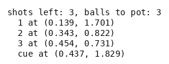

# Billiards

Pool on pooltool. A cue ball and three or four object balls lie on a table, the player has as
many shots as there are object balls, and every object ball is to be potted without sinking the
cue ball. A shot is a choice of object ball to aim at, a cut angle either side of a full hit and
a speed. What it does is a cascade of collisions the physics engine resolves, with balls sliding,
rolling, spinning, meeting cushions and dropping into pockets.

- **Import:** `from planiverse.environments.billiards.environment import BilliardsEnv`
- **Source:** [`planiverse/environments/billiards/environment.py`](../../planiverse/environments/billiards/environment.py)
- **Instances:** 100 tables, indices `0` to `99`, all drawn by the generator at recorded seeds
- **Generator:** `generate_instance(seed, balls=None, shots=None, ...)`; see [Generating tables](#generating-tables)
- **Dependency:** `pooltool-billiards`, which pulls in panda3d and numba; the first shot in a
  process compiles pooltool's numerics and takes a while, every shot after it a hundredth of a second

## Context

The game is potting alone: the object balls are numbered, any of them may be aimed at in any
order, there is no opponent, and the only foul is the scratch (i.e., sinking the cue ball), which
loses the game at once. For each shot the player chooses which ball to aim at, a cut of thirty
degrees to either side of a full hit or none, and one of two speeds. The shots are exactly as
many as the object balls, so none may be wasted. The difficulty is that a shot's effect is only
known by playing it. A pot leaves the cue ball wherever the collision and the cushions send it,
and the next shot is played from there, so the order of the pots and the speed of each shot
decide where the next one starts from.

The physics is [pooltool](https://github.com/ekiefl/pooltool) (Apache-2.0), Kiefl's billiards
simulator (*Pooltool: A Python package for realistic billiards simulation*, JOSS 2024,
https://doi.org/10.21105/joss.07301). It is event-based (i.e., it advances from one collision or
transition to the next rather than in fixed time steps) and covers sliding, rolling and spinning
balls, ball-ball and ball-cushion collisions and pockets. The environment keeps only the
physics: it places the balls itself from the seed, since pooltool's own rack placement is
randomised, and its tables and rules are its own. The table is pooltool's default, a seven-foot
table (its `seven_foot_showood` model, a playing surface of 0.9906 by 1.9812 metres) with six
pockets, and the balls its default balls, 28.575 millimetres in radius. We use the engine rather
than write an action model because no add or delete list carries a carom (i.e., a ball driven on
by the one that struck it), and that is what keeps the environment out of PDDL. The cost is the
dependency and its warm-up. `pooltool-billiards` pulls in panda3d and numba, the first shot in a
process compiles pooltool's numerics and takes a while, and every shot after it a hundredth of a
second.

The rules are three. First, a shot aims the cue ball at an object ball still on the table,
`cut` degrees off a full hit (`-30`, `0` or `30`), at `speed` metres per second (`2.0` or
`3.5`). The table is then simulated until every ball is at rest. Second, a ball that drops into
a pocket leaves the table, and if the cue ball does, the game is lost. Third, the goal is every
object ball potted with the cue ball still up; a position with balls left and no shots left, or
with the cue ball sunk, is a dead end.

## Actions

| Action | Cost | Ball | Cut | Speed | Effect |
|---|---|---|---|---|---|
| `shot(ball, cut, speed)` | 1 | an object ball still up | `-30`, `0` or `30` degrees off a full hit | `2.0` or `3.5` metres per second | the cue ball is struck at the ball and the table runs until every ball is at rest |

Six shots per object ball, so eighteen from a table with three balls up and six from one with
one; `get_actions(state)` lists them for a state and `BilliardsAction.parse` reads one back
from its name. A shot at a ball that is gone is refused and changes nothing. A shot pooltool's
collision model cannot resolve is dropped from the successors rather than raised, and `step`
leaves the state as it was: its cushion model asserts on a ball resting against a pocket jaw
with no closing speed, which the odd table produces. A miss, on the other hand, is a shot like
any other. It spends one of the shots left, so its successor differs from its parent and is
offered.

Applying an action rebuilds the pooltool system from the state's record, every ball at rest on
the default table. The cue is aimed with pooltool's own `aim.at_ball` at the chosen ball and
cut, set to the chosen speed, and the simulation runs to rest. The balls then left on the table,
the pocketed ones excluded, are recorded to the millimetre, and that record with one shot fewer
is the next state.

## Planning problem

A `BilliardsState` holds where every ball still on the table lies, to the millimetre, and the
shots left; a potted ball is absent, and the cue ball's absence means it was sunk. Equality and
hashing are over the two, so a position is the same position wherever it was reached from;
`depth` is bookkeeping. Before each expansion the table is rebuilt from the record at rest,
which is what makes expanding a state twice give the same children. The literals name each
ball's cell on a five-centimetre grid and the counts, and the cells are what the width-based
planners' novelty tests see:

```
at(cue, 5, 12)
at(1, 14, 30)
shots_left(3)
balls_left(2)
scratched()             only once the cue ball is sunk
```

With `balls(s)` the object balls on the table in `s`, `shots(s)` the shots left and
`scratched(s)` whether the cue ball is gone, the goal and the dead end are

```
goal(s)     ≡ balls(s) = 0 ∧ ¬scratched(s)
terminal(s) ≡ scratched(s) ∨ (balls(s) > 0 ∧ shots(s) = 0)
```

Both are absorbing (i.e., no action leads out of them): `successors` returns nothing for either
and `__advance__` returns the state unchanged.

The game as played is a table on which the balls run while the player watches, and it is won
or lost by what is on the cloth when they stop. We turn it into an initial-to-goal problem in
two moves. First, the loop between two decisions (the cue ball's run, the caroms, the cushions
and the pockets, until every ball is at rest) is folded into the action, as described above. A
state is therefore always a table at rest, and the planner never sees a ball rolling. Second,
the game's win and loss conditions become the goal test and the dead-end test on that table.
The win is a count of the object balls with the cue ball up, and the loss is the scratch,
decided the moment it happens, or the last shot spent with a ball up. What the reduction leaves
out is the shot itself: the planner sees where the balls come to rest and nothing of how they
got there. Every action costs 1, so a plan is judged by its length, and since the shots given
are exactly as many as the balls, a plan has no shot to spare unless some shot pots two.

The progress measure the width planners take (`planiverse.benchmark.measures.billiards`) is
the number of object balls still on the table, with a sunk cue ball pinned above any live
count.

## An example

Instance `0` is seed 9000 drawn with three object balls, so three shots. The table is 0.991
metres across and 1.981 long, with `y` along its length. The cue ball lies at (0.437, 1.829)
near the top cushion, the 1 at (0.139, 1.701) beside it against the left cushion, and the 2 at
(0.343, 0.822) and the 3 at (0.454, 0.731) close together in the bottom half:

```
shots left: 3, balls to pot: 3
  1 at (0.139, 1.701)
  2 at (0.343, 0.822)
  3 at (0.454, 0.731)
  cue at (0.437, 1.829)
```

Iterated BFWS, run as the benchmark runs it (i.e., with the measure above and a width bound of
1000), solved it in 3 expansions and 2.0 seconds, one expansion per shot, so the search never
had to back up. Its three-shot plan is

```
shot(2,0,2), shot(1,-30,3.5), shot(3,30,2)
```

A full hit on the 2 at the slower speed pots it and leaves the cue ball at (0.203, 0.608) in
the bottom half. From there the faster speed sends the cue ball up the table to cut the 1,
which sits near the top left corner, into a pocket, and the cue ball stops at (0.318, 0.375).
The opposite cut on the 3 at the slower speed pots the last ball, and the cue ball comes to
rest at (0.271, 1.934) by the top cushion, still up.



The render is the state's own text, typeset, one frame per state: `render_trace` falls back to
`str(state)` for an environment with no screen to photograph. Here the text is the balls left
on the table with their positions, and the shots left. The same plan is also a
[contact sheet](../renders/billiards.png), every frame on one image, captioned with the step
number, the action that produced it, and a note on the goal state. Both were generated by
solving the instance and handing the trace to `render_trace`:

```python
from planiverse.environments.billiards.environment import BilliardsEnv, BilliardsAction
from planiverse.benchmark import measures
from planiverse.planners.width import IteratedBFWS

env = BilliardsEnv()
env.set_index(0)
state, info = env.reset()          # info: table, balls, shots, generated
print(state)                       # where every ball lies, and the shots left
for action, child in env.successors(state):
    print(action, len(child.object_balls), "balls left")

result = IteratedBFWS(max_width=1000, progress=measures.billiards).solve(env)
trace = env.simulate(result.plan)

env.render_trace(trace, "billiards.gif")                                   # animated
env.render_trace(trace, "billiards.png", actions=result.plan, env=env)     # contact sheet
```

Stateful play, as opposed to expansion, goes through `step`, which takes a `BilliardsAction`
such as `BilliardsAction("1", 0, 2.0)` or its name and returns the state and the balls the shot
potted. `env.render()` prints the history of `step` calls and returns it as a list of strings.
See [docs/rendering.md](../rendering.md) for the other output formats.

## Tables

The hundred tables are the generator's own draws, embedded in the module as the plain data
`set_instance` takes with the seed each came from beside it, and the plan each was accepted on
is in `tests/data/billiards_solutions.json`. A table has three or four object balls and the cue
ball scattered over the cloth with no two touching, and exactly as many shots as balls, so none
may be wasted. Every table's shortest plan is at least three shots, which the generator's
breadth-first search has shown by finding no shorter one. Half the tables have three balls and
half four, and the plan each was accepted on is three shots for all hundred.

## Generating tables

`generate_instance` draws a table, selects it, and returns it as the dict `set_instance` takes
back:

```python
env = BilliardsEnv()
table = env.generate_instance(seed=7, balls=3)
print(env.witness, env.witness_expansions)     # the plan it was accepted on, and the search's cost
state, info = env.reset()                       # info["generated"] is True
```

| Option | Default | What it does |
|---|---|---|
| `balls` | 3 or 4 at random | object balls on the table |
| `shots` | as many as the balls | shots the player gets |
| `min_plan_length` | 3 | the shortest plan must be at least this long, so a table two shots clear is thrown back |
| `search_limit` | 80 | expansions the acceptance search may spend per draw |
| `attempts` | 30 | draws before giving up with `GenerationError` |

Each draw is searched breadth-first over shots and kept only when the shortest plan found
within `search_limit` expansions is at least `min_plan_length` shots. The method is
generate-and-test, which the procedural content generation literature calls search-based PCG
(Togelius, Yannakakis, Stanley and Browne, 2011, https://doi.org/10.1109/TCIAIG.2011.2148116;
Shaker, Togelius and Nelson, *Procedural Content Generation in Games*, 2016,
https://pcgbook.com/).

## Determinism

pooltool's simulation is deterministic for the same balls in the same places on the same
platform, and every expansion rebuilds the table from the state's record. Across platforms
floating point can differ in the last places, and a table's stored plan is the test of whether
it still holds; `tests/test_billiards.py` replays one table in five.

## Files

| File | Contents |
|---|---|
| [`environment.py`](../../planiverse/environments/billiards/environment.py) | `BilliardsAction`, `BilliardsState`, the physics (`build_system`, `strike`), `draw_table`, `BilliardsEnv`, `TABLES` |
| [`tests/test_billiards.py`](../../tests/test_billiards.py) | Tests |
| [`tests/data/billiards_solutions.json`](../../tests/data/billiards_solutions.json) | The plan each table was accepted on |
