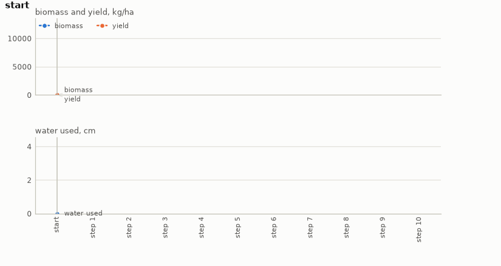

# Crop management

Scheduling irrigation across a growing season on PCSE's WOFOST. A potato crop goes in the ground
in April and comes out in October. Every ten days through the season the farmer decides
whether to irrigate and by how much, with 8 cm of water for the season and a yield target set off
a fixed calendar. The yield is not the sum of those decisions but the integral of a crop growth
model driven by the actual weather, so what a decision was worth is only known at harvest.

- **Class:** `CropEnv`
- **Import:** `from planiverse.environments.crop_management.environment import CropEnv`
- **Source:** [`environment.py`](../../planiverse/environments/crop_management/environment.py)
- **Instances:** 100 seasons, indices `0` to `99`: the 22 gap-free years at the usual sowing date, then 78 the generator drew
- **Generator:** `generate_instance(seed, year=None, sow_shift=14)`; see [Generating seasons](#generating-seasons)
- **Dependencies:** `pcse`. The weather ships inside it and the crop parameters are cached locally
  by PCSE itself, so a season runs offline.

## Context

The system is a field of potatoes under one year's weather. Water applied on day 20 changes the
leaf area, which changes how much light the canopy intercepts for the next eighty days, which
changes the tuber weight at harvest. The farmer decides at ten points through the season whether
to irrigate and by how much, with a fixed amount of water for the whole season. The problem
is to reach a target yield within that budget. What makes it hard is that whether irrigation
helps at all depends on weather that has not happened yet. Two seasons that look identical on
the day of the first decision can want the whole budget or none of it (see
[Seasons](#seasons)). Knowing when *not* to act is as much a part of this problem as knowing
when to.

The crop, the soil, the weather and the growth are PCSE's. [PCSE](https://github.com/ajwdewit/pcse)
is Wageningen University's Python implementation of the WOFOST crop model, and the seasons run
on the CABO weather files it ships for a Dutch station (Netherlands, 1976 to 1999). We run
WOFOST 7.2 in its water-limited mode (`Wofost72_WLP_FD`) on the `Potato_701` variety. This is
not a PDDL domain, for two reasons. First, an action's effect is invisible when it is taken.
Water applied at the first decision point changes nothing measurable by the second, because
the crop has not had time to respond, so there is no add-list to write. Second, the same action
is worth anything from nothing to most of the crop. One 4 cm application on 1986, changing only
which day it lands on, gives:

| Day after sowing | 10 | 20 | 30 | 40 | 50 | 60 | 70 | 80 | 90 | 100 |
|---|---|---|---|---|---|---|---|---|---|---|
| Yield gain (kg/ha) | +0 | +0 | +214 | +871 | +871 | +1530 | +1791 | +2544 | +2371 | +1915 |

Early on the soil is already at capacity and the crop is tiny, so the water drains straight
through. The value climbs to a peak around day 80 and then falls away again, which makes it
non-monotone in timing alone. No delete-list carries that, because the effect of the action is a
function of a growth stage which is itself the integral of every decision before it. The cost of
the simulator is that a successor is a replay of the season so far, a fraction of a second
rather than a microsecond. Nor is the yield known until the season has been replayed to its
end.

The rules are four. First, the season is the year's weather at PCSE's station `NL1`, on a
potato sown on 15 April and harvested on 15 October. The same schedule in the same year
always gives the same yield. Second, the farmer decides every ten days from day 10 to day 100
after sowing, ten decisions in all, and each applies nothing, 1, 2 or 4 cm. Of what is applied,
70 per cent reaches the root zone and the rest is lost to runoff and evaporation. Third, the
season's water is 8 cm, and a schedule that overspends it is a dead end, as is a harvest short
of the target. Fourth, the season is won when the crop is harvested at or above 98 per cent of
what the reference schedule yields, within the budget. That schedule is 2 cm on days 20, 40, 60
and 80, a fixed calendar that ignores the weather entirely.

## Actions

| Action | Cost | Effect |
|---|---|---|
| `wait` | 0 | the crop grows to the next decision point on rain alone |
| `irrigate_1cm` | 1 | 1 cm is applied at this decision point, then the crop grows to the next |
| `irrigate_2cm` | 2 | likewise with 2 cm |
| `irrigate_4cm` | 4 | likewise with 4 cm |

Cost is the water, so waiting is free, which is what makes doing nothing a real decision rather
than a filler action. `successors` offers only the amounts the remaining budget can pay for, so
a plan never overspends by construction. It returns nothing at a goal, at a dead end, or
after the tenth decision, so a plan cannot run past the harvest. Both a goal and a dead end are
absorbing (i.e., no action leads out of them), and `simulate` leaves such a state where it is.

Applying an action replays the schedule from sowing rather than advancing a snapshot, because a
PCSE model carries its whole output history. The model is run to the day of this decision, and
the water is applied through PCSE's irrigation signal at 70 per cent efficiency. The model is
then run on to the day of the next decision, so the state describes the crop as the farmer sees
it when deciding. After the tenth decision it is run to harvest instead. A full season takes
under half a second, and the state a schedule leads to is memoised, since the same schedule in
the same year cannot give two yields.

## Planning problem

A `CropState` holds the schedule and what the crop has done so far:

| Field | Meaning |
|---|---|
| `schedule` | the amounts applied so far, one per decision taken; the whole state |
| `biomass` | above-ground biomass so far, kg/ha |
| `yield_kg` | the tuber yield at harvest, kg/ha, and 0 until then |
| `water_used` | cm applied so far |
| `finished` | the season has ended |
| `depth`, `stage` | decisions taken |

The schedule tuple is the whole state. We verified rather than assumed the determinism this
rests on: the same schedule in the same year produces the same yield to the last digit. So
`__eq__` and `__hash__` are on the tuple, results memoise on it, and `simulate` replaying from
scratch is an independent check on `successors` rather than a restatement of it. States hold
the schedule rather than a model snapshot because a PCSE model carries its whole output history.
Replaying is cheap, under half a second for a full season, and exactly reproducible. The
literals name each application, the decisions taken, the water used, and the biomass and the
yield in hundreds of kg/ha, since the raw floats would make every state novel:

```
applied(I, AMOUNT)    # per decision point at which water was applied
decisions(N)
water-used(N)
biomass(N)            # bucketed into hundreds of kg/ha
harvested             # once the season has ended, and then
yield(N)              # bucketed into hundreds of kg/ha
```

With `R` the yield the reference schedule reaches in the season, `f` the target fraction (0.98)
and `B` the budget (8 cm), the last two arguments of `CropEnv`, the goal and the dead end are

```
goal(s)     ≡ harvested(s) ∧ yield(s) ≥ f·R ∧ water(s) ≤ B
terminal(s) ≡ water(s) > B ∨ (harvested(s) ∧ yield(s) < f·R)
```

No part-grown state is ever a goal, because the yield only exists at harvest, so the whole
season must be planned before the outcome is visible. That is the shape of the domain rather
than a modelling choice. Both are absorbing, so `successors` returns `[]`.

Note that the problem as a farmer would state it is a trajectory problem (i.e., one whose
requirements hold over the whole run rather than at its end). The water must last the season,
and the crop must be worth harvesting at the end of it. We turn it into the goal above with the
reduction the grid and flood environments use, which [NOTES.md](../../NOTES.md) sets out in
full, in three moves. First, a constraint that must hold throughout becomes a dead end. A
schedule that overspends the budget is terminal and, as `successors` shows, never generated, so
a check over the whole trajectory becomes a check at each state. Second, a quantity that
accumulates becomes part of the state and is bounded at the goal. The water used is carried on
the state and compared with the budget, and the yield, which the model accumulates from every
decision before it, is compared with the target at harvest. Third, the horizon becomes time in
the state. The number of decisions taken is a state variable, the tenth ends the season, and a
harvest short of the target is a dead end, since nothing can improve afterwards. The cost of the
reduction is that the goal depends on a target, and a target has to come from somewhere. Here it
is 98 per cent of what the reference schedule achieves, so every season is solvable by
construction, with that schedule as its witness. The planner is asked to do at least about as
well as a calendar that ignores the weather. Note that the target is measured per season, two
simulations per instance. A season in which the calendar gains nothing therefore sets a target
the rainfed crop already meets, and the right plan there applies no water.

That gives a finite-horizon problem of fixed depth 10 and branching up to 4, about a million
schedules, where the objective is only observable at the leaves. It is a different shape from
the [water network](water-distribution.md), which has cheap goal tests at every node, and from
the [power grid](power-grid.md), which is wide and shallow. This one is narrow, deep, and blind
until the end.

The progress measure the width planners take (`planiverse.benchmark.measures.crop_management`)
is the decisions still to make, since the yield is only known once the season ends. A planner
is thus pulled towards the harvest and told nothing about the yield until it gets there.

## An example

Instance `0` is the 1976 season, a drought year. The crop yields 4241 kg/ha rainfed, the
reference schedule reaches 5678 kg/ha on its 8 cm, and the target is 98 per cent of that, 5564
kg/ha. The decisions fall on days 10 to 100 after the sowing on 15 April. Iterated BFWS, run as
the benchmark runs it (i.e., with the measure above and a width bound of 1000), solved it in 10
expansions and 3.4 seconds. Its ten-decision plan is

```
wait, wait, wait, wait, wait, wait, wait, wait, wait, irrigate_4cm
```

which harvests 6055 kg/ha on 4 cm of water, applied on day 100, and so beats the reference
calendar with half its water. That a single late application does better than four spread
through the season is consistent with the 1986 table above, where the value of water climbs
late in the season. The mechanism, though, is the model's to know. Note that the measure counts
decisions only, so the search was not looking for a cheap plan. A schedule of ten waits
completes the season too, but harvests 4241 kg/ha, short of the target, and is a dead end.



The render draws the readings of each state over the plan rather than the state's text, since a
state here is a schedule and three numbers. The panels are the biomass and the yield in kg/ha,
and the water used in cm, decision by decision. A frame of the GIF is the chart up to its state,
so the animation grows a step at a time. The same plan is also a
[sheet](../renders/crop_management_chart.png), the whole plan on one figure. There the action
that produced each state runs along the bottom and the goal is marked where the plan ends;
neither panel carries a target, so the yield target is not drawn. Both were generated by solving
the instance and handing the trace to `render_trace`:

```python
from planiverse.environments import make
from planiverse.benchmark import measures
from planiverse.planners.width import IteratedBFWS

env = make("crop_management")
env.set_index(0)                   # the 1976 season
state, info = env.reset()          # info: year, sow, rainfed, reference, target, budget_cm, decision_days, ...
print(state)                       # growing: 60 kg/ha of biomass so far / water used: 0 cm / nothing applied

result = IteratedBFWS(max_width=1000, progress=measures.crop_management).solve(env)
trace = env.simulate(result.plan)

env.render_trace(trace, "crop_management_chart.gif")                                   # animated
env.render_trace(trace, "crop_management_chart.png", actions=result.plan, env=env)     # the sheet
env.close()
```

Stateful play, as opposed to expansion, goes through `step`, which returns the state and the
biomass gained since the last decision. `successors(state)` returns the action and state pairs
for the amounts the budget still allows, and `get_actions()` lists all four whatever the
budget. `reference_plan()` returns the calendar as a plan of ten actions, and `validate(plan)`
replays a plan and says whether it reaches a goal. `env.render()` prints the history of `step`
calls and returns it as a list of strings. The readings each environment charts, and the panels
they go on, are in [`planiverse/rendering/readings.py`](../../planiverse/rendering/readings.py);
`charts=False` asks `render_trace` for the state's text instead, and
[docs/rendering.md](../rendering.md) covers the other output formats.

## Seasons

`set_index(i)` picks a growing season, meaning the same field under a different year's weather.
There are twenty-two of them, covering 1976 to 1999; 1990 and 1991 are absent because the bundled
weather has gaps.

Both numbers per season are measurements, the rainfed yield and the yield under the reference
schedule, and we record them so that a scenario which stops reproducing fails loudly rather than
quietly changing difficulty:

| Year | Rainfed | Reference | Gain | |
|---|---|---|---|---|
| 1976 | 4241 | 5678 | +1436 | drought year |
| 1980 | 13363 | 13363 | +0 | wet enough on its own |
| 1983 | 4969 | 6749 | +1781 | |
| 1985 | 14957 | 14989 | +31 | wet |
| 1986 | 6758 | 9456 | +2698 | irrigation worth most |
| 1999 | 10662 | 12811 | +2149 | |

The spread is the point. In 1980 the reference schedule gains nothing at all and the right plan
applies no water. In 1986 the same schedule is worth 2698 kg/ha, and a plan that waits loses
most of the crop. On the day the first decision is taken those two seasons look identical, because
whether irrigation helps depends on weather that has not happened yet. Knowing when *not* to act
is as much a part of this problem as knowing when to. For 1986 (index `10`), `reset` reports a
rainfed yield of 6758.3, a reference of 9456.3 and a target of 9267.2, and
`env.validate(env.reference_plan())` is true: 9456 kg/ha on 8 cm of water.

Every season has a witness. The target is 98% of what the reference schedule achieves, so the
reference schedule is a solution by construction and no instance ships whose goal nobody has
reached. It is a fixed calendar of 2 cm on days 20, 40, 60 and 80, ignoring the weather entirely.
That makes it a baseline worth beating as well: in a wet year it spends the whole budget for
nothing.

Indices `22` to `99` were drawn by `generate_instance` at the seeds they record (`seed`) in
`SCENARIOS`: a bundled year with the sowing date moved by up to two weeks. The rainfed and
reference yields were measured the same way.

## Generating seasons

`generate_instance` draws a season, measures it the way the bundled ones were measured,
selects it, and returns it as a dict that `set_instance` accepts back:

```python
env = CropEnv()
season = env.generate_instance(seed=7)     # or make("crop_management", seed=7)
# {'year': 1988, 'sow': [4, 25], 'rainfed': 13616.5, 'reference': 14101.4}
state, info = env.reset()
```

| Option | Default | What it does |
|---|---|---|
| `year` | `None` | one of the twenty-two bundled years, or one at random; the weather PCSE ships has no others without gaps |
| `sow_shift` | 14 | the sowing date is the usual 15 April moved by up to this many days either way |

Moving the sowing date changes which weather the crop meets at each growth stage, which is
what decides whether and when irrigation pays. The rainfed and reference yields are then
measured by running the season both ways, two simulations. The target is thus defined the same
way as for a bundled season: 98% of what the reference schedule achieves. That schedule is a
solution by construction, so every generated season is solvable, and it is what `witness`
holds; nothing is searched for. An instance written by hand may leave `rainfed` and
`reference` out; `reset` measures them.

The draw is on the weather PCSE ships and its WOFOST crop model (https://pcse.readthedocs.io/),
so a generated season is a real year's weather met at a different growth stage. The witness is
the reference schedule, a solution by construction.

## Rendering

`str(state)` describes the season in a few lines of numbers, which is what `render_trace` typesets
when an environment has no screen to photograph.

See [docs/rendering.md](../rendering.md) for the other output formats.

## Attribution

Built on [PCSE](https://github.com/ajwdewit/pcse), Wageningen University's Python implementation
of the WOFOST crop model, with the CABO weather files it ships (Netherlands, 1976 to 1999).

## Files

| Path | What |
|---|---|
| [`environment.py`](../../planiverse/environments/crop_management/environment.py) | `CropEnv`, `CropState`, `CropAction` |
| [`tests/test_crop_management.py`](../../tests/test_crop_management.py) | Tests |
