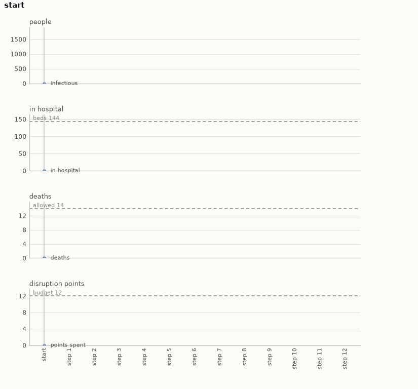

# Epidemic

An outbreak on Covasim, decided a week at a time. A town of five to ten thousand people has a
few dozen infections on day one. For ten to fourteen weeks we choose each week whether the town
stays open, keeps its distance or locks down, with a hospital of fixed size, a budget of
disruption the town will bear, and a death toll we must not exceed.

- **Import:** `from planiverse.environments.epidemic.environment import EpidemicEnv`
- **Source:** [`planiverse/environments/epidemic/environment.py`](../../planiverse/environments/epidemic/environment.py)
- **Instances:** 100 outbreaks, indices `0` to `99`, all drawn by the generator at recorded seeds
- **Generator:** `generate_instance(seed, population=None, weeks=None, ...)`; see [Generating outbreaks](#generating-outbreaks)
- **Dependency:** `covasim`

## Context

The game here is the one a public health office plays. An epidemic runs through a population
whether or not anyone decides anything, and the decisions on offer (i.e., how much contact to
permit) change its course only indirectly, by scaling how easily the infection passes between
people. Each week we set one of three levels for the town. Leaving it open costs nothing and
lets the epidemic run; asking for distancing slows it and costs the town a little; a lockdown
slows it most and costs the town a lot. The hospital has a number of beds, and a week in which
more people are severely or critically ill than there are beds is a failure however the rest of
the outbreak goes. The town also has a budget of disruption, counted in points, which the weeks'
levels spend, and a death toll it is not prepared to exceed by the end of the horizon.

The population, its contacts and its illness are Covasim's. [Covasim](https://github.com/institutefordiseasemodeling/covasim)
(MIT; Kerr et al. 2021, https://doi.org/10.1371/journal.pcbi.1009149) is the Institute for
Disease Modeling's agent-based model of COVID-19: a synthetic population with household, school,
work and community contact layers, an infection with a viral-load course, and a severity ladder
from symptoms to the hospital, intensive care and death. It is a dependency installed from PyPI,
and nothing of it is included here. We use it rather than a compartmental model (i.e., a handful
of differential equations over the susceptible, infected and recovered) because the effect of a
week's level on the weeks after it is only known by running the model. That is what keeps the
environment out of PDDL and makes it a simulation-based planning problem. It is also what makes
an expansion cost a third of a second rather than a microsecond.

The rules are four. First, the town is Covasim's default population at the instance's size with
its seed infections, run from the instance's seed, so the same schedule always gives the same
epidemic. Second, a week is one decision among `open`, `distancing` and `lockdown`, which scale
the model's transmission rate by 1.0, 0.6 and 0.3 and cost 0, 1 and 3 points of disruption. Third,
the hospital load is the number of people severely or critically ill on any day, and a week in
which it exceeds the beds is a dead end. Fourth, the outbreak is won when the last week is reached
with the deaths under the target, the beds never exceeded and the points within the budget; the
horizon reached with more deaths is a dead end.

## Actions

| Action | Cost | Transmission scale | Disruption points | Effect |
|---|---|---|---|---|
| `open` | 1 | 1.0 | 0 | the town runs as it is for a week |
| `distancing` | 1 | 0.6 | 1 | contacts are thinned for a week |
| `lockdown` | 1 | 0.3 | 3 | contacts are cut to a minimum for a week |

An action sets the level for the coming week and runs the model through it, seven days at a
time. Note that the successor is not obtained by advancing a copy of the running simulation: a
copy of a Covasim simulation does not carry its random stream with it, so the environment
replays the whole schedule from day zero for every expansion. This is what makes the same
schedule always give the same epidemic, and it is paid for in time, since a twelve-week schedule
over ten thousand people takes about a third of a second to replay. `get_actions(state)` leaves
out any level the remaining budget cannot pay for, so a plan never overspends by construction,
and every action costs 1.

## Planning problem

An `EpidemicState` holds the schedule so far (i.e., the level chosen for each week already
decided) and the readings at the end of it: the day, the infectious, the hospital load now and at
its peak, the deaths, the infections and the points spent. Two states are the same state when
their schedules are the same, because the model replays exactly from its seed, so the schedule
determines every reading. The literals name each week's level, the week, the deaths and the
points exactly, and the loads and the infectious in bands (tens for the hospital, fifties for the
infectious). The bands are what the width-based planners' novelty tests see:

```
chosen(0, open)
chosen(1, lockdown)
week(2)
deaths(1)
points(3)
in_hospital(20)
peak(20)
infectious(150)
```

`over_capacity` is added whenever the peak has exceeded the beds. With `H` the horizon in weeks,
`D` the death target, `C` the beds and `B` the budget, the goal and the dead end are

```
goal(s)     ≡ week(s) = H ∧ deaths(s) ≤ D ∧ peak(s) ≤ C ∧ points(s) ≤ B
terminal(s) ≡ peak(s) > C ∨ points(s) > B ∨ (week(s) = H ∧ deaths(s) > D)
```

Note that the problem as a health office would state it is not an initial-to-goal problem but a
trajectory problem (i.e., one whose requirements hold over the whole run rather than at its end).
The hospital must never overflow, the budget must not be exceeded, and the deaths must be few by
the end. We turn it into the goal above with the reduction the grid and flood environments use,
which [NOTES.md](../../NOTES.md) sets out in full, in three moves. First, a constraint that must
hold throughout becomes a dead end: the first week that overflows the hospital is terminal, so no
plan through it exists, and a check over the whole trajectory becomes a check at each state.
Second, a quantity that accumulates becomes part of the state and is bounded at the goal. The
deaths and the points are carried on the state; the deaths are compared with the target when the
horizon is reached, and the points are compared with the budget at every step and, as
`get_actions` shows, never allowed to exceed it. Third, the horizon becomes time in the state:
the week is a state variable, so "by the end" is a condition on a state rather than on a
trajectory. The cost of the reduction is that the goal depends on a target, and a target has to
come from somewhere. Here it is what the best of four scripted schedules achieves (see
[Generating outbreaks](#generating-outbreaks)), so every instance is solvable by construction and
the planner is asked to do at least as well as a simple policy.

The progress measure the width planners take (`planiverse.benchmark.measures.epidemic`) is the
weeks still to get through plus every death over the target, so a planner is pulled towards the
horizon and away from schedules that have already lost.

## An example

Instance `0` is a town of 8,000 people with 22 infected on day one, a horizon of 12 weeks, a
hospital of 144 beds, a budget of 12 points and a target of 14 deaths. Iterated BFWS, run as the
benchmark runs it (i.e., with the measure above and a width bound of 1000), solved it in 278
expansions and 134 seconds. Its twelve-week schedule is

```
open, lockdown, lockdown, lockdown, open, open, open, open, lockdown, open, open, open
```

which spends the whole budget on four lockdowns, three of them early. It ends the horizon with
10 dead, a hospital peak of 128 of the 144 beds and 1,678 people still infectious. The early
lockdowns are what keep the peak under the beds; the late one is what keeps the deaths under the
target once the town has been open for a month.



The render draws the readings of each state over the plan rather than the state's text, since a
state here is a handful of numbers. The panels are the infectious, the hospital load against the
beds, the deaths against the target and the disruption points against the budget, week by week.
A frame of the GIF is the chart up to its state, so the animation grows a step at a time. The
same plan is also a [sheet](../renders/epidemic_chart.png), the whole plan on one figure. There
the action that produced each state runs along the bottom, each target is a dashed line, and the
goal is marked where the plan ends. Both were generated by solving the instance and handing the
trace to `render_trace`:

```python
from planiverse.environments.epidemic.environment import EpidemicEnv
from planiverse.benchmark import measures
from planiverse.planners.width import IteratedBFWS

env = EpidemicEnv()
env.set_index(0)
state, info = env.reset()          # info: outbreak, weeks, capacity, budget, target, generated
print(state)                       # week 0 of 12: 0 infectious, 0 in hospital (peak 0 of 144 beds), ...

result = IteratedBFWS(max_width=1000, progress=measures.epidemic).solve(env)
trace = env.simulate(result.plan)

env.render_trace(trace, "epidemic_chart.gif")                                   # animated
env.render_trace(trace, "epidemic_chart.png", actions=result.plan, env=env)     # the sheet
```

Stateful play, as opposed to expansion, goes through `step`, which returns the state and the
deaths avoided since the last one; `successors(state)` returns the action and state pairs for
the levels the budget still allows. The readings each environment charts, and the panels they go
on, are in [`planiverse/rendering/readings.py`](../../planiverse/rendering/readings.py);
`charts=False` asks `render_trace` for the state's text instead, and
[docs/rendering.md](../rendering.md) covers the other output formats.

## Outbreaks

The hundred outbreaks are the generator's own draws, embedded in the module as the plain data
`set_instance` takes (`seed`, `population`, `infected`, `weeks`, `capacity`, `budget`, `target`)
with the seed each came from beside it, and the schedule each was accepted on is in
`tests/data/epidemic_solutions.json`. Beds are one to two and a half per cent of the population,
budgets six to twenty-one points, and horizons ten to fourteen weeks.

## Generating outbreaks

`generate_instance` draws an outbreak, selects it, and returns it as the dict `set_instance`
takes back:

```python
env = EpidemicEnv()
outbreak = env.generate_instance(seed=7, weeks=12)
print(env.witness, env.witness_expansions)     # the schedule it was accepted on, and the schedules measured
```

| Option | Default | What it does |
|---|---|---|
| `population` | 5,000, 8,000 or 10,000 | the town |
| `weeks` | 10, 12 or 14 | the horizon |
| `attempts` | 40 | draws before giving up with `GenerationError` |

A draw is measured by four scripted schedules: the town left open, distancing throughout (when
the budget allows), the budget spent on lockdown first, and a lockdown after two open weeks. The
target is the fewest deaths any schedule that keeps under the beds and within the budget reaches;
a draw is thrown back when none does, or when leaving the town open already meets it. The method
is generate-and-test with the target set off a reference policy (Togelius, Yannakakis, Stanley
and Browne, 2011, https://doi.org/10.1109/TCIAIG.2011.2148116). The same seed and options always
give the same outbreak.

## Files

| File | Contents |
|---|---|
| [`environment.py`](../../planiverse/environments/epidemic/environment.py) | `EpidemicAction`, `EpidemicState`, `replay`, `EpidemicEnv`, `OUTBREAKS` |
| [`tests/test_operational_four.py`](../../tests/test_operational_four.py) | Tests |
| [`tests/data/epidemic_solutions.json`](../../tests/data/epidemic_solutions.json) | The schedule each outbreak was accepted on |
