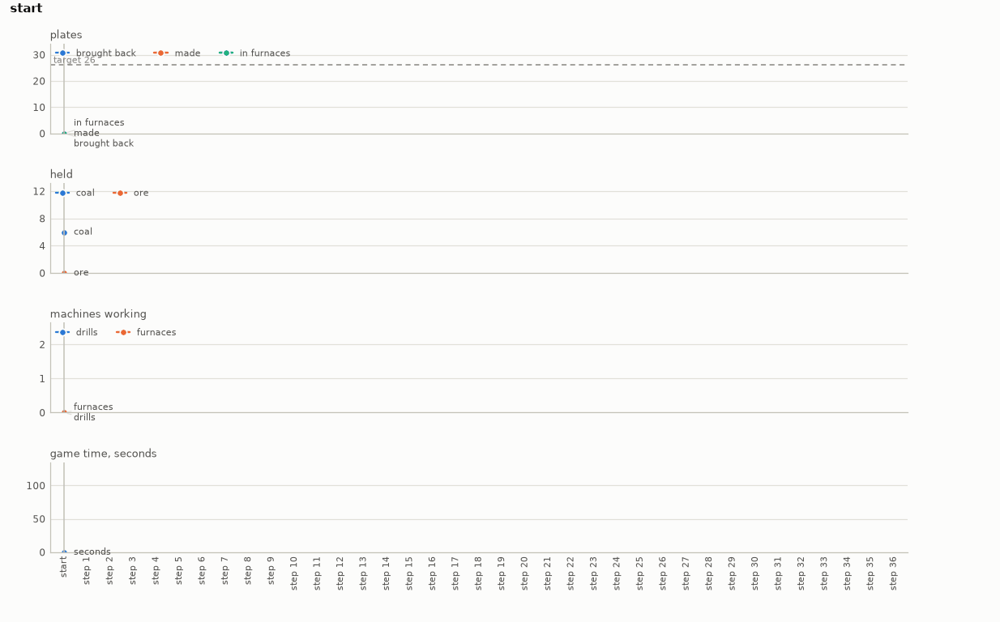

# Factory

An early-game factory on factory-sim. A character stands near a patch of iron ore carrying a
burner mining drill or two, a stone furnace or two and some coal. It has forty seconds to two
minutes of the game to bring a number of iron plates back in hand. A decision is thirty ticks,
half a second of the game. In one the character walks, places a drill on the ore or a furnace at
a drill's drop, hands a machine coal, digs ore by hand, empties a furnace of its plates, or
waits.

- **Import:** `from planiverse.environments.operational.factory.environment import FactoryEnv`
- **Source:** [`planiverse/environments/operational/factory/environment.py`](../../planiverse/environments/operational/factory/environment.py)
- **Instances:** 100 patches, indices `0` to `99`, all drawn by the generator at recorded seeds
- **Generator:** `generate_instance(seed, drills=None, furnaces=None, coal=None, horizon=None, ...)`; see [Generating patches](#generating-patches)
- **Dependency:** `fsim`, built by [`scripts/build_factory_sim.sh`](../../scripts/build_factory_sim.sh)

## Context

The game is the simulator's, and its numbers are the measured game's. A drill burns coal at 150
kW and lifts one ore every four seconds, and a furnace burns it at 90 kW and smelts a plate in
3.2 seconds. A piece of coal is four megajoules, and the hand reaches ten tiles for a machine
and 2.7 for ore. The operator decides which machines to build with what is carried and how to
split the coal between drills and furnaces. The operator also decides where to stand so that
everything is in reach, and how long to wait before the plates are worth collecting. None of
that is known without running the ticks, which keeps the environment out of PDDL. A plan's worth
is what the simulator makes of it, and the cost is that every expansion runs the simulator
rather than reading a model.

[factory-sim](https://github.com/divagr18/factory-sim) (MIT) is a C simulator of a small slice
of Factorio's early game, checked decision by decision and tick by tick against traces recorded
from the game itself (Factorio 2.0.60, through its FactorioRL harness). It has none of the game
in it: every rule and number was measured on the running game and written down, and no code,
data, art or sound of Factorio's is copied. Factorio is a game by Wube Software Ltd and
"Factorio" is Wube's trademark; neither factory-sim nor this environment is affiliated with or
endorsed by Wube. Nothing of the simulator is included here: it has to be built from source
(below), and the notice is in [THIRD-PARTY-NOTICES.md](../../THIRD-PARTY-NOTICES.md).

We wanted a factory game, and we wanted to wrap a maintained implementation rather than write
one. The candidates were three. The [Factorio Learning
Environment](https://github.com/JackHopkins/factorio-learning-environment) (MIT) drives the real
game through its headless server and so needs Docker and Wube's server binary, free to download
but not ours to ship. [Mindustry](https://github.com/Anuken/Mindustry) (GPL-3.0) is a Java game
whose headless server takes console commands but has no simulation interface without a plugin of
our own. factory-sim needs a C compiler and nothing else, runs a decision in microseconds, is
deterministic to the byte, and is measured against the game rather than imagined. It covers the
early game only (drills, furnaces, coal, walking and hand mining; no belts, inserters or
assemblers yet), and it is young, so the build script pins the commit the patches were drawn on.
We took it, and the other two are noted in case the slice ever proves too small.

The simulator is built by a script:

```console
$ pip install cffi numpy                 # what the binding needs
$ bash scripts/build_factory_sim.sh      # git, a C compiler and the Python headers
```

The script fetches factory-sim at the pinned commit, compiles its C core into the cffi extension
`fsim._fsim` and copies the `fsim` package into the running Python's site-packages. A decision
of thirty ticks takes about four microseconds, and expanding a state a millisecond or two.

The rules are seven. First, the scene is a rectangle of iron ore, ten thousand ore a tile, with
walls in some families, in an arena sixty tiles square about the origin. The character starts
eight to thirteen tiles from the patch's centre carrying the instance's drills, furnaces and
coal. Second, a decision is thirty ticks: `move(d)` walks for all of them, about four and a half
tiles, and `step(d)` for seven, about one tile, and either stops at a wall or a machine. Third,
`place(drill, x, y, d)` puts a drill, two tiles by two centred on the corner `(x, y)`, on four
free ore tiles within ten tiles of the character, facing `d`. `place(furnace, x, y)` puts a
furnace where a drill drops its ore, two tiles in front of the drill's centre, on free tiles.
Fourth, `give(x, y, coal, n)` hands a machine within reach 1, 2, 5 or 10 coal, and `give(x, y,
ore)` hands a furnace all the ore the character holds, up to the 54 its slot takes. `take(x, y)`
takes every plate out of a furnace. Fifth, `mine(tx, ty)` digs five ore from the tile whose
corner is `(tx, ty)`, within 2.7 tiles of the character, at about two seconds a piece, and the
decision lasts until the ore is dug. Sixth, `wait(n)` waits `n` decisions, for `n` of 1, 10 or
40. Seventh, the goal is the instance's plates in the character's inventory at or before the
horizon; a state at the horizon without them is a dead end, and so is one past it. Everything
else is the simulator's: fuel burning through energy buffers, the drill's mining progress and
where it drops, the furnace's slots and smelting, collisions, reach, and the inventory's stacks.

## Actions

| Action | Cost | Ticks | Effect |
|---|---|---|---|
| `move(d)` | 1 | 30 | walks the whole decision, about four and a half tiles, stopping at a wall or a machine |
| `step(d)` | 1 | 30 | walks for seven ticks, about one tile |
| `place(drill, x, y, d)` | 1 | 30 | a drill on the four ore tiles about the corner `(x, y)`, facing `d` |
| `place(furnace, x, y)` | 1 | 30 | a furnace where a drill drops its ore |
| `give(x, y, coal, n)` | 1 | 30 | `n` coal (1, 2, 5 or 10) to the machine centred on `(x, y)` |
| `give(x, y, ore)` | 1 | 30 | all the ore held to the furnace at `(x, y)`, up to the 54 its slot takes |
| `take(x, y)` | 1 | 30 | every plate out of the furnace at `(x, y)` |
| `mine(tx, ty)` | 1 | until dug, about two seconds a piece | five ore from the tile whose corner is `(tx, ty)` |
| `wait(n)` | 1 | 30·`n` | waits `n` decisions, `n` of 1, 10 or 40 |

That is eight walks, a drill placement per free anchor and facing within reach, and a furnace
placement per drill whose drop is free. Then come coal in four amounts for each machine within
reach, ore for a furnace, a take per furnace holding plates, a dig per ore tile the hand
reaches, and three waits. Each costs 1. `get_actions(state)` lists what is open before the
simulator has its say on reach and collisions, and `FactoryAction.parse` reads one back from its
name. A placement the simulator refuses (the character standing on it, out of reach) changes
nothing and is not offered as a successor, and coal is offered only in amounts the hand holds
and the machine's fuel slot takes. A start offers between fifteen and a hundred and fifty
decisions, depending on how much of the patch is within reach. A factory that is built and
fuelled offers the walks, the waits, and whatever coal, ore and plates are left to hand over.

Applying an action brings the simulator to the parent state and runs the decision's ticks. The
simulator's whole state is one C struct with no pointers in it, so the environment snapshots it
as bytes for the last 64 states expanded and restores the parent from its snapshot. A state with
no snapshot is reached by replaying its decisions from the longest snapshotted prefix of its
path, which is what `path` on the state is kept for. `successors` applies each open action and
drops the ones the simulator refuses or that leave the state unchanged. A decision takes about
four microseconds and an expansion a millisecond or two, so the replay is cheap where it
happens.

## Planning problem

A `FactoryState` holds the tick, the character's position in 1/256 tiles, what it holds, and
every machine. A machine is its centre, facing, the simulator's status, and the coal, ore and
plates in its slots, with the energy, progress and the rest kept underneath. It also holds the
piles on the ground, the ore left under each tile of the patch, and the plates made so far.
Identity is these contents, not the decisions that led to them, so two orders of the same
decisions that leave the same factory at the same tick are one state. `path` is kept for replay
and `depth` is bookkeeping. `target` and `horizon` are carried for the benchmark's measure, and
`state_identity` is `value` in the registry. The literals name the character's tile, what it
holds, each machine with its status and fuel, a furnace's ore and plates, the plates made, and
the tick:

```
at(5, -11)
holds(coal, 4)
holds(plate, 0)
drill(3, -2, north)
status(drill, 3, -2, working)
fuel(drill, 3, -2, 1)
furnace(3, -4)
ore_in(3, -4, 1)
plates_in(3, -4, 7)
made(7)
tick(1830)
```

With `T` the instance's target in plates, `H` its horizon in ticks and `plates(s)` the plates in
the character's inventory (the `holds(plate, n)` literal), the goal and the dead end are

```
goal(s)     ≡ plates(s) ≥ T ∧ tick(s) ≤ H
terminal(s) ≡ tick(s) ≥ H ∧ ¬goal(s)
```

Note that the problem as a player would state it is a trajectory problem (i.e., one whose
requirements hold over the whole run rather than at its end): bring the plates back before the
deadline. We turn it into the goal above with the reduction the epidemic and flood environments
use, which [NOTES.md](../../NOTES.md) sets out in full, in three moves. First, a constraint that
must hold throughout becomes a dead end. The first state at the horizon without the plates is
terminal, so no plan through it exists, and a check over the whole trajectory becomes a check at
each state. Second, a quantity that accumulates becomes part of the state and is bounded at the
goal: the plates in hand are carried on the state, and the goal is a lower bound on them. Third,
the horizon becomes time in the state: the tick is a state variable, so "before the deadline" is
a condition on a state rather than on a trajectory. The cost of the reduction is that the goal
depends on a target, and a target has to come from somewhere. Here it is the most plates any of
the scripted lines brings back (see [Generating patches](#generating-patches)). Every instance
is therefore solvable by construction, and the planner is asked to do at least as well as a rule
of thumb. The plates over the target are not rewarded, since a plan is judged by reaching it.

The progress measure the width planners take (`planiverse.benchmark.measures.factory`) is the
plates still to bring back, counting from the target carried on the state.

## An example

Instance `0` is a square patch of ore from `(-3, -3)` to `(3, 3)`, seven tiles by seven with no
walls. The character starts at `(5.4, -11.6)` carrying two drills, two furnaces and six coal,
with a target of 26 plates by a horizon of 7,200 ticks (two minutes). Fifteen decisions are open
at the start: the eight walks, a drill on the one anchor within reach in each of its four
facings, and the three waits. Iterated BFWS, run as the benchmark runs it (i.e., with the
measure above and a width bound of 1000), solved it in 71,727 expansions and 163 seconds. Its
plan is thirty-six decisions:

```
place(drill, 3, -2, north), give(3, -2, coal, 1), wait(40), place(furnace, 3, -4),
give(3, -4, coal, 1), wait(10), take(3, -4), wait(10), take(3, -4), wait(10), take(3, -4),
wait(10), take(3, -4), give(3, -2, coal, 1), wait(10), take(3, -4), wait(10), take(3, -4),
move(south), move(south), place(drill, -2, 0, north), give(-2, 0, coal, 1), mine(3, -3),
place(furnace, -2, -2), give(-2, -2, coal, 1), mine(3, -3), give(-2, -2, ore), mine(3, -3),
wait(40), take(-2, -2), take(3, -4), move(north), take(-2, -2), wait(10),
give(-2, -2, coal, 1), take(-2, -2)
```

The plan builds one line where the character stands, feeds each machine a single piece of coal
at a time and empties the furnace as the plates come. It then walks south to build a second line
with the last of the coal. Since the coal is short, it digs fifteen ore by hand and feeds it to
the second furnace directly. It ends at tick 7,110 of the 7,200 with the 26 plates in hand, all
six coal burnt and five ore still held. The scripted line the target came from builds both lines
at once, fuels them and waits, in eighteen decisions. BFWS's plan is twice as long and reaches
the same 26, which is what the goal asks.



The render draws the readings of each state over the plan rather than the state's text, since a
state here is a line of numbers. The panels are the plates brought back, made and waiting in
furnaces against the target, the coal and ore in hand, the machines working, and the game's
clock. A frame of the GIF is the chart up to its state, so the animation grows a step at a time.
The same plan is also a [sheet](../renders/factory_chart.png), the whole plan on one figure.
There the action that produced each state runs along the bottom, the target is a dashed line,
and the goal is marked where the plan ends. Both were generated by solving the instance and
handing the trace to `render_trace`:

```python
from planiverse.environments.operational.factory.environment import FactoryEnv, FactoryAction
from planiverse.benchmark import measures
from planiverse.planners.width import IteratedBFWS

env = FactoryEnv()
env.set_index(0)
state, info = env.reset()          # info: patch, family, target, horizon, generated
print(state)                       # tick 0: at (5.4, -11.6); holds coal 6, drill 2, furnace 2; ...

result = IteratedBFWS(max_width=1000, progress=measures.factory).solve(env)
trace = env.simulate(result.plan)

env.render_trace(trace, "factory_chart.gif")                                   # animated
env.render_trace(trace, "factory_chart.png", actions=result.plan, env=env)     # the sheet
```

Stateful play, as opposed to expansion, goes through `step`, which takes an action or its name
and returns the state and the plates gained. `successors(state)` returns the action and state
pairs the simulator accepts, and `env.render()` prints the history of `step` calls as lines of
text and returns them:

```python
state, gained = env.step("place(drill, 3, -2, north)")
for action, child in env.successors(state):
    print(action, child.tick, child.plates)
```

The readings each environment charts, and the panels they go on, are in
[`planiverse/rendering/readings.py`](../../planiverse/rendering/readings.py); `charts=False`
asks `render_trace` for the state's text instead, and [docs/rendering.md](../rendering.md)
covers the other output formats.

## Patches

The hundred patches are the generator's own draws, embedded in the module as the plain data
`set_instance` takes (`family`, `ore`, `walls`, `start`, `drills`, `furnaces`, `coal`, `target`,
`horizon`) with the seed each came from beside it. The plan each was accepted on is in
`tests/data/factory_solutions.json`. The scenes are factory-sim's ten families (open, offset,
obstructed, varied, cluttered, square and narrow patches, with walls in the obstructed,
cluttered and narrow ones), drawn with its own generator, which draws them the way FactorioRL
does. Half the patches give the character two drills and two furnaces, since two lines are the
richer problem; the coal is 6 to 40 pieces; the horizon 2,400 to 7,200 ticks. A target is the
most plates a scripted line brings back: 8 in forty seconds, up to 54 with two lines and two
minutes.

## Generating patches

`generate_instance` draws a patch, selects it, and returns it as the dict `set_instance` takes
back:

```python
env = FactoryEnv()
patch = env.generate_instance(seed=7, horizon=4800)
print(env.witness, env.witness_expansions)     # the plan it was accepted on, and the lines measured
state, info = env.reset()                       # info["generated"] is True
```

| Option | Default | What it does |
|---|---|---|
| `drills`, `furnaces` | one or two each, two of each half the time | what the character carries |
| `coal` | 6, 8, 12, 16, 24 or 40 | the coal it carries |
| `horizon` | 2,400 to 7,200 ticks | the deadline |
| `min_plates` | 5 | the least a target may be; a scene no line works to that is thrown back |
| `attempts` | 40 | scenes drawn before giving up with `GenerationError` |

A draw is measured by scripted lines (`reference_plans`). One line is tried at the nearest two
places it fits, and two lines, when two of each machine are carried, at the nearest two places a
second fits beside the first. Each layout is tried with every split of the coal between drill
and furnace in the amounts a hand gives. Each line walks to a spot within reach of its machines
(a breadth-first search over the walks, so walls are gone round), builds, fuels, waits out the
horizon in tens and forties of decisions, and takes the plates. The target is the most any of
them brings back and that plan is the witness. The method is generate-and-test with the target
set off a reference policy, as the flood and Micropolis environments set theirs (Togelius,
Yannakakis, Stanley and Browne, 2011, https://doi.org/10.1109/TCIAIG.2011.2148116; Shaker,
Togelius and Nelson, *Procedural Content Generation in Games*, 2016, https://pcgbook.com/). A
planner is free to beat the target: the lines never dig by hand, never feed a furnace ore, and
never give a machine coal twice.

## Files

| File | Contents |
|---|---|
| [`environment.py`](../../planiverse/environments/operational/factory/environment.py) | `FactoryAction`, `FactoryState`, the scene (`scene_instance`, `blueprint_of`), `FactoryEnv` with the scripted lines (`lines`, `reference_plan`, `reference_plans`), `PATCHES` |
| [`scripts/build_factory_sim.sh`](../../scripts/build_factory_sim.sh) | Builds and installs the simulator's Python binding |
| [`tests/test_factory.py`](../../tests/test_factory.py) | Tests |
| [`tests/data/factory_solutions.json`](../../tests/data/factory_solutions.json) | The plan each patch was accepted on |
