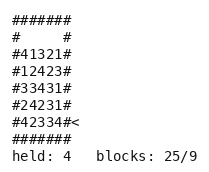

# Flipull

This environment implements a puzzle in the spirit of Taito's *Flipull* (arcade *Plotting*), with
a rule set we state below rather than one reverse-engineered from the cartridge. It needs no
emulator, no ROM, and no dependencies beyond the standard library.

A wall of coloured blocks stands to the player's left. The player rides up and down the rows
holding one block, and throws it leftward along whichever row they are standing on. A stage is
cleared once few enough blocks are left, which the cartridge calls the CLEAR target.

- **Class:** `FlipullGame`
- **Import:** `from planiverse.environments.gameboy_py.flipull import FlipullGame`
- **Source:** [`planiverse/environments/gameboy_py/flipull.py`](../../planiverse/environments/gameboy_py/flipull.py)
- **Instances:** 32 stages, indices `0`–`31`
- **Generator:** `generate_instance(seed, width=5, height=5, types=4, ...)`; see [Generating stages](#generating-stages)
- **Dependencies:** none

## A solved instance



BFWS's plan for instance `0`: 24 moves, one frame per state. The same plan is also a
[contact sheet](../renders/flipull.png), every frame on one image, captioned with the step
number, the action that produced it, and a note on the goal state.

Both were generated by solving the instance and handing the trace to `render_trace`:

```python
from planiverse.environments.gameboy_py.flipull import FlipullGame
from planiverse.benchmark import measures
from planiverse.planners.width import IteratedBFWS

env = FlipullGame()
env.set_index(0)
env.reset()

result = IteratedBFWS(max_width=1000, progress=measures.flipull).solve(env)
trace = env.simulate(result.plan)

env.render_trace(trace, "flipull.gif")                                   # animated
env.render_trace(trace, "flipull.png", actions=result.plan, env=env)     # contact sheet
```

Frames are the state's own text, typeset: `render_trace` falls back to `str(state)` for
an environment with no screen to photograph. See
[docs/rendering.md](../rendering.md) for the other output formats.

## The rules

1. The thrown block **destroys** every block of its own type it meets, and keeps going.
2. The first block of a **different** type takes the thrown block's place and comes back into the
   player's hand, a swap.
3. If the very first block it meets is a different type, **nothing happens**. The throw is refused
   and the position is unchanged.
4. Every destroyed cell **collapses its column**: the run of blocks stacked directly above it
   falls one row. The run stops at the first gap, so a block with air under it stays put.

Rule 3 is what makes this a puzzle rather than a shuffling exercise. Only the rightmost block of a
row is reachable, so a throw is legal only where that block matches what the player is holding,
and what the player is holding is decided by the previous throw. A board where no row's rightmost
block matches the hand can never change again.

This is a Flipull-like environment with a stated rule set rather than a clone of the cartridge,
and we made two simplifications deliberately. First, there is no staircase (i.e., the fixed
diagonal structure some cartridge stages carry at the left), because what a thrown block does when
it meets one is not established. Second, there is no clock, so the only failure is a genuine dead
end and a plan's length is bounded by the search budget rather than by a timer.

We derived the rules above by driving a real Flipull cartridge and predicting what it
would do next. They reproduce field and hand exactly for throws taken level with the wall in the
positions we checked. Over a longer automated comparison they agreed on about half of the level
throws and four in five of the throws from above the wall, so something more is going on that we
have not pinned down. What this environment is good for is a well-defined, dependency-free
planning problem, not predicting the cartridge.

## Quickstart

```python
from planiverse.environments.gameboy_py.flipull import FlipullGame

env = FlipullGame()
env.set_index(0)
state, info = env.reset()

print(state)
print(info)     # {'stage': 0, 'blocks': ..., 'clear_target': ..., 'rows': ...}

for action, successor in env.successors(state):
    print(action, successor.blocks_remaining)
```

Stateful play goes through `step`, which returns how many blocks the action cleared:

```python
state, cleared = env.step('throw')
env.render()          # prints the state history
```

## Stages

`set_index(i)` selects stage `i`. Indices run from `0` to `31` and match the cartridge's stage
table, giving the same board size (25, 30 or 36 blocks) and the same CLEAR target (9 down to 6),
stage for stage. `STAGES` is a literal tuple of `(ascii, clear_target)` pairs in the module, so
the indices are stable.

We generated the arrangements rather than copying them, because the cartridge stores none: it
draws each stage's layout from an RNG seeded by boot timing. Each board is kept only when the
fewest blocks it can be reduced to under the rules above is exactly the cartridge's target.

Stage strings use this alphabet:

| Char | Meaning |
|---|---|
| `#` | Wall |
| (space) | Empty cell |
| `1`–`4` | A block; the digit is its type |

## Generating stages

`generate_instance` draws a stage the way the bundled ones were made, selects it, and returns
it as a `[stage_text, clear_target]` pair that `set_instance` accepts back:

```python
env = FlipullGame()
text, target = env.generate_instance(seed=7)     # or make("flipull", seed=7)
state, info = env.reset()
```

| Option | Default | What it does |
|---|---|---|
| `width`, `height` | 5, 5 | the wall of blocks, in blocks |
| `types` | 4 | block types, `1` upward |
| `clear_target` | `None` | a CLEAR target to demand; unset, the draw's own is used |
| `max_target_fraction` | 0.4 | with no target given, reject a draw whose fewest reachable blocks exceed this share of the wall |
| `search_limit` | 200000 | positions the exhaustive exploration may visit per draw |
| `attempts` | 100 | draws before giving up with `GenerationError` |

Each draw is explored exhaustively (`fewest_blocks_reachable`), and the fewest blocks it can
be worn down to becomes its target, so a generated stage is always clearable and, because
the target is the minimum, never clearable by accident. With `clear_target` given, a draw is
kept exactly when it can be reduced that far. A draw whose state space outgrows
`search_limit` is rejected as undecided. The plan that reached the fewest blocks is left in
`env.witness`.

`FlipullState` holds the grid (a tuple of tuples of single characters), the row the player is on,
the block in hand, the clear target and a depth counter. Equality and hashing are over `(grid,
row, held)` only, because depth is bookkeeping: two identical boards reached by different routes
must be the same state or search never closes anything.

`literals` is a `frozenset` of strings:

```
at(block-2, 3, 4)      a block of type 2 at row 3, column 4
at(player, 3)          the player is standing on row 3
holding(block-1)       the block in hand
remaining(7)           blocks left on the board
```

## Actions

The action set holds three actions, the same three the cartridge has, each costing 1:

| Action | Effect |
|---|---|
| `up` | Move up one row. Refused at the top row. |
| `down` | Move down one row. Refused at the bottom row. |
| `throw` | Throw the held block along the current row. Refused unless rule 1 or 2 applies. |

`successors` never offers an action that would leave the position unchanged, so a refused throw
does not appear at all and the branching factor is between 1 and 3. A planner is never handed a self-loop to close.

## Goal and terminal

- **Goal** (`is_goal`): `blocks_remaining <= clear_target`.
- **Terminal** (`is_terminal`): no throw from any row would connect. `state.any_throw_connects()`
  decides it outright, so dead-end detection here is exact.

Because we state the rules, a position is a dead end exactly when no throw from any row would
connect. An emulator-backed environment could not compute that, since it does not know what a
throw hits. A planner on this environment prunes a doomed
branch the moment it enters one, which is most of what makes a puzzle searchable.

## Rendering

`str(state)` draws the board in the stage alphabet, and `env.render()` prints the state history.

See [docs/rendering.md](../rendering.md) for the other output formats.

## Files

| Path | What |
|---|---|
| [`flipull.py`](../../planiverse/environments/gameboy_py/flipull.py) | `FlipullGame`, `FlipullState`, `STAGES` |
| [`tests/test_flipull.py`](../../tests/test_flipull.py) | Tests |
