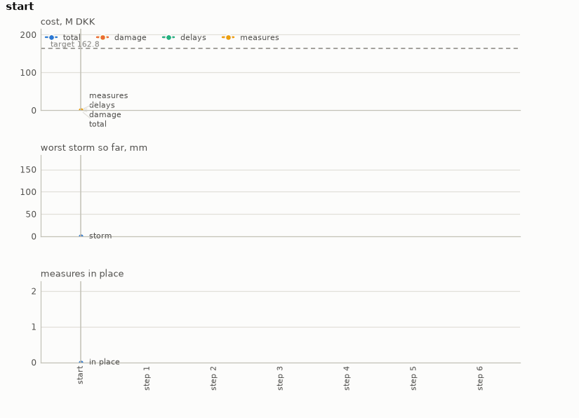

# Flood adaptation

Adapting a city's roads to flooding over decades, after MAAT. A rainstorm leaves water standing
in some of the city's zones. Where it stands, roads are damaged in proportion to its depth and
traffic slows or stops, so that trips take longer or cannot be made. Once a period, the operator
may protect one zone, by raising its roads or by making them more resistant, at a cost that is a
share of the value of the roads protected. The problem is to decide where and when to spend over
a horizon of decades, under storms drawn from a climate projection, so that damage, delay and
adaptation together stay within a target.

- **Class:** `FloodTransportEnv`
- **Import:** `from planiverse.environments.operational.flood_transport.environment import FloodTransportEnv`
- **Source:** [`environment.py`](../../planiverse/environments/operational/flood_transport/environment.py)
- **Instances:** 100 scenarios, indices `0` to `99`: 15 chosen, then 85 drawn over a grid of options
- **Generator:** `generate_instance(seed, zones=12, years=40, period=5, rain="klimaatlas", ...)`;
  see [Generating scenarios](#generating-scenarios)
- **Dependencies:** none beyond NumPy and SciPy, which the library already requires

## Context

The system is a city of zones, each with a stock of roads and a supply and demand of trips. A
road graph joins them, and the trips between every pair of zones are routed over it. A storm
leaves water standing in some zones, to a depth of each zone's own, which damages the roads
there and slows or closes them to traffic. The operator decides, once a period, whether to
protect one zone and how, paying at once a share of the value of the roads protected for a
benefit that accrues in every storm afterwards. The problem is to keep the sum of damage, delay
and adaptation within a target over a horizon of decades. What makes it hard is that a measure
pays for itself only over decades. A policy that looks one period ahead therefore never acts,
and nothing short of the end of the horizon says whether a measure was worth taking.

The model follows MAAT, the environment of Costa, Petersen, Vandervoort, Drews, Morrissey and
Pereira's *Climate Adaptation with Reinforcement Learning: Experiments with Flooding and
Transportation in Copenhagen* (NeurIPS 2024 workshop on Tackling Climate Change with Machine
Learning, https://arxiv.org/abs/2409.18574; [floods_transport_rl](https://github.com/MLSM-at-DTU/floods_transport_rl),
MIT). It takes from MAAT what that work takes from the literature: the damage curves and road
values of van Ginkel et al.'s assessment of the European road network (NHESS, 2021), the cost of
each measure, the speed a flooded road allows, the value of an hour of delay, and the rainfall
projections of the Danish Klimaatlas by return period. Two parts are this environment's own,
and we say so where they matter below. First, the city is drawn from a seed, because MAAT's
Copenhagen data (its traffic zones, its road network and a hydrodynamic flood map) cannot be
redistributed. Second, the depth a storm leaves is a ramp rather than the output of a
hydrodynamic model, because this environment has no terrain to run one over. This is not a
PDDL domain, for two reasons. First, the effect of protecting a zone is not a fact about that
zone. It is a change in the travel times of a network over which every trip between every pair
of zones is re-routed. The delay saved by one measure therefore depends on which other zones
are flooded and on where the trips go. Second, the cost of a measure is paid at once and its
benefit accrues over decades. No local test on a state says whether a measure was worth taking;
only the total at the end of the horizon does. The cost of drawing the city ourselves is that
nothing here is Copenhagen, and a plan for a drawn city transfers to nothing but itself. A city
exported from MAAT, though, loads through the same door (see
[Generating scenarios](#generating-scenarios)).

The rules are five, and each is MAAT's unless said otherwise.

First, damage. Each zone holds a stock of roads, in kilometres by type (motorway, trunk,
primary, secondary, tertiary and other). Each kilometre is valued as the assessment values a
two-lane road, with the assessment's factor for signalling on motorways and trunks, and
converted to Danish kroner of 2023 as MAAT converts it. A storm that leaves `d` metres of water
in a zone takes a share of each road's value given by the assessment's damage curve for its
class. The classes are C1 for a signalled motorway or trunk, C3 for one without signals, and C5
for every other road. The curves are steep in nothing: at one metre a C5 road loses 2.5% of its value and a C1
road 3%.

Second, delay. Trips between zones are distributed once, since the decay below does not depend
on the flood, by iterative proportional fitting (i.e., scaling a seed matrix alternately to its
row and column totals until both fit). The seed is a distance decay (`exp(-0.5 d)`, `d` in
kilometres) and the totals are each zone's supply and demand of trips. The trips are then
routed over the zone graph by shortest
travel time. A dry road allows 50 km/h; water slows it along MAAT's quadratic in the depth in
millimetres, and closes it above 300 mm. An edge between two zones is travelled half in each
(the share is data, so an exported city can say otherwise), so a flooded zone slows every trip
that passes through it. The delay of a trip is the difference between its flooded and its dry
travel time, valued at 213 kroner an hour. A trip with no passable route is a trip not made,
valued at a day's income, which MAAT weights at zero and so does this environment by default.

Third, measures. `elevate1` and `elevate2` raise a zone's roads by one or two metres, so that a
storm's water is that much shallower for them, for damage and for traffic alike. `resist25`
and `resist50` scale the damage by three quarters or a half and leave the traffic as it is.
Each costs a share of the value of the roads it protects: 22% and 47% for the elevations, from
the assessment, and a placeholder of 100% for the resistances, which MAAT leaves at that. A
zone that the design storm leaves dry is never a candidate, since a measure there would change
nothing. Note that MAAT applies the elevation to the traffic model for its first elevation
measure only. We apply it to both, because a road raised by two metres is not underwater when
one raised by one metre is not.

Fourth, storms. An instance holds one storm a year, in millimetres. With `rain="design"` every
year brings MAAT's design storm of 160 mm, which is what its deterministic mode does. With
`rain="klimaatlas"` each year's storm is drawn by inverse-CDF sampling (i.e., a uniform draw
pushed through the inverse of the distribution) from the Klimaatlas return periods (one to a
hundred years) for the climate period the year falls in (to 2040, to 2070, to 2100). It is
rounded to four millimetres, as MAAT draws it. The depth a storm leaves in
a zone is the zone's depth under the design storm scaled linearly from zero at 20 mm, the
lightest event MAAT models, to one at 160 mm. MAAT has a hydrodynamic flood map for each of
its storms; this environment has no terrain to run one over, so the ramp is its own. The
Klimaatlas storms, which top out near 120 mm, flood a zone to at most three quarters of its
design depth.

Fifth, time. A decision covers a `period` of years, five in the bundled scenarios. The measure
is taken at the start of the period and protects the zone through it; each year's storm is
then costed and the years summed. MAAT decides once a year over 77 years, which `period=1`
reproduces at a depth few planners will search. The period trades that depth for a coarser
decision, and it is the one modelling choice here that MAAT does not make.

## Actions

| Action | Cost | Price of the measure | Effect |
|---|---|---|---|
| `wait` | 1 | none | the period passes with the measures already in place |
| `elevate1(z)` | 1 | 22% of the roads' value | zone `z`'s roads are raised one metre, for damage and traffic alike, then the period passes |
| `elevate2(z)` | 1 | 47% | likewise, raised two metres |
| `resist25(z)` | 1 | 100% | zone `z`'s damage is scaled by three quarters, traffic unchanged, then the period passes |
| `resist50(z)` | 1 | 100% | likewise, scaled by a half |

`FloodAction("wait")` lets the period pass, and `FloodAction(kind, zone)` protects a zone; both
cost 1, so a plan's cost is its length and the money is in the state. `successors` offers
`wait` and every measure the instance allows on every flooding zone not yet protected. The
branching factor is therefore one plus the number of such zones times the number of measures,
between five and thirty-one on the bundled scenarios. A measure on a zone already protected, or
on one the design storm leaves dry, is refused: `__advance__` returns the state unchanged. A
goal and a dead end are absorbing (i.e., no action leads out of them), so `successors` returns
`[]` and `simulate` leaves such a state where it is. The last decision of the horizon is
absorbing in the same way. Actions parse from their names, so
`simulate(["elevate1(z03)", "wait"])` works.

Applying an action puts the measure in place at the start of the period, charges its price, and
then runs each year of the period. The year's storm falls, the roads take damage according to
their depth and their protection, and the trips are routed over the slowed network. The year's
damage, delay and trips not made are then added to the total. A year's costs depend only on the
measures in place and the storm, so they are memoised on that pair, which keeps an expansion
to about a millisecond.

## Planning problem

A `FloodState` carries the path of decisions taken, from which everything else follows:

| Field | Meaning |
|---|---|
| `path` | the actions taken, one per period; the whole state |
| `step`, `year` | decisions taken, and the year they have reached |
| `protected` | zone to measure, for the measures in place |
| `cost` | the total so far, in kroner |
| `damage`, `delay`, `no_travel`, `spent` | its parts: damage, delays, trips not made, and measures |
| `rain` | the worst storm of the last period, in millimetres |
| `years`, `period`, `target` | the instance's horizon, period and target |

The path is the identity: one decision a period, so two states with the same path are the same
state. The same measures taken in a different order are different states, as they should be,
since a zone protected a period earlier was protected through one more period of storms.
The literals are:

```
step(N)
protected(ZONE, MEASURE)    # per measure in place
spent(B)                    # the total as a share of the target in twentieths, capped one above the target
goal-reached
terminal-state
```

The storms are not literals, because they are the same on every path through an instance. With
`T` the target and `K` the number of decisions in the horizon (the years divided by the period,
rounded up), the goal and the dead end are

```
goal(s)     ≡ step(s) = K ∧ cost(s) ≤ T
terminal(s) ≡ cost(s) > T
```

The dead end is sound, because every part of the total is non-negative, so a state past the
target can never come back under it. Both are absorbing, so `successors` returns `[]`.

Note that the problem as a city's planners would state it is a trajectory problem (i.e., one whose
requirements hold over the whole run rather than at its end). The total must stay within the
target throughout, and the horizon must be reached. We turn it into the goal above with the
reduction the grid and epidemic environments use, which [NOTES.md](../../NOTES.md) sets out in
full, in three moves. First, a constraint that must hold throughout becomes a dead end. The
first state whose total passes the target is terminal, so no plan through it exists, and a
check over the whole trajectory becomes a check at each state. Second, a quantity that
accumulates becomes part of the state and is bounded at the goal. The damage, the delays, the
trips not made and the money spent on measures are carried on the state and summed into the
total, and the total is compared with the target. Third, the horizon becomes time in the state:
the step and the year are state variables, and the horizon reached under the target is the
goal. The cost of the reduction is that the goal depends on a target, and a target has to come
from somewhere. Here it is set from a reference policy, the way the
[crop environment](crop-management.md) sets its yield target, so that every instance has a
solution by construction. A measure pays for itself only over decades, so a policy that looks
one period ahead never acts; the reference instead looks to the end of the horizon. At each
decision it takes the action that leaves the lowest total if nothing more is done afterwards,
over the storms the instance holds, and waits when no action improves on waiting. The target is
that policy's cost plus a slack of 2%, and `reference_plan()` returns its plan, which is the
instance's `witness`. A plan therefore has to do at least about as well as the reference, and
an instance on which doing nothing would pass is not an instance: the generator redraws it.

The progress measure the width planners take (`planiverse.benchmark.measures.flood_transport`)
is the years still to plan plus the share of the target already spent, with a state past the
target worse than any other. A planner is thus pulled towards the horizon along the cheaper
paths to it.

## An example

Instance `0` is a city of eight zones over thirty years with the 160 mm design storm every
year, five years to a decision, so six decisions, and `elevate1` the only measure. The design
storm floods four of the zones: `z01` to 0.18 m, `z03` to 0.90 m, `z06` to 0.26 m and `z07` to
1.01 m. Doing nothing for thirty years costs 246.5 M DKK, the reference policy costs 159.6 M by
elevating `z03` and then `z07` and waiting out the rest, and the target is 162.8 M. The five
successors of the initial state show the first period's bill: waiting costs 41.1 M, and
protecting `z07` costs 50.6 M, `z03` 52.9 M, `z01` 59.8 M and `z06` 188.9 M. The last is so dear
because `z06` holds the city's only motorway and a trunk road, and elevating them costs 22% of
their value. Iterated BFWS, run as the benchmark runs it (i.e., with the measure above and a
width bound of 1000), solved it in 36 expansions and no measurable time (the record rounds to
0.0 s). Its six-decision plan is

```
elevate1(z07), elevate1(z03), wait, wait, wait, wait
```

which ends the horizon at 160.95 M of the 162.84 M: 112.55 M of damage, 3.60 M of delays and
44.80 M on the two measures. It protects the same two zones as the reference, the two deepest,
in the other order, and pays 1.3 M more in damage and delays for the order, which the 2% slack
absorbs. The shallow `z01` and the expensive `z06` are left to flood.



The render draws the readings of each state over the plan rather than the state's text, since a
state here is a path and a handful of sums. The panels are the cost and its parts (damage,
delays and measures) against the target, the worst storm so far, and the measures in place,
period by period. A frame of the GIF is the chart up to its state, so the animation grows a
step at a time. The same plan is also a [sheet](../renders/flood_transport_chart.png), the
whole plan on one figure. There the action that produced each state runs along the bottom, the
target is a dashed line, and the goal is marked where the plan ends. Both were produced by
solving the instance and handing the trace to `render_trace`:

```python
from planiverse.environments import make
from planiverse.benchmark import measures
from planiverse.planners.width import IteratedBFWS

env = make("flood_transport")
env.set_index(0)                   # eight zones, thirty years, the design storm every year
state, info = env.reset()          # info["target"], info["reference"], info["do_nothing"]: 162.8e6, 159.6e6, 246.5e6 kroner
print(state)                       # year 0 of 30 / protected: nothing / cost 0.00 M of 162.84 M DKK: ...

result = IteratedBFWS(max_width=1000, progress=measures.flood_transport).solve(env)
trace = env.simulate(result.plan)

env.render_trace(trace, "flood_transport_chart.gif")                                   # animated
env.render_trace(trace, "flood_transport_chart.png", actions=result.plan, env=env)     # the sheet
```

Stateful play, as opposed to expansion, goes through `step`, which returns the state and the
change in the total, negated (i.e., minus what the period cost). `successors(state)` returns
the action and state pairs for waiting and for each measure still open, and `get_actions()`
lists `wait` and every measure on every flooding zone whatever the state. `reference_plan()`
returns the policy that set the target as a plan, and `validate(plan)` replays a plan and says
whether it reaches a goal, which it does for the reference. `env.render()` prints the history
of `step` calls and returns it as a list of strings. The readings each environment charts, and
the panels they go on, are in
[`planiverse/rendering/readings.py`](../../planiverse/rendering/readings.py); `charts=False`
asks `render_trace` for the state's text instead, and [docs/rendering.md](../rendering.md)
covers the other output formats.

## Scenarios

`set_index(i)` selects one of a hundred scenarios. Each is a fixed draw of the generator, the way
Flipull's stages are, so the table gives the draw's options rather than a layout:

| Index | Zones | Years | Storms | Measures |
|---|---|---|---|---|
| 0 | 8 | 30 | the design storm every year | `elevate1` |
| 1 | 8 | 30 | Klimaatlas | `elevate1` |
| 2 | 12 | 30 | design | `elevate1` |
| 3 | 12 | 40 | Klimaatlas | `elevate1` |
| 4 | 16 | 40 | design | `elevate1` |
| 5 | 16 | 40 | Klimaatlas | `elevate1` |
| 6 | 24 | 50 | design | `elevate1` |
| 7 | 24 | 50 | Klimaatlas | `elevate1` |
| 8 | 30 | 60 | Klimaatlas | `elevate1`, `elevate2` |
| 9 | 10 | 30 | design | `elevate1`, `resist50` |
| 10 | 12 | 40 | Klimaatlas, from 2052 | `elevate1` |
| 11 | 16 | 50 | Klimaatlas, six zones in ten flooding | `elevate1` |
| 12 | 20 | 40 | design, two years to a decision | `elevate1` |
| 13 | 24 | 60 | Klimaatlas, from 2042 | `elevate1`, `elevate2` |
| 14 | 36 | 60 | design | all four |

All but one of these fifteen are five years to a decision, so the horizons are six to twelve
decisions deep; scenario 12 decides every two years and is twenty deep. Indices `15` to `99`
were drawn over a grid of the same options (8 to 36 zones, 30 to 60 years, either storm
series, the four measure sets above), one draw in six with a twist (two years to a decision,
a later start in the Klimaatlas series, or six zones in ten flooding). They were drawn at the
seeds recorded beside them in the module, and accepted by the same test as the fifteen.
Under the design storm the reference protects most of the flooding zones and doing nothing
costs half as much again. Under Klimaatlas storms, which are shallower, it protects one or
two, and the margin over doing nothing is a few per cent, which makes those the harder
instances, since fewer plans meet the target.

## Generating scenarios

`generate_instance` draws a city and its storms, measures the draw the way the bundled ones
are measured, selects it, and returns it as a dict that `set_instance` accepts back:

```python
env = FloodTransportEnv()
scenario = env.generate_instance(seed=7, zones=10, years=30, rain="design")
state, info = env.reset()              # info["generated"] is True
env.witness                            # the reference policy's plan
```

| Option | Default | What it does |
|---|---|---|
| `zones` | 12 | the size of the city |
| `years` | 40 | the horizon |
| `period` | 5 | years to a decision |
| `rain` | `"klimaatlas"` | `"design"` for 160 mm every year, `"klimaatlas"` for a draw from the return periods |
| `measures` | `("elevate1",)` | the measures on offer |
| `flood_share` | 0.4 | the share of zones the design storm floods |
| `slack` | 0.02 | the target's margin over the reference policy's cost |
| `start_year` | 0 | the year, from 2022, the horizon starts in, which picks the climate period |
| `attempts` | 50 | draws before giving up with `GenerationError` |

`draw_city` places the zones on a jittered grid and joins each to its neighbours (always along
the grid, sometimes diagonally). It gives each a supply and a demand of trips, a stock of roads
by type, and a depth under the design storm, zero for the zones the storm does not reach. A draw
is kept only if doing nothing would miss the target; with a short horizon nothing pays for
itself and every draw is rejected, which is what the error says.

A city exported from MAAT loads through the same door. [`tools/export_maat_city.py`](../../tools/export_maat_city.py)
runs inside a checkout of MAAT, with its dependencies, and writes its zones, roads, trips,
graph and design-storm depths as an instance of this shape, to which the storms, horizon and
period are added. The exporter is not run by this repository's tests, since it needs MAAT's
data.

The city is a draw of this environment's own, and the rest of the model is MAAT's
(https://github.com/MLSM-at-DTU/floods_transport_rl, https://arxiv.org/abs/2409.18574). Trips
are distributed by iterative proportional fitting (Deming and Stephan, 1940,
https://doi.org/10.1214/aoms/1177731829), storms by inverse transform sampling
(https://en.wikipedia.org/wiki/Inverse_transform_sampling) from the Klimaatlas return periods
(https://www.dmi.dk/klimaatlas), and damage by the curves of van Ginkel et al.
(https://doi.org/10.5194/nhess-21-1011-2021).

## Attribution

Built after [floods_transport_rl](https://github.com/MLSM-at-DTU/floods_transport_rl) (MIT), the
MAAT environment of Costa et al., with the constants it takes from van Ginkel et al. and the
Danish Klimaatlas; see [THIRD-PARTY-NOTICES.md](../../THIRD-PARTY-NOTICES.md).

## Files

| Path | What |
|---|---|
| [`environment.py`](../../planiverse/environments/operational/flood_transport/environment.py) | `FloodTransportEnv`, `FloodState`, `FloodAction`, `draw_city`, the model's constants |
| [`tools/export_maat_city.py`](../../tools/export_maat_city.py) | Exports a MAAT city as an instance |
| [`tests/test_flood_transport.py`](../../tests/test_flood_transport.py) | Tests |
