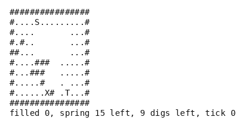

# Fluid

A cellular fluid puzzle, in pure Python. Water pours from a spring into a cave of rock and earth.
The player digs channels, a cell at a time and only so many, to bring enough of it to a basin
before the spring runs dry, past a drain that swallows whatever falls into it. Nothing here is
taken from any published title, and the environment needs no dependency.

- **Import:** `from planiverse.environments.games.fluid.environment import FluidEnv`
- **Source:** [`planiverse/environments/games/fluid/environment.py`](../../planiverse/environments/games/fluid/environment.py)
- **Instances:** 100 caves, indices `0` to `99`, all drawn by the generator at recorded seeds
- **Generator:** `generate_instance(seed, need=None, digs=None, ...)`; see [Generating caves](#generating-caves)

## Context

The mechanic is the one the falling-sand games and the water-routing puzzles share. A cave is a
grid of sixteen by ten cells of rock, earth and air. A spring sits near the top left, a basin near
the bottom right, and a drain on the floor between them. The water in it is a cellular automaton
(i.e., a grid whose cells change by one local rule applied to all of them every tick) in the
falling-sand family. Each tick every water cell falls if it can, else slides diagonally, else moves
sideways, in a fixed scan order. The player decides which cell of earth to dig, and when, with a
budget of digs and a budget of time. Digs are allowed only where the water is, so the player
follows the flow rather than tunnelling anywhere. That is what keeps the branching to a handful of
cells and makes the order of digs the puzzle. The difficulty is that a dig is one cell of earth
removed, after which the water runs for a period, and what reaches the basin depends on the whole
cave and on everything dug before. The automaton is the transition function, and no add or delete
list carries a flow, which is what keeps the environment out of PDDL. The cost is fidelity. The
water has neither level nor pressure, a unit of it is a cell, and a pool on a floor keeps shifting
about, as the genre's water does. What matters to the puzzle is only where a unit can fall next.

The rules are four. First, each tick the spring gives one unit of water to the air below it, while
it has any left. Then every water cell, scanned from the bottom row up, falls into air below it,
else slides into air diagonally below, else moves into air beside it. The side tried first
alternates with the tick, and so does the direction of the scan along a row. Second, water that
moves onto the basin is taken and counted, and water that moves onto the drain is lost. Third, an
action is a dig of one earth cell that has water against it, or a wait. Either way the water then
runs for `PERIOD` (12) ticks, and a dig spends one of the digs allowed. Fourth, the goal is the
basin taking at least `need` units. A position is a dead end when the water left in the spring and
afloat together cannot cover what the basin still needs, or when `MAX_TICKS` (240) have passed.

## Actions

| Action | Cost | Effect |
|---|---|---|
| `dig(x, y)` | 1 | the earth at `(x, y)`, which must have water against it, becomes air, and the water then runs twelve ticks |
| `wait` | 1 | the water runs twelve ticks |

A dig that the budget or the water does not allow changes nothing and is not offered as a
successor. `get_actions()` lists the digs open in the current state, which are the earth cells with
water in one of the four cells around them, and `wait`. `FluidAction.parse` reads one back from its
name, and `WAIT` is the wait as a constant. A wait is always offered while the game is on, and
since the tick is part of the state its successor never equals its parent, even when no water
moves.

Applying an action removes the cell, for a dig, and then runs twelve ticks of the automaton. Each
tick goes in the order the first rule gives, the spring and then the rows from the bottom up. A
cell that has already moved this tick is left alone, so a unit falls one cell a tick. The cave, the
spring's remainder and the basin's count after the twelfth tick, with the digs left and the tick
advanced by twelve, are the next state.

## Planning problem

A `FluidState` holds the cave as a tuple of row strings, the water the spring has left, the water
the basin has taken, the digs left and the tick. Equality and hashing are over all five, so a
position is the same position wherever it was reached from, and the same cave at two different
ticks is two positions. `depth` is bookkeeping and `need` is carried for the benchmark's measure.
The literals name every earth, air and water cell and the counters; the rock, the spring, the basin
and the drain never change and are left out. The cells are what the width-based planners' novelty
tests see:

```
cell(4, 2, water)
cell(5, 3, earth)
filled(3)
supply(9)
digs_left(5)
```

With `N` the basin's need, `T` the tick limit (240) and `afloat(s)` the water cells in the cave of
`s`, the goal and the dead end are

```
goal(s)     ≡ filled(s) ≥ N
terminal(s) ≡ ¬goal(s) ∧ (tick(s) ≥ T ∨ supply(s) + afloat(s) < N - filled(s))
```

Both are absorbing (i.e., no action leads out of them): `successors` returns nothing for either and
`__advance__` returns the state unchanged.

The game as played is a real-time loop in which the water runs whether or not the player digs. It
is won when the basin fills and lost when the spring is dry and the last unit has settled short of
it. We turn it into an initial-to-goal problem in two moves. First, the loop between two decisions
(twelve ticks of the automaton) is folded into the action, as described above. A state is therefore
always the cave at a period's end, and the planner never sees a unit halfway down a chute. Second,
the game's win and loss conditions become the goal test and the dead-end test on that cave. The win
is the basin's count. The loss, which the game would only show once the last unit had come to rest,
is decided at once from the water still to come. A position from which the spring and the water
afloat together cannot fill the basin is therefore pruned before a dig is tried in it. What the
reduction costs is timing. A dig lands on a period's boundary rather than on the tick a player
would choose. The tick on the state also means the search cannot recognise a cave it has seen
before at another time. Every action costs 1, so a plan is judged by its length, and the digs
allowed bound the digs in it but are not the objective.

The progress measure the width planners take (`planiverse.benchmark.measures.fluid`) is the water
the basin has still to take.

## An example

Instance `0` is seed 4000. The spring at (5, 1) sits over a pocket of air seven cells wide and
three deep. From the pocket's floor a chute of air at columns 8 and 9 runs down to the cave's
floor. There the drain at (7, 8) lies at the chute's left foot, and a single cell of earth at (10,
8) parts its right foot from the basin at (11, 8). The basin needs 12 units, the spring holds 15
and 9 digs are allowed:

```
################
#....S.........#
#....       ...#
#.#..       ...#
##...       ...#
#....###  .....#
#...###   .....#
#.....#   . ...#
#......X# .T...#
################
filled 0, spring 15 left, 9 digs left, tick 0
```

Iterated BFWS, run as the benchmark runs it (i.e., with the measure above and a width bound of
1000), solved it in 3 expansions and under a tenth of a second. Its three-action plan is

```
wait, dig(10,8), dig(4,3)
```

At the start no earth has water against it, so the only move is to wait. In the first period the
spring's first six units fall through the pocket and down the chute. One lands on the drain and is
lost. The rest are strung down the pocket and the chute to the floor at (9, 8), where only that one
cell of earth parts them from the basin. Digging it lets the water through as it arrives, and the
basin takes six units in the next period while the spring runs down to three. The third action digs
at (4, 3), high in the pocket, which changes nothing the water needs. It is there for the twelve
ticks it runs, in which the last six units come down and the basin reaches twelve at tick 36; a
wait in its place would have done the same.



The render is the state's own text, typeset, one frame per state: `render_trace` falls back to
`str(state)` for an environment with no screen to photograph. Here the text is the cave, with `#`
for rock, `.` for earth, `~` for water, `S` for the spring, `T` for the basin and `X` for the
drain. It shows the earth dug and the water where the ticks left it, with the counters under it.
The same plan is also a [contact sheet](../renders/fluid.png), every frame on one image, captioned
with the step number, the action that produced it, and a note on the goal state. Both were
generated by solving the instance and handing the trace to `render_trace`:

```python
from planiverse.environments.games.fluid.environment import FluidEnv, FluidAction, WAIT
from planiverse.benchmark import measures
from planiverse.planners.width import IteratedBFWS

env = FluidEnv()
env.set_index(0)
state, info = env.reset()          # info: cave, need, supply, digs, generated
print(state)                       # the cave above
for action, child in env.successors(state):
    print(action, child.filled, "in the basin")    # only `wait`, since no water is out yet

result = IteratedBFWS(max_width=1000, progress=measures.fluid).solve(env)
trace = env.simulate(result.plan)

env.render_trace(trace, "fluid.gif")                                   # animated
env.render_trace(trace, "fluid.png", actions=result.plan, env=env)     # contact sheet
```

Stateful play, as opposed to expansion, goes through `step`, which takes a `FluidAction` such as
`FluidAction(10, 8)`, `WAIT` or a name and returns the state and the units the basin took since the
last one. `env.render()` prints the history of `step` calls and returns it as a list of strings.
See [docs/rendering.md](../rendering.md) for the other output formats.

## Caves

The hundred caves are the generator's own draws, embedded in the module as the plain data
`set_instance` takes with the seed each came from beside it, and the plan each was accepted on is
in `tests/data/fluid_solutions.json`. A cave is sixteen by ten: earth inside a rock border with a
few pockets of air and veins of rock. The spring is near the top left, the basin near the bottom
right with air over it, and the drain on the floor between them. The basin needs 8 to 12 units, the
spring holds 3 to 6 more than that, and 6 to 9 digs are allowed. The plan each cave was accepted on
runs from three to twelve actions.

## Generating caves

`generate_instance` draws a cave, selects it, and returns it as the dict `set_instance` takes back:

```python
env = FluidEnv()
cave = env.generate_instance(seed=7, need=10)
print(env.witness, env.witness_expansions)     # the plan it was accepted on, and the search's cost
state, info = env.reset()                       # info["generated"] is True
```

| Option | Default | What it does |
|---|---|---|
| `need` | 8 to 12 at random | units the basin must take |
| `digs` | 6 to 9 at random | digs allowed |
| `search_limit` | 200 | expansions the acceptance search may spend per draw |
| `attempts` | 40 | draws before giving up with `GenerationError` |

A draw is kept only if waiting without digging fails. A best-first search over digs, guided by what
the basin still needs and then by how far the nearest water is from it, must then find a plan
within `search_limit` expansions. The method is generate-and-test, which the procedural content
generation literature calls search-based PCG (Togelius, Yannakakis, Stanley and Browne, 2011,
https://doi.org/10.1109/TCIAIG.2011.2148116; Shaker, Togelius and Nelson, *Procedural Content
Generation in Games*, 2016, https://pcgbook.com/).

## Files

| File | Contents |
|---|---|
| [`environment.py`](../../planiverse/environments/games/fluid/environment.py) | `FluidAction`, `FluidState`, the automaton (`tick`, `run`), `diggable`, `draw_cave`, `FluidEnv`, `CAVES` |
| [`tests/test_fluid.py`](../../tests/test_fluid.py) | Tests |
| [`tests/data/fluid_solutions.json`](../../tests/data/fluid_solutions.json) | The plan each cave was accepted on |
