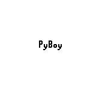

# Game Boy (PyBoy)

One environment for any Game Boy cartridge, run under
[PyBoy](https://github.com/Baekalfen/PyBoy) and read through PyBoy's *game wrappers* (i.e., the
per-game classes that know where a title keeps its counters and how its menus are walked). What
a wrapper reads becomes the planning problem: a save state is a state, and the wrapper's
measurements and the background map are its literals. The goal is the wrapper's own verdict
(`stage_cleared()`, `level_solved()`, `room_solved()`) or a threshold on one of its
measurements. Nothing here knows where a particular game keeps its counters; that is the
wrapper's business, and it stays in PyBoy.

- **Class:** `GameBoyEnv`
- **Import:** `from planiverse.environments.games.emulated.game_boy import GameBoyEnv`
- **Source:** [`planiverse/environments/games/emulated/game_boy.py`](../../planiverse/environments/games/emulated/game_boy.py)
- **Instances:** one per stage, level or room the cartridge's wrapper can start at; see
  [Profiles](#profiles)
- **Generator:** `generate_instance(seed, warmup=(0, 30), index=None, goal=None, solvable=False, search_limit=2000, attempts=20)`;
  see [Generating instances](#generating-instances)
- **Dependencies:** `pyboy`, and a cartridge you supply

## Context

The game is whatever the cartridge holds, and the player's decisions are the console's eight
buttons, pressed alone or together for a few frames at a time. What a planner needs from an
emulator is the same whatever is running on it. It needs a way back to a state to expand it
again, which a save state gives. It needs something to read a state as, which the wrapper gives:
`game_area()`, a matrix of tile identifiers, and whatever the wrapper measures (blocks left,
hearts left, level progress, score). And it needs a goal, which the wrapper answers too, or
which is a threshold on one of those measurements. What makes an instance hard is the game's
own: a stage of Puzznic or a room of Lolo is as deep as its puzzle is. Running the game itself
rather than a re-implementation has two costs. An expansion is milliseconds of emulation rather
than microseconds, so a search budget buys fewer states; and a cartridge is only as readable as
its wrapper.

Commercial cartridges are copyrighted, so none ships with this repository and none is
downloaded. The environment reads the path from `rom=` or from the `PLANIVERSE_GB_ROM` variable,
and raises `FileNotFoundError` naming the variable when it has neither:

```bash
export PLANIVERSE_GB_ROM=/path/to/puzznic.gb
```

```python
from planiverse.environments import make

env = make("game_boy", index=7)         # the wrapper's eighth stage
env = make("game_boy", seed=3)          # a generated one
state, info = env.reset()
info["wrapper"]                         # 'GameWrapperPuzznic'
```

Which wrapper a cartridge gets is PyBoy's decision, made from the cartridge title. PyPI's PyBoy
ships wrappers for Super Mario Land, Tetris, Kirby's Dream Land, Pokémon Pinball and Pokémon Gen
1; [MFaisalZaki/PyBoy](https://github.com/MFaisalZaki/PyBoy) adds Puzznic, Flipull, Amazing
Tater and Adventures of Lolo (the four games this library also has in pure Python) and Super
Mario Bros. Deluxe:

```bash
pip install git+https://github.com/MFaisalZaki/PyBoy
```

A cartridge no wrapper claims still works, through PyBoy's generic wrapper: the state is the
background map plus whatever bytes of memory `watch=` names, and the goal is whatever `goal=`
says about them. That is the path the test suite exercises, on a cartridge it assembles itself
(`tests/counter_rom.py`, an original program that counts button presses), and it is the instance
the example below is rendered on, since it is the only cartridge we can publish.

The rules are four. First, a bundled instance is one of the wrapper's stages, levels or rooms,
reached by its `start_game` argument with the timer's DIV register at zero, so the same instance
always boots to the same bytes. Second, an action holds one or more buttons for `hold` frames,
releases them and lets the game settle, so the planner never sees the frames between two
decisions. Third, a state is what the wrapper reads off the emulator (i.e., the background map
and the fields the profile names), and two states that read the same are the same state whatever
their save states say. Fourth, the goal and the dead end are specs over those readings (the
wrapper's verdict, a threshold, a count of actions survived), and a state where the dead end
holds is a dead end whether or not the goal holds too.

## Actions

An action is a button name (`a`, `b`, `start`, `select`, `up`, `down`, `left`, `right`), several
joined with `+` (`a+right`), or `nop`. `throw` means the Flipull wrapper's `throw_button`, and
`switch` means select. Which of these a profile offers, and for how many frames a press lasts,
is per wrapper, and every action costs 1:

| Wrapper | Actions | Cost | Hold | Effect |
|---|---|---|---|---|
| `GameWrapperPuzznic` | `left`, `right`, `up`, `down`, `a+left`, `a+right` | 1 | 6 frames | held, released, then the wrapper's `settle()` |
| `GameWrapperFlipull` | `up`, `down`, `throw` | 1 | 5 frames | held, released, then the wrapper's `settle()` |
| `GameWrapperAmazingTater` | `left`, `right`, `up`, `down`, `select` | 1 | 5 frames | held, released, then the wrapper's `settle()` |
| `GameWrapperAdventuresOfLolo` | `left`, `right`, `up`, `down`, `a` | 1 | 20 frames | held, released, then the wrapper's `settle()` |
| `GameWrapperSuperMarioLand`, `GameWrapperSuperMarioBrosDeluxe` | `right`, `a+right`, `left`, `a+left`, `a`, `nop` | 1 | 8 frames | held, released, then `settle=` frames, or one |
| `GameWrapperTetris` | `left`, `right`, `down`, `a`, `b`, `nop` | 1 | 4 frames | held, released, then `settle=` frames, or one |
| `GameWrapperKirbyDreamLand` | `right`, `a+right`, `left`, `a+left`, `b`, `a`, `nop` | 1 | 8 frames | held, released, then `settle=` frames, or one |
| any other | every button, `nop` | 1 | 8 frames | held, released, then `settle=` frames, or one |

Pressing holds the buttons for `hold` frames, releases them, and settles. The four wrappers from
the fork expose `settle()`, which runs the game to its next stable frame after a press; the
others get `settle=` frames, or one. A wrapper that declares its own `press_ticks` wins over the
profile's `hold`, and `actions=` and `hold=` on the constructor override both. Actions can be
given to `simulate` and `step` as strings.

`successors` tries every action in the vocabulary from the state's save state and drops the ones
that change nothing (a `nop` on a still menu, a wall bumped into). Note that under a survival
goal the step count is part of the state, so every action changes it and none is dropped, which
is why the counter cartridge's initial state has nine successors. One expansion is one
save-state load and `hold` plus settle frames of emulation per action. PyBoy's compiled build
runs a few thousand frames a second, so an expansion costs a few milliseconds, which is cheap
beside a replayed simulator and dear beside a re-implementation.

## Planning problem

A `GBState` carries a save state (PyBoy's, zlib-compressed; about 200 KB uncompressed and mostly
zeros, so the counter cartridge's 143 KB compresses to about a kilobyte), the wrapper's
`game_area()` as a tuple of rows of tile identifiers, and the fields the profile named. Its
literals are:

| Literal | When |
|---|---|
| `tile(row, col, id)` | per cell of the game area |
| `field(name, value)` | per field; a tuple-valued field is flattened to `name.0`, `name.1`, ... |
| `steps(n)` | only under a survival goal, since only then is the count part of the problem |
| `goal-reached`, `terminal-state` | in a goal state and in a dead-end state |

Two states with the same tiles and fields are the same state, and under a survival goal the step
count is part of that. That is the modelling decision, and it is what lets search close. Two
histories that leave the board in the same position are one node, whatever their save states say
about the frame counter or the timer. What it costs is exactness for games with randomness. Two
equal states can have different timer registers and so different futures. The environment is
deterministic given the timer seed and the inputs, however, so what a planner sees is one fixed
game, and the plan it finds replays. `state_identity` is `snapshot` in the registry, for this
reason: the state is an emulator image, told apart from others by what the wrapper reads off it.

A goal or dead-end spec is a dict with one of:

| Spec | Holds when |
|---|---|
| `{"method": "stage_cleared"}` | the wrapper method returns true |
| `{"attribute": "lines", "delta": 1}` | the field has risen by `delta` since the instance's initial state |
| `{"attribute": "coins", "at_least": 5}` | `at_least`, `at_most` or `equals` on the field |
| `{"memory": 0xC000, "at_least": 3}` | the same comparisons on one byte of memory |
| `{"attribute": "lives_left", "drop": true}` | (dead end) the field has fallen below its value at the initial state |
| `{"survive": 20}` | `survive` actions have been taken without a dead end |

A dead-end spec naming both a `method` and an `attribute` holds when either does, and the
attribute is read as a drop, which is how "game over, or a lost life" is written. Relative specs
(`delta`, `drop`) are measured from the instance's own initial state, after any opening the
generator played, not from the stage's first frame. With `G` the instance's goal spec, `T` its
dead-end spec and `holds(spec, s)` the reading the table gives, the goal and the dead end are

```
goal(s)     ≡ holds(G, s) ∧ ¬holds(T, s)
terminal(s) ≡ holds(T, s)
```

so a state where the dead end holds is a dead end whether or not the goal holds too. Under the
generic profile's defaults, with `N` the actions to survive (20), these read

```
goal(s)     ≡ steps(s) ≥ N ∧ ¬game_over(s)
terminal(s) ≡ game_over(s)
```

A console game is a stream of frames that runs one way: the player presses, the game moves on,
and there is no returning to a frame already passed. We turn it into an initial-to-goal problem
in three moves, which are the emulator's version of the two the re-implemented games use. First,
the save state gives the way back. Every state carries the emulator's image, so any position can
be restored and expanded again, and the one-way stream becomes a graph. Second, the held button
folds the frames between two decisions into one action. A press lasts `hold` frames and is
followed by the settle, so the planner never sees a frame in mid-press or a block in mid-fall,
only the position the game has settled into. Third, the goal spec and the dead-end spec make the
game's own win and loss conditions into the goal test and the dead-end test on that position.
They read as the wrapper's verdict, a threshold on a measurement, or a count of actions survived
where the game has no verdict to read. The cost is coarseness. A press of `hold` frames is the
only press the planner can make, so a plan is a plan at that granularity. A survival goal is a
proxy where no better goal is named, and a plan is open-loop for one timer seed.

The progress measure the width planners take (`planiverse.benchmark.measures.emulated`) is
whatever the profile says is left: blocks remaining, hearts left, taters out, or the negated
progress or score. For a survival goal it is the negated step count.

## An example

No cartridge ships with this repository, so the instance we can publish is the one the test
suite assembles for itself: `tests/counter_rom.py`, an original program that counts button
presses. Right adds one to a counter, left takes one away (never below zero), A puts it back to
zero, and every press is counted too. The counter is drawn as the tile at the top-left corner of
the background map and the press count as the tile beside it. Its title is one no wrapper
claims, so instance `0` is the generic profile's. That is 120 frames of boot, the timer at zero,
every button and `nop` held for eight frames, a goal of surviving twenty actions, and
`game_over()` as the dead end. The generic wrapper exposes no number and `make("game_boy")`
names no `watch=`, so the state is the 32-by-32 background map and the step count, 1,025
literals. Iterated BFWS, run as the benchmark runs it (i.e., with the measure above and a width
bound of 1000), solved it in 20 expansions and seven seconds. Its twenty-move plan is

```
a, a, a, a, a, a, a, a, a, a, a, a, a, a, a, a, a, a, a, a
```

which is the first button in the vocabulary pressed twenty times. It works because the cartridge
has no game over, so any twenty actions survive, and the search went straight down. Each A puts
the counter back to zero and adds one to the presses, so the last frame shows tile 0 at the
corner and tile 20 beside it. With a cartridge of your own the frames are the game's own screen,
and the plan is the game's.



The render is the console's own frames, one per state: `render_trace` is routed through
`frames`, which loads each state's save state, runs one frame and photographs the screen. The
same plan is also a [contact sheet](../renders/game_boy.png), which keeps twelve of the
twenty-one frames (`max_states=12`), captioned with the step number, the action that produced
it, and a note on the goal state. Both were generated by solving the instance and handing the
trace to `render_trace`:

```python
from planiverse.environments.games.emulated.game_boy import GameBoyEnv
from planiverse.benchmark import measures
from planiverse.planners.width import IteratedBFWS

env = GameBoyEnv("/path/to/counter.gb")      # or any cartridge, see above
env.set_index(0)
env.reset()

result = IteratedBFWS(max_width=1000, progress=measures.emulated).solve(env)
trace = env.simulate(result.plan)

env.render_trace(trace, "game_boy.gif")                                                # animated
env.render_trace(trace, "game_boy.png", actions=result.plan, env=env, max_states=12)   # contact sheet
```

Stateful play, as opposed to expansion, goes through `step`, which returns the state and how far
the profile's progress fell. `render()` returns the console's frames for the positions `step`
played through, as PIL images (see [Rendering](#rendering)). See
[docs/rendering.md](../rendering.md) for the other output formats.

## Profiles

`PROFILES` in the module says, per wrapper class, what the environment knows about the game. A
profile is data, not code. It says how to reach instance *i* (the `start_game` argument), which
wrapper attributes to read into every state, what the goal and the dead end are, which buttons
are worth offering, and how many frames a press lasts.

| Wrapper | Instances | `set_index(i)` starts | Fields read | Goal | Dead end | Actions |
|---|---|---|---|---|---|---|
| `GameWrapperPuzznic` | 128 | `stage=i` | stage, blocks remaining and total, cursor | `stage_cleared()` | `game_over()` | ←→↑↓, A+←, A+→ |
| `GameWrapperFlipull` | 32 | `stage=i+1` | stage, blocks remaining, clear target, time, row, held block | `stage_cleared()` | `game_over()` | ↑, ↓, throw |
| `GameWrapperAmazingTater` | 105 | `level=i` | level, taters left and home, active tater | `level_solved()` | `game_over()` | ←→↑↓, select |
| `GameWrapperAdventuresOfLolo` | 163 | `room=i` | room, hearts left, magic shots, position | `room_solved()` | `game_over()` (a lost life) | ←→↑↓, A |
| `GameWrapperSuperMarioLand` | 12 | `world_level=(w, l)` | progress, lives, coins, time, world | 250 columns of progress | `game_over()` or a lost life | →, A+→, ←, A+←, A, nop |
| `GameWrapperSuperMarioBrosDeluxe` | 1 | | as Super Mario Land | as Super Mario Land | as Super Mario Land | as Super Mario Land |
| `GameWrapperTetris` | 16 | `timer_div=16·i` | score, level, lines, next piece | one line cleared | `game_over()` | ←, →, ↓, A, B, nop |
| `GameWrapperKirbyDreamLand` | 1 | | score, health, lives | 100 points | `game_over()` or a lost life | →, A+→, ←, A+←, B, A, nop |
| any other | 1 | 120 frames of boot | every number the wrapper exposes, plus `watch=` | `survive` 20 actions | `game_over()` | every button, nop |

`hold` is 6, 5, 5, 20, 8, 8, 4 and 8 frames respectively; a wrapper that declares its own
`press_ticks` wins. The Game Boy's timer seeds the randomness of the games that have any, so
every bundled instance starts with the DIV register at zero. Tetris, whose only variation is the
piece sequence, takes its instance number as the seed. The four wrappers from the fork expose
`settle()`, which runs the game to its next stable frame after a press; the others get `settle=`
frames, or one.

`actions=`, `hold=`, `goal=` and `terminal=` on the constructor override the profile, and
`profile=` replaces it, for a wrapper the module has no entry for.

## Generating instances

An instance is plain data:

```python
{"index": 7, "start": {"stage": 7}, "timer_div": 0, "warmup": [], "goal": {...}, "terminal": {...}}
```

`set_index(i)` builds the one the profile maps `i` to; `set_instance` takes a dict of this
shape; `generate_instance` draws one:

```python
instance = env.generate_instance(seed=3)             # any stage, a random timer seed, an opening
instance = env.generate_instance(seed=3, index=7)    # stage 7, but a fresh timer seed and opening
instance = env.generate_instance(seed=3, warmup=(10, 20), goal={"attribute": "coins", "delta": 3})
instance = env.generate_instance(seed=3, solvable=True, search_limit=500)
```

Three things vary in a draw. First, the stage, level or room, unless `index` pins it. Second,
the timer seed, for the games whose randomness reads it (Tetris keeps its seed as the instance
number). Third, an *opening*: a run of `warmup` (a range) actions from the vocabulary, played
from the stage's first frame, so the problem starts somewhere in the level rather than at its
door. A draw that is already won or lost after its opening is redrawn. The opening is random
play from the game's own start, as in the no-op and random starts the Atari evaluation protocol
uses to vary a deterministic game (Mnih et al., 2015, https://doi.org/10.1038/nature14236). The
instance itself is one of the game's own stages or save states.

The emulator is deterministic given the cartridge, the timer seed and the inputs, and everything
random in the draw comes from `random.Random(seed)`. The same seed therefore gives the same
instance, and the same instance gives the same initial state byte for byte, on any machine with
the same cartridge. The instance records the `seed` it came from as well, so a file of generated
instances is also a file of seeds.

With `solvable=True` the draw is searched, best-first under the profile's progress measure, for
up to `search_limit` expansions, and only a draw the search solves is handed out. The plan is
left in `env.witness` and its cost in `env.witness_expansions`. This is off by default, because
an emulator expansion is milliseconds and a search of a real level is minutes.

## Rendering

`render()` returns the console's own frames, one PIL image per position `step` played through.
`render(target)` and `render_trace` write a trace as a GIF, a contact sheet or a directory of
PNGs of those frames. Each frame is captioned with its step, the action that produced it and
whether it is a goal or a dead end. `charts=False` and the other `render_trace` options apply as
elsewhere; the state's text (the tile grid and the fields) is `str(state)`.

## Caveats

Three things to know. First, the profiles for the fork's wrappers (Puzznic, Flipull, Amazing
Tater, Adventures of Lolo, Super Mario Bros. Deluxe) were written against those wrappers'
interfaces and are not exercised by the test suite, which has no cartridge to run them on. The
generic path, and everything the profiles share with it, is. Second, each stage needs a fresh
emulator, because a wrapper's `start_game` runs once per boot. `reset` pays for a boot only when
the instance's start changes, and returns to a cached save state otherwise. Third, `game_area()`
is the wrapper's view of the screen; for a scrolling game it moves with the camera, so a state's
tiles are relative to the camera rather than to the level.

## Files

| File | Contents |
|---|---|
| [`game_boy.py`](../../planiverse/environments/games/emulated/game_boy.py) | `Profile`, `PROFILES`, `GENERIC`, `GBAction`, `GBState`, `GameBoyEnv` |
| [`tests/test_emulated.py`](../../tests/test_emulated.py) | Tests, shared with the Stable-Retro environment |
| [`tests/counter_rom.py`](../../tests/counter_rom.py) | The counter cartridge the tests and the example run on |
