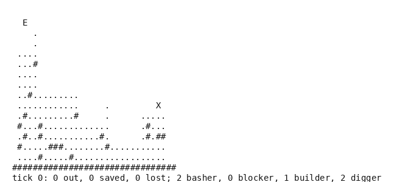

# Lemmings

A Lemmings-like, in pure Python. A crowd of walkers is let into a cave one at a time, walks without
being told, and has to be steered to the exit with a few skills handed out at the right moments.
Enough of them must be saved before the time runs out. The mechanics are the genre's, at the
resolution of a cell rather than a pixel, the levels are this environment's own, and it needs no
dependency.

- **Import:** `from planiverse.environments.games.lemmings.environment import LemmingsEnv`
- **Source:** [`planiverse/environments/games/lemmings/environment.py`](../../planiverse/environments/games/lemmings/environment.py)
- **Instances:** 100 levels, indices `0` to `99`, all drawn by the generator at recorded seeds
- **Generator:** `generate_instance(seed, lemmings=None, quota=None, ...)`; see [Generating levels](#generating-levels)

## Context

The game is the genre's, with the public-domain [Lix](https://www.lixgame.com/) as the reference
for what the skills do; the levels are ours. A level is a cave of thirty-two by sixteen cells of
rock, earth and air, with an entrance above the first platform and an exit on the last. Each tick
every lemming acts on its own. A walker walks, climbs a step of one, turns at a wall of two (i.e.,
a rise of two cells or more) and falls off an edge. A faller dies if it falls too far. A digger
digs down through earth, a basher tunnels forward through it, a builder lays a stair of bricks up
and forward, and a blocker stands and turns the others back. Rock stops every tool. What the player
decides is which walker gets which skill, and when, from the few skills the level hands out.
Between decisions the crowd runs for a fixed number of ticks. What a skill is worth therefore
depends on where everyone will be by then, on the terrain the earlier tools have already changed,
and on the order the lemmings were released in. That is the whole puzzle, and it is what keeps the
environment out of PDDL: a crowd walking a cave is a simulation, not an action model. The cost is
in the timing and the branching. A skill lands on a decision's boundary, eight ticks apart, rather
than on the tick a player would pick. A decision offers every walker out times every kind of skill
still left, plus a wait, so a crowd of eight can offer up to thirty-three moves.

The rules are five. First, a lemming enters at the entrance every `RELEASE` (6) ticks until the
level's crowd is out, facing right, and falls to the ground. Second, each tick a walker steps
forward if the cell ahead is clear, climbs if it is one cell high, turns if it is two or more, and
falls if there is nothing under it. A fall of more than `FATAL_FALL` (6) cells kills, and a walker
on the exit is saved. Third, a digger removes the earth under it, one cell a tick, until it meets
rock or air. A basher removes the earth ahead of it two cells high and walks into the gap, until it
meets rock or air. A builder lays a brick in the cell ahead at its own height and steps up onto it,
so that each brick is one higher than the last. It lays up to `BRICKS` (8) of them, or fewer if
something is in the way. A blocker stands where it is and turns any walker that reaches it, and it
stands for the rest of the level; any other tool used up turns its lemming back into a walker.
Fourth, a decision is `assign(skill, lemming)` for a walker and a skill the level has left, or
`wait`; either way the crowd then runs for `DECISION` (8) ticks. Fifth, the goal is `quota`
lemmings saved. A position is a dead end when the saved, the ones out in the cave other than
blockers and the ones still to enter together cannot reach the quota, or when `MAX_TICKS` (320)
have passed.

## Actions

| Action | Cost | Effect |
|---|---|---|
| `assign(digger, k)` | 1 | walker `k` digs down through earth, one cell a tick, until rock or air |
| `assign(basher, k)` | 1 | walker `k` tunnels forward through earth, two cells high, until rock or air |
| `assign(builder, k)` | 1 | walker `k` lays up to eight bricks, each a step up and forward |
| `assign(blocker, k)` | 1 | walker `k` stands where it is and turns back any walker that reaches it |
| `wait` | 1 | nobody is assigned |

Either way the crowd then runs for eight ticks. `k` indexes the lemmings out in the cave in release
order. A lemming that is saved or lost leaves the list, so the same number names a different
lemming once an earlier one has gone. An assignment the skills or the lemming do not allow (no such
lemming, one that is not walking, or a skill with none left) changes nothing and is not offered as
a successor. `get_actions()` lists the decisions open in a state, one per walker and per skill with
a count left, and `wait`; `LemmingsAction.parse` reads one back from its name, and `WAIT` is the
wait as a constant.

Applying an action sets the chosen lemming's state to the skill and takes one from the level's
stock, then runs the crowd for eight ticks. Each tick a lemming enters if one is due, and then
every lemming acts in release order by the rules above. The terrain the tools have changed, the
crowd, the counts of released, saved and lost, the skills left and the tick advanced by eight are
the next state.

## Planning problem

A `LemmingsState` holds the terrain as a tuple of row strings, every lemming out in the cave as
`(x, y, direction, state, counter)`, the counts released, saved and lost, the skills left and the
tick. Equality and hashing are over all of them, so a position is the same position wherever it was
reached from, and the same cave at two different ticks is two positions. `depth` is bookkeeping and
`quota` is carried for the benchmark's measure. The literals name every earth cell, every lemming
by its index, cell and state, the skills left and the counts. The direction, the counter and the
tick are left out of them, so the width-based planners' novelty tests see a coarser state than
equality does:

```
earth(12, 7)
lemming(2, 9, 5, walker)
basher_left(1)
saved(3)
lost(1)
released(6)
```

With `Q` the quota, `L` the size of the crowd, `T` the tick limit (320) and `out(s)` the lemmings
in the cave of `s` other than blockers, the goal and the dead end are

```
goal(s)     ≡ saved(s) ≥ Q
terminal(s) ≡ ¬goal(s) ∧ (tick(s) ≥ T ∨ saved(s) + out(s) + (L - released(s)) < Q)
```

Both are absorbing (i.e., no action leads out of them): `successors` returns nothing for either and
`__advance__` returns the state unchanged.

The game as played is a real-time loop in which the crowd walks whether or not the player acts. It
is won or lost by the count saved when the time runs out or the last lemming is gone. We turn it
into an initial-to-goal problem in two moves. First, the loop between two decisions (eight ticks of
the crowd) is folded into the action, as described above. A state is therefore always the cave at a
decision's boundary, and the planner never sees a lemming between two cells. Second, the game's win
and loss conditions become the goal test and the dead-end test on that state. The win is the count
saved, checked as soon as it reaches the quota. The loss, which the game would only report at the
end, is decided at once from the lemmings that could still be saved. A position from which the
quota is out of reach is therefore pruned before a skill is tried in it. What the reduction costs
is timing, as with the fluid environment. A skill lands on a decision's boundary rather than on the
tick a player would choose, so a plan here is coarser than a player's. A lemming that reaches an
edge within the eight ticks falls before anything can be done for it. Every action costs 1, so a
plan is judged by its length; the skills are a budget on the assignments in it, not the objective.

The progress measure the width planners take (`planiverse.benchmark.measures.lemmings`) is the
number of lemmings still to save, counting from the level's quota carried on the state.

## An example

Instance `0` is seed 6000: a crowd of seven with a quota of five, and two diggers, two bashers, one
builder and no blocker. The entrance is at (2, 1) over a platform at the top left and the exit at
(28, 9) on a platform at the right, with the origin at the top left:

```
                                
  E                             
    .                           
    .                           
 ....                           
 ...#                           
 ....                           
 ....                           
 ..#.........                   
 ............     .         X   
 .#.........#     .      .....  
 #...#.............      .#...  
 .#..#...........#.      .#.##  
 #.....###........#...........  
 ....#.....#..................  
################################
tick 0: 0 out, 0 saved, 0 lost; 2 basher, 0 blocker, 1 builder, 2 digger
```

Iterated BFWS, run as the benchmark runs it (i.e., with the measure above and a width bound of
1000), solved it in 7,239 expansions and 8.8 seconds. Its fourteen-decision plan is

```
wait, assign(digger,0), assign(basher,2), wait, wait, wait, wait,
assign(digger,0), assign(basher,0), assign(builder,1), wait, wait, wait, wait
```

The first wait is forced, since nobody is out yet. The digger given to lemming 0 changes nothing.
That lemming was turned back by the wall of two at the first platform's right end and is standing
at the platform's left edge. It falls to its death in the next tick, as does the lemming behind it.
The basher opens that wall, and the rest of the crowd walks through it. It goes along the platforms
and down into a pit between a ledge and a wall at columns 13 to 17, where it is trapped. The second
digger sinks a shaft from the pit's floor to the rock, and the second basher tunnels along the rock
to the right edge. The builder then lays its eight bricks from the tunnel up to above the exit's
platform. The five survivors climb the stair and drop onto the exit by tick 112, and two lost is
exactly what a quota of five out of seven allows.



The render is the state's own text, typeset, one frame per state: `render_trace` falls back to
`str(state)` for an environment with no screen to photograph. Here the text is the level, with `#`
for rock, `.` for earth, `E` for the entrance and `X` for the exit, and the lemmings on it. A
walker or faller is `>` or `<` by its direction, and `B`, `D`, `H` and `U` are a blocker, a digger,
a basher and a builder. The tally of released, saved and lost, with the skills left, is under it.
The same plan is also a [contact sheet](../renders/lemmings.png), every frame on one image,
captioned with the step number, the action that produced it, and a note on the goal state. Both
were generated by solving the instance and handing the trace to `render_trace`:

```python
from planiverse.environments.games.lemmings.environment import LemmingsEnv, LemmingsAction, WAIT
from planiverse.benchmark import measures
from planiverse.planners.width import IteratedBFWS

env = LemmingsEnv()
env.set_index(0)
state, info = env.reset()          # info: level, lemmings, quota, skills, generated
print(state)                       # the level above
for action, child in env.successors(state):
    print(action, child.saved, "saved")    # only `wait`, since nobody is out yet

result = IteratedBFWS(max_width=1000, progress=measures.lemmings).solve(env)
trace = env.simulate(result.plan)

env.render_trace(trace, "lemmings.gif")                                   # animated
env.render_trace(trace, "lemmings.png", actions=result.plan, env=env)     # contact sheet
```

Stateful play, as opposed to expansion, goes through `step`, which takes a `LemmingsAction` such as
`LemmingsAction("basher", 2)`, `WAIT` or a name and returns the state and the lemmings saved since
the last one. `env.render()` prints the history of `step` calls and returns it as a list of
strings. See [docs/rendering.md](../rendering.md) for the other output formats.

## Levels

The hundred levels are the generator's own draws, embedded in the module as the plain data
`set_instance` takes with the seed each came from beside it, and the plan each was accepted on is
in `tests/data/lemmings_solutions.json`. A level is thirty-two by sixteen: earth platforms at
different heights over earth and rock, gaps and walls between them, the entrance above the first
and the exit on the last. It has a crowd of five to eight with a quota one to three fewer, and up
to one blocker, two diggers, two bashers and two builders. The plan each level was accepted on runs
from seven to fifteen decisions.

## Generating levels

`generate_instance` draws a level, selects it, and returns it as the dict `set_instance` takes
back:

```python
env = LemmingsEnv()
level = env.generate_instance(seed=7, lemmings=6, quota=4)
print(env.witness, env.witness_expansions)     # the plan it was accepted on, and the search's cost
state, info = env.reset()                       # info["generated"] is True
```

| Option | Default | What it does |
|---|---|---|
| `lemmings` | 5 to 8 at random | the crowd |
| `quota` | 1 to 3 fewer than the crowd | how many must be saved |
| `search_limit` | 400 | expansions the acceptance search may spend per draw |
| `attempts` | 40 | draws before giving up with `GenerationError` |

A draw is kept only if letting the crowd walk unaided saves fewer than the quota. A best-first
search over decisions, guided by the lemmings saved and then by how near the rest are to the exit,
must then find a plan within `search_limit` expansions. The method is generate-and-test, which the
procedural content generation literature calls search-based PCG (Togelius, Yannakakis, Stanley and
Browne, 2011, https://doi.org/10.1109/TCIAIG.2011.2148116; Shaker, Togelius and Nelson, *Procedural
Content Generation in Games*, 2016, https://pcgbook.com/).

## Files

| File | Contents |
|---|---|
| [`environment.py`](../../planiverse/environments/games/lemmings/environment.py) | `LemmingsAction`, `LemmingsState`, the crowd (`run_ticks`), `draw_level`, `LemmingsEnv`, `LEVELS` |
| [`tests/test_lemmings.py`](../../tests/test_lemmings.py) | Tests |
| [`tests/data/lemmings_solutions.json`](../../tests/data/lemmings_solutions.json) | The plan each level was accepted on |
