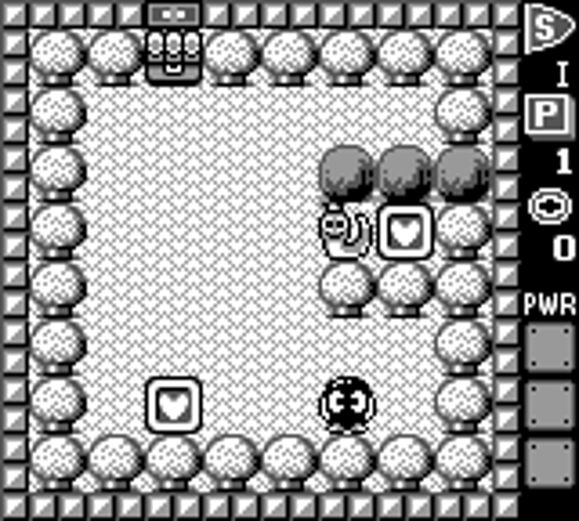

# Adventures of Lolo (Game Boy)

This environment plays Adventures of Lolo on the cartridge. It drives the Game Boy ROM inside
[PyBoy](https://github.com/Baekalfen/PyBoy), so the transition function is HAL's own code rather
than a reconstruction of its rules. States are emulator save-states (i.e., the whole machine
serialised to bytes), so search can branch by rewinding the machine.

The sibling [`lolo.py`](lolo.md) re-implements the same puzzle in Python over the same 163 rooms.
Use that one for a dependency-free benchmark, and this one for the cartridge's actual behaviour,
which for the 137 rooms whose enemies move is the only faithful option.

- **Class:** `LoloGBEnv`
- **Import:** `from planiverse.environments.gameboy.lolo_gb import LoloGBEnv, LoloGBAction`
- **Source:** [`planiverse/environments/gameboy/lolo_gb.py`](../../planiverse/environments/gameboy/lolo_gb.py)
- **Instances:** 163 rooms, indices `0`–`162`
- **Dependencies:** `pyboy` plus an `Adventures of Lolo (U) [S][!].gb` ROM you supply; `pillow`
  for screenshots
- **Memory map:** [`lolo-gb-memory-map.md`](lolo-gb-memory-map.md)

## A solved instance



BFWS's plan for instance `0`: 19 moves, one frame per state. The same plan is also a
[contact sheet](../renders/lolo_gb.png), captioned with the step number, the action that
produced it, and a note on the goal state. A cartridge frame is 640x576, so the sheet is
thinned to twelve frames rather than tiled in full; the captions keep the real step numbers,
so a thinned sheet still says which step is which.

Both were generated by solving the instance and handing the trace to `render_trace`:

```python
import os
from planiverse.environments.gameboy.lolo_gb import LoloGBEnv
from planiverse.benchmark import measures
from planiverse.planners.width import IteratedBFWS

env = LoloGBEnv(romfile=os.environ["PLANIVERSE_LOLO_ROM"])
env.set_index(0)
env.reset()

result = IteratedBFWS(max_width=1000, progress=measures.lolo_gb).solve(env)
trace = env.simulate(result.plan)

env.render_trace(trace, "lolo_gb.gif")                                   # animated
env.render_trace(trace, "lolo_gb.png", actions=result.plan, env=env,     # contact sheet
                 columns=4, max_states=12)
```

`render_trace` supplies this environment's own cartridge, so the frames are real console
screenshots rather than typeset text. See
[docs/rendering.md](../rendering.md) for the other output formats.

## The ROM

The repo ships no ROM, because Adventures of Lolo is HAL Laboratory's and Nintendo's copyrighted
work, so you supply your own legally obtained dump:

```python
env = LoloGBEnv("Adventures of Lolo (U) [S][!].gb")
```

| | |
|---|---|
| File | `Adventures of Lolo (U) [S][!].gb`, 262,144 bytes |
| MD5 | `8f6b6ef366a787852f664d945c86eb72` |
| Internal title | `LOLO2` |
| Cartridge | MBC1, 256 KiB, 16 banks, no cartridge RAM; all state is in work RAM |

The addresses are revision-specific, so the constructor hashes the file and raises a `UserWarning`
when it is not that dump. Pass `verify_rom=False` to silence it.

Or point `PLANIVERSE_LOLO_ROM` at your dump and build it by name:

```python
from planiverse.environments import make
env = make("lolo_gb", index=38)
```

## Quickstart

```python
from planiverse.environments.gameboy.lolo_gb import LoloGBEnv

env = LoloGBEnv("Adventures of Lolo (U) [S][!].gb")   # render=True opens an SDL2 window
env.set_index(38)                                     # choose the room before reset
state, info = env.reset()

print(info)
# {'room_index': 38, 'room': 'int 1-1', 'floor': 0, 'level_in_floor': 0, 'hearts': 6,
#  'shots': 0, 'door': (1, 1), 'start': (6, 1), 'calibration': None}

print(state)
# ##.#####
# #D..H.H#
# #......#
# #......#
# #...H.H#
# #......#
# #@..H.H#
# ########

for action, successor in env.successors(state):
    print(action, action.cost(), successor.hearts_left)
# up_for_20 1 6
# right_for_20 1 6
```

`simulate` replays a plan from a fresh boot and `validate` says whether it clears the room:

```python
plan = ["right,20"] * 5 + ["up,20"] * 2 + ["left,20"] * 2 + ["up,20"] * 3 \
     + ["right,20"] * 2 + ["left,20"] * 5
env.validate(plan)       # True
```

## Rooms

The environment ships 163 rooms at indices `0` to `162`, in the cartridge's own order and at the
same indices [`lolo.py`](lolo.md) uses:

| Indices | `label_for` | What |
|---|---|---|
| 0–37 | `tutorial 1a` … `tutorial 19b` | 19 puzzles, each stored twice: `a` is the demonstration the game plays for itself, `b` is the same room to try |
| 38–107 | `int 1-1` … `int 5-14` | 5 intermediate floors of 14 |
| 108–157 | `adv 1-1` … `adv 10-5` | 10 advanced floors of 5 |
| 158–162 | `pro 1` … `pro 5` | the Pro rooms |

That gives 144 distinct puzzles in 163 slots. `set_index` takes the slot, and `env.rooms()`
decodes all of them straight out of the ROM without booting anything.

## Booting

`reset` boots from power-on every time, which takes a couple of thousand frames: title, START, A
for NEW GAME, twenty-seven taps of A through the King's introduction, **B** at the screen offering
`Push A: ENTRY / Push B: INTERMEDIATE`, then A through the orchestra cutscene until a board is up.

B rather than A at that one screen is load-bearing. A starts the tutorial, where the first room of
every pair is a demonstration the game plays for itself, and a self-playing board answers every
action with a position nobody asked for. Because the screen is reached by counting taps, `reset`
tries the neighbouring counts and checks the result: `is_playing` requires the scene byte to be
`$17`, the graded-room scene, rather than `$14`, the demonstration one.

We choose the room itself by hooking `LoadRoom` and pinning `$C3A6` on the way in. The hook fires
once and then stands down, so clearing a room lets the cartridge advance of its own accord instead
of being pinned into replaying it.

## State

A state carries the emulator save-state plus the board read out of the console.

The board buffer at `$C3BF` should not be confused with the live position: it is the *level*.
`LoadRoom` writes it once and nothing ever writes it again, so collecting a heart, pushing a
Framer and opening the door all leave it exactly as loaded. We read the live position off the BG
tilemap, which is what the game actually redraws, and the actors out of the shadow OAM, where they
are the only place they exist.

Tile numbers are per-environment, because the cartridge ships eight terrain themes, so `reset`
learns the four numbers it needs from the freshly loaded room, while the board buffer and the
tilemap still describe the same thing, and decodes every later frame against that.

A state also carries **which way Lolo faces**, which is not read back off the console but carried
along from the action that set it. The memory map's facing probe
([§5](lolo-gb-memory-map.md#5-rules)) says what sets it: a d-pad press turns Lolo whether or not
the step it asked for happened, and the magic shot goes wherever he is pointing. Nothing on screen
distinguishes a Lolo who has just walked into a rock from one who has not tried — `read_grid`
decodes terrain and `lolo_position` reads coordinates, and neither sees the sprite's facing — so
leaving it out of the state made those two positions compare equal. Search then closed the turn as
a duplicate of the position it came from, and the branch that could have fired that shot was never
looked at, which is why an `exhausted` reported without it was not a proof that a room has no plan.
Walking into a wall to turn is a real move in this game, and several rooms need it.

### The alphabet

A state prints as eight rows of eight, in the alphabet shared with [`lolo.py`](lolo.md):

| | | | |
|---|---|---|---|
| `@` Lolo | `#` rock | `T` tree | `~` river |
| `.` floor | `=` bridge | `,` desert | `*` flower bed |
| `x` break tile | `o` marker | `D` door | `d` open door |
| `O` Emerald Framer | `H` heart framer | `h` heart framer, magic | `e` a live enemy or egg |
| `v` `<` `^` `>` one-way passes | | | |

Two of those are worth pausing on. First, `h` should not be confused with `H`: they draw the same
tile and are indistinguishable on screen, but only `h` gives Lolo a magic shot, two of them. A
room with no `h` in it gives him none, and the enemies in it cannot be moved.

Second, `e` says nothing about which enemy it is. Enemies and eggs are sprites rather than board
cells, so a live enemy prints as `e` whatever kind it is. The static room, which does carry the
kinds, is available without booting anything:

```python
env.rooms()[38]        # ('##.#####', '#D..H.H#', ..., '########')
```

## Actions

The action set holds five actions, spelled `"button,ticks"`, each costing 1:

| Action | What it does |
|---|---|
| `left,20` `up,20` `down,20` `right,20` | one cell |
| `a,6` | the magic shot |

Lolo walks on a half-cell grid, moving 8 pixels per 16 frames of hold, so the hold length is what
decides whether an action is half a cell, one cell or two. 20 frames is one cell, in the middle of
the `(16, 28)` band the cartridge accepts. Pass `calibrate=True` to measure that band again rather
than take it on trust, which costs about eighty presses and reports the result in
`info["calibration"]`.

`HALF_STEP_TICKS` (8) is there for the positions where standing on a half-cell matters. START
opens the pause overlay and B does nothing in a room, so we offer neither.

## Magic shots

The meter starts empty, because it belongs to the player rather than to the room: on a real
playthrough whatever was left over from the room before comes with you. A few rooms need a shot
they cannot earn in-room, `int 1-5` among them, where a Snakey sits in the only gap in a wall of
trees and there is no magic heart framer anywhere. Those rooms cannot be cleared from a cold boot
for that reason, and not because anything is broken.

```python
env = LoloGBEnv(rom, magic_shots=2)     # start every room with two
```

`lolo.py` takes the same argument and means the same thing by it.

## Goal and terminal

- **Goal** (`is_goal`): every heart framer collected and Lolo standing on the door. That is read
  off the screen rather than waited for: the door tile changes the frame the last heart is taken.
  It is checked this way rather than by watching the room number advance, because the room number
  only moves once the between-rooms sequence has run, and a state snapshotted during that sequence
  is not a Lolo position.
- **Terminal** (`is_terminal`): Lolo lost a life.

The cartridge answers a death by restarting the room where Lolo stands, which is not a flag
anywhere in work RAM. `LoloGBAction` recognises it from either side of the transition: the hearts
he had collected come back, or he is suddenly somewhere no single action could have taken him.
Both tests are needed, and the state carries the verdict, because a restarted room is byte-for-
byte the room `reset` handed out. Without the flag, search would walk back into the initial state
by a different route and never notice it had thrown a life away.

## Performance

One action costs a save-state load, a button press and a settle of up to 300 frames, so a full
expansion of a state is five of those. Room 38 expands in about a tenth of a second on a laptop,
and a 100-action plan replays in about a second and a half. Booting dominates anything short, so
`simulate` boots once and then replays.

## Rendering

`str(state)` draws the board in the alphabet given under [The alphabet](#the-alphabet).

```python
state.save("Adventures of Lolo (U) [S][!].gb", "room38.png", scale=4)
```

writes a PNG by booting a throwaway emulator and loading the state. It needs Pillow.

See [docs/rendering.md](../rendering.md) for the other output formats.

## Files

| Path | What |
|---|---|
| [`lolo_gb.py`](../../planiverse/environments/gameboy/lolo_gb.py) | `LoloGBEnv`, `LoloGBAction`, `read_rooms` |
| [`lolo-gb-memory-map.md`](lolo-gb-memory-map.md) | Every address the environment reads |
| [`tests/test_lolo_gb.py`](../../tests/test_lolo_gb.py) | Tests |
