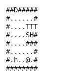

# Adventures of Lolo

This environment implements Adventures of Lolo's puzzle in Python rather than emulating the
cartridge, over the cartridge's own 163 rooms. It needs no ROM, no emulator, and no dependencies.

Lolo walks the four directions, one cell at a time, on an 8 × 8 board. He has to collect every
heart framer (i.e., the collectible hearts that open the door), and then stand on the open door.

We measured every rule below on the cartridge rather than taking it from a manual; the probes are
in the [memory map](lolo-gb-memory-map.md) §5.

- **Class:** `LoloGame`
- **Import:** `from planiverse.environments.gameboy_py.lolo import LoloGame, LoloAction`
- **Source:** [`planiverse/environments/gameboy_py/lolo.py`](../../planiverse/environments/gameboy_py/lolo.py)
- **Instances:** 163 rooms, indices `0`–`162`
- **Dependencies:** none
- **Sibling:** [`LoloGBEnv`](lolo-gb.md) drives the real Game Boy cartridge

## A solved instance



BFWS's plan for instance `0`: 19 moves, one frame per state. The same plan is also a
[contact sheet](../renders/lolo.png), every frame on one image, captioned with the step
number, the action that produced it, and a note on the goal state.

Both were generated by solving the instance and handing the trace to `render_trace`:

```python
from planiverse.environments.gameboy_py.lolo import LoloGame
from planiverse.benchmark import measures
from planiverse.planners.width import IteratedBFWS

env = LoloGame()
env.set_index(0)
env.reset()

result = IteratedBFWS(max_width=1000, progress=measures.lolo).solve(env)
trace = env.simulate(result.plan)

env.render_trace(trace, "lolo.gif")                                   # animated
env.render_trace(trace, "lolo.png", actions=result.plan, env=env)     # contact sheet
```

Frames are the state's own text, typeset: `render_trace` falls back to `str(state)` for
an environment with no screen to photograph. See
[docs/rendering.md](../rendering.md) for the other output formats.

## The rules

1. A step into a **rock** `#`, a **tree** `T`, a **river** `~` or the edge is refused.
2. A step into a **one-way pass** `v` `<` `^` `>` is refused if it goes against the arrow, and
   allowed from the other three sides.
3. A step into an **Emerald Framer** `O` or an **egg** `e` pushes it one cell the same way, if the
   cell behind is empty walkable ground. Nothing can be pulled and no chain of two can be pushed.
   A river refuses both, unless the environment is built with `rafts=True`, which floats an egg
   into a raft Lolo may stand on and which drifts away once he steps off it.
4. A step onto a **heart framer** collects it. `h`, the second of the cartridge's two heart codes,
   also gives Lolo two magic shots; plain `H` gives none.
5. A step into an **enemy** is refused. Enemies never move.
6. **`shoot`** fires one cell in the direction Lolo last tried to move, whether or not that move
   succeeded. An enemy there becomes an egg, which can then be pushed; an egg there is blasted out
   of the room. Each shot costs one.
7. A **Medusa** `M` kills Lolo when he stands anywhere in its row or column, unless a tree, an
   Emerald Framer, a heart framer, an enemy or an egg stands between them. Rocks, rivers, bridges,
   deserts, flower beds, one-way passes and break tiles do not block a Medusa.
8. The **door** `D` opens once every heart framer is collected. Standing on the open door clears
   the room.

### Where this differs from the cartridge

**Six of the eight enemies are frozen here.** Snakey and Medusa never move on the cartridge
either, so rooms holding only those two are modelled exactly. The other six (Leeper, Rocky, Alma,
Gol, Skull and Don Medusa) do move there, in lock-step with Lolo, and this module leaves them
where they started. For a room that contains one, a plan found here is a plan against a strictly
easier puzzle and may well die on the cartridge, which is the wrong direction for an approximation
to err in, so we flag it rather than smooth it over:

```python
from planiverse.environments.gameboy_py.lolo import EXACT_ROOMS
len(EXACT_ROOMS)      # 26

state, info = game.reset()
info["exact"]                  # True when the model is faithful for this room
info["unmodelled_enemies"]     # ('K', 'R'), the kinds that would have moved
```

**Rafts are off by default.** On the cartridge an egg shoved into a river floats, and Lolo can step
onto it and ride across, which is how `int 1-3` is cleared. `LoloGame(rafts=True)` models that: the
egg becomes a raft, Lolo may stand on it, and it drifts away behind him, so it is a bridge that
works once. It needs no notion of time, because the rooms that want a raft want it to cross a river
one cell wide by stepping straight over. With the flag on, BFWS finds the cartridge's own
twelve-action plan for `int 1-3`, action for action:

```python
game = LoloGame(rafts=True)
game.set_index(40)                     # int 1-3
# right right up shoot up up up left left up up up
```

It is off by default because of a room it gets wrong. The cartridge floats an egg on five of its six
river codes and refuses it on `$82`, and two of the five then carry the raft away on a current. The
rooms here spell all six `~`, because `lolo_gb.decode_room` maps `$82`–`$87` onto one glyph, so this
module cannot tell which river it is looking at: it floats an egg on every one of them and holds
every raft still. On `int 1-3` that lands exactly on the cartridge's answer. On `tutorial 14a` it
does not — that river is `$83`, it drifts, and the memory map [§6](lolo-gb-memory-map.md#6-rafts)
records that it cannot be crossed by stepping straight over, which is what a still raft would have
Lolo do. One right and one wrong is not a rule, so the default keeps the rule this module can hold,
and a plan found with `rafts=True` has to be replayed on [`lolo_gb`](lolo-gb.md) before it is
believed.

Five rooms that are otherwise proved unsolvable here get a plan with the flag on: `tutorial 14a`
(known wrong, above), `int 1-3` (matches the cartridge), and `int 4-8`, `int 5-4` and `adv 3-1`,
which have not been replayed on hardware.

**The hammer is not modelled.** A few rooms start with one in the cartridge's PWR meter, `int 1-5`
among them, and we have not established what it breaks.

Two smaller divergences run in the safe direction. Medusa's shot is instant here where the
cartridge gives one move of grace, but that move cannot be used to escape, so no plan is lost. An
Emerald Framer is not pushed onto a heart framer, a door or a marker, which we never tested and
refuse rather than guess.

**A marker may block a Medusa, and here it does not.** The probe that established what stops a
Medusa's line (memory map §5) tried a tree, a Framer, a heart framer, an enemy, a rock, a river, a
bridge, a desert, a flower bed, a one-way pass and a break tile. It never tried a **marker**, the
`$97`-`$9C` codes whose meaning is unresolved, and this module treats one as transparent. That is
the only assumption that separates this module's verdict on `tutorial 13a` from the cartridge's:
the cartridge clears that room by walking column 0 underneath a marker at `(3, 0)` that would
otherwise be a Medusa's clear line, and adding the marker to the shield set is the one change that
makes BFWS clear it here too. Until somebody probes it, `tutorial 13a` is an open question rather
than a room with no plan.

We measured what these approximations cost. Breadth-first search over this module found a plan for
32 of the 163 rooms, and we replayed every one of those plans on the real cartridge:

| | plans found | cleared the room on the cartridge |
|---|---|---|
| rooms in `EXACT_ROOMS` | 7 | 7 |
| rooms whose enemies this module freezes | 25 | 3 |

Where the model is faithful it is faithful, and where it is an approximation the approximation
errs in the easy direction: the twenty-two failures are all Lolo walking into an enemy that was
not standing still.

## Quickstart

```python
from planiverse.environments.gameboy_py.lolo import LoloGame

game = LoloGame()
game.set_index(38)                    # int 1-1
state, info = game.reset()

print(info)
# {'room_index': 38, 'room': 'int 1-1', 'hearts': 6, 'shots': 0, 'door': (1, 1),
#  'start': (6, 1), 'exact': True, 'unmodelled_enemies': (), 'rafts': False}

print(state)
# ##.#####
# #D..H.H#
# #......#
# #......#
# #...H.H#
# #......#
# #@..H.H#
# ########

for action, successor in game.successors(state):
    print(action, successor.lolo, successor.hearts_left)
```

Or by name:

```python
from planiverse.environments import make
game = make("lolo", index=38)
```

## Rooms

The environment ships 163 rooms at indices `0` to `162`, at the same indices
[`lolo_gb`](lolo-gb.md) uses, so `set_index(38)` selects the same room in both. They are decoded
out of the ROM by `lolo_gb.read_rooms` rather than transcribed by hand.

| Indices | `label` | What |
|---|---|---|
| 0–37 | `tutorial 1a` … `tutorial 19b` | 19 puzzles, each stored twice |
| 38–107 | `int 1-1` … `int 5-14` | 5 intermediate floors of 14 |
| 108–157 | `adv 1-1` … `adv 10-5` | 10 advanced floors of 5 |
| 158–162 | `pro 1` … `pro 5` | the Pro rooms |

Print any of them:

```console
$ python -m planiverse.environments.gameboy_py.lolo --room 0
---   0 tutorial 1a  2 hearts
  |##D#####|
  |#......#|
  |#....TTT|
  |#....SH#|
  |#....###|
  |#......#|
  |#.h..@.#|
  |########|
```

## Magic shots

The meter starts empty, as the cartridge does on a cold boot, because the meter belongs to the
player rather than to the room. A few rooms need a shot they cannot earn in-room, and cannot be
cleared from a cold boot for that reason:

```python
game = LoloGame(magic_shots=2)
```

`LoloGBEnv` takes the same argument and means the same thing by it.

## State

A state carries Lolo's position, his facing, the board, the hearts still to collect and the shots
left. Equality is over the position rather than over depth or history, so a position reached two
ways compares equal and search can close it.

## Actions

The action set holds five actions, `left`, `up`, `down`, `right` and `shoot`, each costing 1.

Note that a refused move is still a successor when it leaves Lolo facing somewhere new, because
the facing is what decides where the next shot goes. Walking into a rock to turn is a real move in
this game.

## Goal and terminal

- **Goal** (`is_goal`): every heart framer collected and Lolo standing on the door.
- **Terminal** (`is_terminal`): Lolo in a Medusa's clear line. Absorbing.

## Rendering

`str(state)` draws the board in the glyphs listed under [The rules](#the-rules).

See [docs/rendering.md](../rendering.md) for the other output formats.

## Files

| Path | What |
|---|---|
| [`lolo.py`](../../planiverse/environments/gameboy_py/lolo.py) | `LoloGame`, `LoloAction`, `EXACT_ROOMS` |
| [`tests/test_lolo.py`](../../tests/test_lolo.py) | Tests |
