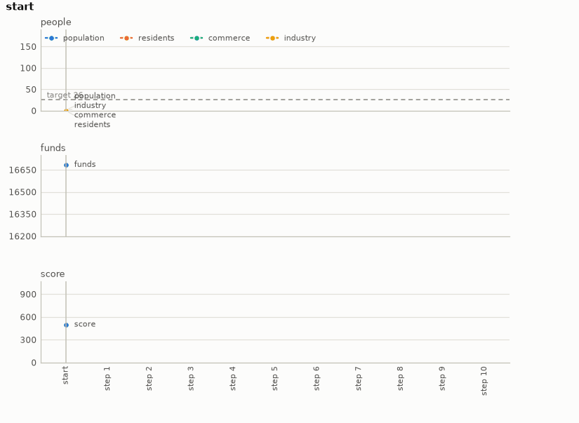

# Micropolis city

A city on the Micropolis engine. A map is generated from a seed, and a power plant, a road and
the wires are laid out on the first flat patch of it, with eight sites beside the road. Once a
year the player zones one site residential, commercial or industrial, or waits. The goal is a
population when the horizon comes, and which mix of zones in which order gets there is only
known by running the years.

- **Import:** `from planiverse.environments.micropolis.environment import MicropolisEnv`
- **Source:** [`planiverse/environments/micropolis/environment.py`](../../planiverse/environments/micropolis/environment.py)
- **Instances:** 100 cities, indices `0` to `99`, all drawn by the generator at recorded seeds
- **Generator:** `generate_instance(seed, years=None, slack=0.15, ...)`; see [Generating cities](#generating-cities)
- **Dependency:** `micropolisengine`, built by [`scripts/build_micropolis.sh`](../../scripts/build_micropolis.sh)

## Context

The game here is the one the engine plays. A map is generated from a seed, a small city is laid
out on it, and once a year the player zones one of its eight sites residential, commercial or
industrial, or waits. The engine then simulates the year: demand, traffic, power, land value,
pollution, growth and decline, all of it coupled and none of it written down as an action
model. What makes it hard is that a year's readings say little about where the city is going.
A zone fills over years rather than at once, the kinds of zone feed one another, and the order
in which they are placed changes what the city has become when the horizon comes. That is
what keeps the environment out of PDDL. It is the closest of the games to the operational
environments: a decision a year against a simulated economy, as the crop environment decides a
season against a simulated crop.

Micropolis is the GPL-3.0 release of the original SimCity's simulation by Electronic Arts
(2008). Its C++ engine, [MicropolisCore](https://github.com/SimHacker/micropolis), comes with a
SWIG binding that this environment drives headless (i.e., without the game's interface, tick
by tick from Python). Nothing of it is included here: the binding has to be built from source,
as set out below, and the licence's additional terms and the trademark attribution are in
[THIRD-PARTY-NOTICES.md](../../THIRD-PARTY-NOTICES.md). Micropolis is a registered trademark
of Micropolis Corporation (Micropolis GmbH) and is licensed here as a courtesy of the owner
(https://micropolis.com/). What the engine buys is the whole of SimCity's economy for the price
of a zone a year; what it costs is a build step, since the binding is not on PyPI.

The engine is built by a script:

```console
$ pip install swig                       # a swig binary, if the system has none
$ bash scripts/build_micropolis.sh       # git, a C++ compiler and the Python headers
```

The script fetches MicropolisCore, replaces two Python 2 names in its SWIG callback hook, and
makes the engine's `seedRandom` reachable from Python. That last step matters because the
engine reseeds from the clock after generating a map, and the environment pins the seed
instead. The script then builds the extension and copies `micropolisengine` into the running
Python's site-packages. A city year is eight hundred engine
ticks and takes a few milliseconds.

The rules are three. First, the map is the engine's own for the instance's seed. The layout is
a coal plant, a road between two rows of four sites and wires round them, on the first flat
patch of twenty by nine tiles the map has. Second, a year is one decision: zone a free site
residential, commercial or industrial, or wait, and then eight hundred ticks of the engine.
Third, the goal is the instance's population target at the horizon. A city short of it when the
horizon comes is a dead end; nothing before the horizon is a goal, since the target is measured
at the end. Funds start at the engine's default and are not a constraint at this scale; the
population is the engine's `totalPop`.

## Actions

| Action | Cost | Offered when | Effect |
|---|---|---|---|
| `zone(R,site)`, `zone(C,site)`, `zone(I,site)` | 1 | `site` (`0` to `7`) is free | the site is zoned residential, commercial or industrial, and a year passes |
| `wait` | 1 | always | a year passes |

`get_actions()` lists the three kinds for every free site and `wait`: twenty-five actions in the
empty city, three fewer for every site taken. A zone on a taken site, or on a site that does
not exist, changes nothing, and `successors` drops any child equal to its parent, so such a
move is not offered. A goal or dead-end state has no successors at all. `MicropolisAction.parse`
reads an action back from its name. Applying an action does not advance a running engine.
The engine reseeds its random numbers from the clock once it has generated a map, so the
environment pins the seed straight after and treats a state as its decisions. To expand one it
builds a fresh engine, generates the map from the instance's seed, pins the random seed, lays
the city out, and replays every decision so far, eight hundred ticks after each. This is what
makes the same decisions always give the same city, and it is paid for in time, though not
much of it: a ten-year replay was measured here at about fifteen milliseconds.

## Planning problem

A `MicropolisState` holds the decisions taken so far, one a year, and the readings the engine
gives after them: population, residents, commerce, industry, funds and score. Two states are the
same state when their decisions are the same, because the engine replays deterministically
from the seed, so the decisions determine every reading. `depth` is bookkeeping and `target` is
carried for the benchmark's measure. The literals name the zones placed and the year exactly,
and the population and the funds in bands (fives for the population, thousands for the funds).
The bands are what the width-based planners' novelty tests see:

```
zoned(R, 0)
zoned(I, 4)
year(3)
population(15)
funds(16000)
```

With `Y` the horizon in years and `P` the population target, the goal and the dead end are

```
goal(s)     ≡ year(s) = Y ∧ population(s) ≥ P
terminal(s) ≡ year(s) = Y ∧ population(s) < P
```

Note that the problem as a mayor would state it is a trajectory problem (i.e., one whose
requirement is a property of the whole run): grow the city over the horizon. We turn it into
the goal above with the reduction the epidemic, traffic, airspace and reservoir environments
share, which [NOTES.md](../../NOTES.md) sets out in full, in three moves, of which this
environment needs the lightest form. First, a constraint that must hold throughout becomes a
dead end. Here the only constraint is the horizon itself, so the only dead end is a city short
of its target when the horizon comes, and nothing earlier is one. Second, a quantity that
accumulates becomes part of the state and is bounded at the goal. Here the quantity is the
population, which the engine accumulates for us and the state reads back. The bound is a
floor rather than a ceiling: a target to reach rather than a budget to keep under. Third, the
horizon becomes time in the state: the year is a state variable, so "when the horizon comes" is
a condition on a state rather than on a trajectory. The cost of the reduction is that the goal
depends on a target, and a target has to come from somewhere. Here it is fifteen per cent
above the best of three thoughtless zoning plans, and the draw is kept only if a search finds
a plan that meets it (see [Generating cities](#generating-cities)). Every instance is thus
solvable by construction, and the planner is asked to beat the plans that need no thought by a
margin.

The progress measure the width planners take (`planiverse.benchmark.measures.micropolis`) is
the population still short of the target.

## An example

Instance `0` is the generator's draw at seed 7000: a map from the engine's seed 692463416 with
the layout at tile (61, 22), a horizon of 10 years and a target of 26. The three thoughtless
plans reach 22, 8 and 19 on it, which is where the target comes from. The bare layout reads a
population of 1, funds of 16,685 after the plant, the road and the wires, and a score of 500.
Iterated BFWS, run as the benchmark runs it (i.e., with the measure above and a width bound of
1000), solved it in 61 expansions and 6.6 seconds. Its ten-year plan is

```
zone(I,0), zone(I,1), zone(R,5), zone(R,6), zone(R,2), zone(R,7), zone(R,3), wait, wait,
zone(I,4)
```

which zones two industrial sites first, then five residential ones, waits two years for them to
fill, and adds a third industrial site in the last year. It ends the horizon with a population
of 27 (residents 144, commerce 0, industry 9), funds of 16,533 and a score of 297. Note that
this clears the target by one, which is all the goal asks. The plan the city was accepted on,
which zones three commercial sites among four residential and one industrial, reaches 32.



The render draws the readings of each state over the plan rather than the state's text, since a
state here is a handful of numbers. The panels are the population and its parts against the
target, the funds, and the score, year by year. A frame of the GIF is the chart up to its state,
so the animation grows a step at a time. The same plan is also a
[sheet](../renders/micropolis_chart.png), the whole plan on one figure. There the action that
produced each state runs along the bottom, the target is a dashed line, and the goal is marked
where the plan ends. Both were generated by solving the instance and handing the trace to
`render_trace`:

```python
from planiverse.environments.micropolis.environment import MicropolisEnv
from planiverse.benchmark import measures
from planiverse.planners.width import IteratedBFWS

env = MicropolisEnv()
env.set_index(0)
state, info = env.reset()          # info: city, years, target, sites, generated
print(state)                       # year 0: population 1 (residents 0, commerce 0, industry 0), funds 16685, score 500; nothing zoned

result = IteratedBFWS(max_width=1000, progress=measures.micropolis).solve(env)
trace = env.simulate(result.plan)

env.render_trace(trace, "micropolis_chart.gif")                                   # animated
env.render_trace(trace, "micropolis_chart.png", actions=result.plan, env=env)     # the sheet
```

Stateful play, as opposed to expansion, goes through `step`, which takes a `MicropolisAction`
(or `WAIT`, or a name such as `"zone(R,0)"`) and returns the state and the population gained
in the year. `successors(state)` returns the action and state pairs for the decisions open in
the state, and `env.render()` prints the history of `step` calls and returns it as a list of
strings. The readings each environment charts, and the panels they go on, are in
[`planiverse/rendering/readings.py`](../../planiverse/rendering/readings.py); `charts=False`
asks `render_trace` for the state's text instead, and [docs/rendering.md](../rendering.md)
covers the other output formats.

## Cities

The hundred cities are the generator's own draws, embedded in the module as the plain data
`set_instance` takes (`seed`, `origin`, `years`, `target`) with the seed each came from beside
it. The plan each was accepted on is in `tests/data/micropolis_solutions.json`. A city's
horizon is ten, fifteen or twenty years. Its target sits fifteen per cent above the best
population that three thoughtless zoning plans reach on it: all residential, residential and
industrial by turns, and a fixed mix.

## Generating cities

`generate_instance` draws a city, selects it, and returns it as the dict `set_instance` takes
back:

```python
env = MicropolisEnv()
city = env.generate_instance(seed=7, years=10)
print(env.witness, env.witness_expansions)     # the plan it was accepted on, and the search's cost
state, info = env.reset()                       # info["generated"] is True
```

| Option | Default | What it does |
|---|---|---|
| `years` | 10, 15 or 20 at random | the horizon |
| `slack` | 0.15 | the target's margin over the best baseline |
| `search_limit` | 40 | expansions the acceptance search may spend per draw |
| `attempts` | 80 | maps drawn before giving up with `GenerationError`; most maps have no flat patch and cost nothing |

A draw is kept only if a best-first search over decisions meets the target within
`search_limit` expansions. The search is guided by the population the city would have at the
horizon if nothing more were zoned (a rollout, since a year's readings say little about where
the city is going). The method is generate-and-test, which the procedural content generation
literature calls search-based PCG (Togelius, Yannakakis, Stanley and Browne, 2011,
https://doi.org/10.1109/TCIAIG.2011.2148116; Shaker, Togelius and Nelson, *Procedural Content
Generation in Games*, 2016, https://pcgbook.com/). The target is set the way the flood
environment sets its own, off a reference policy. The same seed and options always give the
same city.

## Files

| File | Contents |
|---|---|
| [`environment.py`](../../planiverse/environments/micropolis/environment.py) | `MicropolisAction`, `MicropolisState`, the engine (`find_patch`, `lay_out`, `replay`), `BASELINES`, `MicropolisEnv`, `CITIES` |
| [`scripts/build_micropolis.sh`](../../scripts/build_micropolis.sh) | Builds and installs the engine's Python binding |
| [`tests/test_micropolis.py`](../../tests/test_micropolis.py) | Tests |
| [`tests/data/micropolis_solutions.json`](../../tests/data/micropolis_solutions.json) | The plan each city was accepted on |
