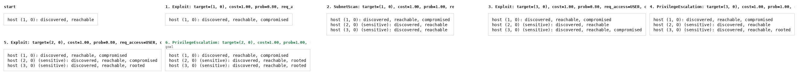

# Network attack

Penetration testing as a planning problem, on NASim. The attacker starts outside a segmented
network and must compromise every sensitive host by scanning, exploiting services and escalating
privileges. We wrap [NASim](https://github.com/MFaisalZaki/NetworkAttackSimulator) and make it
deterministic, so a planner can reason about it rather than sample it.

- **Class:** `EnvNASim`
- **Import:** `from planiverse.environments.network_attack.network_attack import EnvNASim`
- **Source:** [`network_attack.py`](../../planiverse/environments/network_attack/network_attack.py)
- **Instances:** 100 scenarios, indices `0` to `99`: NASim's 18 benchmarks, then 82 networks its generator drew
- **Generator:** `generate_instance(seed, hosts=5, services=3, **options)`; see [Generating networks](#generating-networks)
- **Dependencies:** `nasim`, the `MFaisalZaki/NetworkAttackSimulator` fork pinned in
  `pyproject.toml`. Upstream `nasim` will not work: `generative_step` and the patched internals
  (`_perform_wiretapping`, `has_required_remote_permission`) come from the fork.

## Context

The game here is the one a penetration tester plays. A network is a set of subnets behind
firewalls, each holding hosts that run an operating system, some services and some processes, and
a few of the hosts are sensitive (i.e., the ones whose root access is the attacker's goal). The
attacker begins with the hosts the internet can reach discovered and reachable, and nothing else
known, and works inward. A scan reveals what a host runs, and an exploit against a service the
firewalls let through gains user access on it. A privilege escalation through a process it runs
raises that access to root, and every host compromised opens the subnets connected to its own.
What the attacker decides is the route. A subnet may pass no traffic to its neighbour, and a
host's own firewall may deny a service from one address while allowing it from another. A
sensitive host is therefore often reachable only from the far side of another host, and the order
in which the hosts are taken is the whole problem. The network is won when every sensitive host is
owned at root.

The network and its actions are NASim's. NASim (MIT; Jonathon Schwartz's Network Attack Simulator,
https://github.com/Jjschwartz/NetworkAttackSimulator, documented at
https://networkattacksimulator.readthedocs.io/) is a simulated network built as a
reinforcement-learning environment for penetration testing. The dependency here is the
`MFaisalZaki/NetworkAttackSimulator` fork, which adds credentials and vulnerabilities after Becker
et al. (https://arxiv.org/abs/2407.15656) and carries the patched internals this module needs;
related upstream work is [PenGym](https://github.com/cyb3rlab/PenGym). We use NASim rather than
write an attack model of our own because its eighteen benchmark scenarios and its scenario
generator are what an instance here is drawn from. A network here is therefore the same thing a
NASim agent is trained on. The cost is that NASim is a stochastic environment, in which an exploit
succeeds with probability `action.prob`, and a deterministic search needs that roll removed. How
we remove it, and what the patch does to the rest of the process, is under
[Determinism](#determinism).

The rules are four. First, an action targets one host and is applied only if that host is
discovered and reachable and the attacker holds, on some compromised host, the access the action
requires (a host on the public subnet is always within reach). An exploit further needs the subnet
and host firewalls to permit its service, and a privilege escalation needs its host compromised.
Otherwise the state is unchanged. Second, a scan reveals one thing about its target (its services,
its operating system, its processes, its vulnerabilities or the credentials to be found on it),
and a subnet scan from a compromised host discovers every host in the subnets connected to that
host's. Third, an exploit against a service the host runs, on the operating system it targets and
with the vulnerability and credentials it needs, compromises the host at the exploit's access
level. It also makes every host in a subnet connected to that host's reachable. A privilege
escalation through a process the host runs raises a compromised host's access to the escalation's
level. Fourth, the network is won when every sensitive host is owned at root, and it is never
lost. NASim ends an episode only at the goal or at its step limit, and this environment declares
no dead end.

## Actions

The action set is NASim's own `env.action_space.actions`, which enumerates every ground action for
the scenario. For every host there is one of each scan and one of each exploit and privilege
escalation the scenario defines, so `tiny` has 24. The kinds are eight, each with the cost the
scenario gives it:

| Action | Cost | Effect |
|---|---|---|
| `ServiceScan` | `service_scan_cost` | reveal the services the host runs |
| `OSScan` | `os_scan_cost` | reveal the host's operating system |
| `ProcessScan` | `process_scan_cost` | reveal the processes a compromised host runs |
| `VulScan` | `vul_scan_cost` | reveal the host's vulnerabilities |
| `Wiretapping` | `wiretapping_cost` | reveal the credentials to be found on the host |
| `SubnetScan` | `subnet_scan_cost` | discover every host in the subnets connected to a compromised host's |
| `Exploit` | the exploit's `cost` | compromise the host through a service, at the exploit's access level, subject to the firewalls |
| `PrivilegeEscalation` | the escalation's `cost` | raise a compromised host's access through a process it runs |

Note that the planner does not read these costs. NASim keeps `cost` as a number rather than a
method, so a result's `cost` falls back to the plan's length, and a plan is judged by its number
of actions. `successors` applies each action through `env.generative_step(state, action)` and
drops any action that leaves the state unchanged, so a failed precondition produces no successor.
Nor does any scan but the subnet scan. The state is the network's true state, and a scan of a
host's services, operating system, processes, vulnerabilities or credentials changes only what an
agent observes. Those five kinds are therefore never offered, and a plan is made of subnet scans,
exploits and escalations. That is what keeps the branching factor manageable, since only actions
that accomplish something are offered. Applying an action runs one NASim step against a copy of
the state. That is the checks of the first rule, the target host's update and, after a successful
exploit, the marking as reachable of every host in a subnet connected to the new foothold's.

## Planning problem

`NASimState` subclasses NASim's `State`, keeping its `tensor` (one row per host, holding the
host's discovery, reachability and compromise flags, its access level, its operating system, its
services and its processes) and its `host_num_map`, and adds literals. Two states are the same
state when their tensors are equal, which is NASim's own definition. The literals are:

| Literal | Meaning |
|---|---|
| `at(x,y,val)` | Cell `(x, y)` of the state tensor holds `val`; one per cell |
| `compromised_host_N` | Sensitive host `N` is owned at `AccessLevel.ROOT` |

The `at(...)` literals are a direct, lossless transcription of the NASim tensor, with one literal
per cell (54 of them for `tiny`), covering every host's discovery, reachability and compromise
flags, OS, services and processes. Nothing is abstracted away, which makes the literal set large
but exact, so a planner's visited set is precise. The `compromised_host_N` literals are the
goal-relevant summary layered on top. With `S` the scenario's sensitive hosts and `access(s, h)`
the attacker's access on host `h`, the goal and the dead end are

```
goal(s)     ≡ ∀h ∈ S. access(s, h) = ROOT
terminal(s) ≡ false
```

`is_goal` asks `env.network.all_sensitive_hosts_compromised(state)`. `is_terminal` is always
`False`, and the source comment flags this as a known gap: stuck states exist in this environment
but are not detected, so a planner must bound its own search.

NASim as played is an episode. An agent takes an action, receives an observation of what it
revealed and a reward of the value gained less the action's cost, and the episode ends at the goal
or at the step limit. We turn it into an initial-to-goal problem in two moves. First, the step
between two decisions is folded into the action: `generative_step` runs NASim's transition on the
state itself rather than through the agent's observation. The planner therefore sees the network's
true state, every host's services and operating system included, whether or not a scan has
revealed them. Second, the game's win condition becomes the goal test, every sensitive host at
root; NASim has no losing condition to become a dead-end test, and the gap above is what stands in
its place. What the reduction gives up is the reward and the partial observability. NASim scores
an attack by the value of the hosts it roots less the cost of its actions, and asks an agent to
act on what it has observed. Here every action counts one and a plan is judged by its length, and
a planner that reads the full state never needs a service or an OS scan.

The progress measure the width planners take (`planiverse.benchmark.measures.network_attack`) is
minus the number of sensitive hosts already rooted, so it falls as the attack advances.

## An example

Instance `0` is `tiny`: three hosts, one in each of three subnets behind the internet, all running
one operating system (`linux`), one service (`ssh`) and one process (`tomcat`). The scenario has
one exploit (`e_ssh`, user access at probability 0.8 and cost 1) and one privilege escalation
(`pe_tomcat`, root at cost 1). Hosts `(2, 0)` and `(3, 0)` are sensitive, at a value of 100 each,
and `(1, 0)` sits on the public subnet, so it starts discovered and reachable while the other two
are unknown. The firewalls are the puzzle. The internet reaches subnet 1 over `ssh`, subnet 1
passes nothing to subnet 2, and subnets 1 and 3 and subnets 2 and 3 pass `ssh` both ways. Host
`(2, 0)`'s own firewall denies `ssh` from `(1, 0)`, and `(1, 0)` denies it from `(3, 0)`. The
action space holds 24 ground actions, eight per host, and the initial state's text is one line:

```
host (1, 0): discovered, reachable
```

Iterated BFWS, run as the benchmark runs it (i.e., with the measure above and a width bound of
1000), solved it in 8 expansions and under a tenth of a second. Its six-action plan is

```
Exploit: target=(1, 0), service=ssh
SubnetScan: target=(1, 0)
Exploit: target=(3, 0), service=ssh
PrivilegeEscalation: target=(3, 0), process=tomcat
Exploit: target=(2, 0), service=ssh
PrivilegeEscalation: target=(2, 0), process=tomcat
```

(abbreviated: `str(action)` also carries each action's cost, probability, required access and
operating system), which takes `(1, 0)` as the foothold, scans from it to discover the two
sensitive hosts, and roots `(3, 0)` before `(2, 0)`. The order is forced, because `(2, 0)` accepts
`ssh` from subnet 3 but not from `(1, 0)`, so it can only be exploited once `(3, 0)` is
compromised. It is the optimal path the scenario file itself notes, and the final state reads

```
host (1, 0): discovered, reachable, compromised
host (2, 0) (sensitive): discovered, reachable, rooted
host (3, 0) (sensitive): discovered, reachable, rooted
```



The render is a contact sheet of the whole plan, since a state here is a few lines of text and six
frames fit on one image; there is no animated GIF for this environment. Each frame is the state's
own text, which lists the hosts discovered so far and says of each whether it is reachable,
compromised or rooted. The frames therefore show the attack advancing host by host, and the
captions carry the actions and mark the goal. It was generated by solving the instance and handing
the trace to `render_trace`:

```python
from planiverse.environments.network_attack.network_attack import EnvNASim
from planiverse.benchmark import measures
from planiverse.planners.width import IteratedBFWS

env = EnvNASim()
env.set_index(0)                   # 'tiny'
state, info = env.reset()          # info: instance, scenario, generated
print(state)                       # host (1, 0): discovered, reachable

result = IteratedBFWS(max_width=1000, progress=measures.network_attack).solve(env)
trace = env.simulate(result.plan)
env.render_trace(trace, "network_attack.png", actions=result.plan, env=env)
```

There is no stateful `step` here and no static action list: expansion goes through
`successors(state)`, which needs `reset()` first, and `simulate(plan)` replays a plan from a fresh
reset and returns the trace. A scenario can also be named directly instead of selected by index,
or a scenario file of your own loaded through `nasim.load`:

```python
env = EnvNASim(scenario_name="small-honeypot")
state, _ = env.reset()

env = EnvNASim(scenario_yaml="/path/to/scenario.yaml")
state, _ = env.reset()
```

See [docs/rendering.md](../rendering.md) for the other output formats.

## Scenarios

`set_index(i)` maps to NASim's benchmark scenarios, loaded via `nasim.make_benchmark(name)` with
`seed=0`:

| Index | Scenario | | Index | Scenario |
|---|---|---|---|---|
| 0 | `tiny` | | 9 | `tiny-gen` |
| 1 | `tiny-hard` | | 10 | `tiny-gen-rgoal` |
| 2 | `tiny-small` | | 11 | `small-gen` |
| 3 | `small` | | 12 | `small-gen-rgoal` |
| 4 | `small-honeypot` | | 13 | `medium-gen` |
| 5 | `small-linear` | | 14 | `large-gen` |
| 6 | `medium` | | 15 | `huge-gen` |
| 7 | `medium-single-site` | | 16 | `pocp-1-gen` |
| 8 | `medium-multi-site` | | 17 | `pocp-2-gen` |

The `-gen` scenarios are procedurally generated, and the rest are hand-authored. The seed is what
makes a `-gen` scenario a problem rather than a draw. NASim generates those networks on demand, so
an unseeded `make_benchmark` hands out a different topology, service layout and OS layout on every
call. Search would then run on one network while `simulate` replayed the plan against another.
`reset()` raises unless an instance has been selected with `set_index`, `set_instance` or
`generate_instance`, or named in the constructor.

Indices `18` to `99` are networks NASim's own generator drew (`GENERATED`), from five hosts and
three services up to sixteen and five. Each has its seed recorded, so NASim rebuilds the same
network, and the depth the check solved it at.

## Generating networks

`generate_instance` hands the drawing to NASim's own scenario generator, selects the result, and
returns it as a dict that `set_instance` accepts back:

```python
env = EnvNASim()
network = env.generate_instance(seed=7, hosts=8, services=4, num_os=3)
# {'hosts': 8, 'services': 4, 'seed': 7, 'num_os': 3}
state, info = env.reset()
```

`hosts` and `services` fix the size; anything else in `options` goes straight to
`nasim.scenarios.generator.ScenarioGenerator.generate` (`num_os`, `num_processes`, `num_exploits`,
`num_privescs`, `r_sensitive`, `r_user`, `uniform`, `alpha_H`, `alpha_V`, `lambda_V`,
`base_host_value`, `host_discovery_value`, `step_limit`, and the rest). The seed goes into the
dict with them, so the same dict builds the same network every time, including on replay through
`simulate`. With `solvable` (the default) the draw is searched breadth-first for up to
`search_limit` (2000) expansions and kept only if a plan was found: `witness` holds it and the
instance records `solved_at`. NASim's generated networks keep their sensitive hosts reachable, so
the check is on this environment's own transition function rather than on the draw. A network too
large to decide within the budget is redrawn from the next seed, up to `attempts` (20) times,
which biases the generator towards networks a small search can decide.

An instance is one of three dicts: `{"scenario": name}` (what `set_index` selects),
`{"yaml": path}` (a scenario file of your own), or the generated shape above.

The draw is NASim's own scenario generator (https://networkattacksimulator.readthedocs.io/), which
is how nine of its eighteen benchmarks are made, so a generated network is the same kind of thing;
the test is breadth-first search.

## Determinism

NASim is a stochastic reinforcement-learning environment, in which exploits succeed with
probability `action.prob`. That is fatal for deterministic search, so this module replaces
`Network.perform_action` at import time with a copy that keeps every precondition check and
removes the random failure roll:

```python
if action.is_exploit() and host_compromised:
    # host already compromised so exploits do not fail due to randomness
    pass
# elif np.random.rand() > action.prob:
#     return next_state, ActionResult(False, 0.0, undefined_error=True)
```

Preconditions still apply, and their failures are deterministic outcomes rather than dice rolls.
Unreachable or undiscovered targets return a connection error, and remote actions without
permission return a permission error. Exploits against a service the firewall blocks return a
connection error, and so does privilege escalation on an uncompromised host.

The same patch adds `__hash__` to every action class (`Exploit`, `PrivilegeEscalation`,
`ServiceScan`, `OSScan`, `SubnetScan`, `ProcessScan`, `NoOp`), hashing on `str(self)` so actions
can live in sets.

Note that both patches are applied by `setattr` on import of this module and are global to the
process. Importing this environment therefore changes NASim's behaviour for everything else in the
same interpreter, which matters if you also use NASim directly.

## Rendering

`str(state)` lists the hosts discovered so far, one line each, with whether the host is reachable,
compromised or rooted and whether it is sensitive. NASim's own `State.__str__` prints the address
space and nothing that changes, so `NASimState` overrides it; the full state, every cell of the
tensor, is in `state.literals`. See [docs/rendering.md](../rendering.md) for the other output
formats.

## Notes and limits

Three notes before building on this environment. First, `reset()` rebuilds the
environment every call, re-running `make_benchmark`; it is not cheap, so do not call it inside a
loop. Second, `successors` needs `reset()` first, because it reads `self.actionslist`, which is
`None` until reset. Third, `is_terminal` is always `False`; see
[Planning problem](#planning-problem).

## Files

| Path | What |
|---|---|
| [`network_attack.py`](../../planiverse/environments/network_attack/network_attack.py) | The `perform_action` patch, `NASimState`, `EnvNASim`, `BENCHMARKS`, `GENERATED` |
| [`tests/test_network_attack.py`](../../tests/test_network_attack.py) | Tests |
