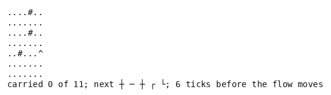

# Pipe Dream

A Pipe Dream-like, in pure Python. Pipe pieces arrive one at a time from a queue, and the
player lays each on a board ahead of a flow that starts after a countdown and then advances a
cell at a time. The level is won when the flow has run through the distance it asks for before
it spills out of an open end. The queue is fixed by the instance, so the whole future of the
pieces is known, and the environment needs no dependency.

- **Import:** `from planiverse.environments.games.pipe_dream.environment import PipeDreamEnv`
- **Source:** [`planiverse/environments/games/pipe_dream/environment.py`](../../planiverse/environments/games/pipe_dream/environment.py)
- **Instances:** 100 levels, indices `0` to `99`, all drawn by the generator at recorded seeds
- **Generator:** `generate_instance(seed, width=7, height=7, distance=None, countdown=None, pace=3, ...)`; see [Generating levels](#generating-levels)
- **Dependencies:** none

## Context

The game is The Assembly Line's *Pipe Mania* (1989), which Lucasfilm Games published as *Pipe
Dream* and Bullet-Proof Software brought to the Game Boy in 1990. A grid of empty cells holds a
start piece somewhere on it. Pipe pieces arrive one at a time from a queue whose next few
pieces are shown: the two straights, the four elbows, and a cross the flow may pass through
twice. The player lays the next piece on any empty cell, or over a piece already laid, which
costs a delay. After a countdown the liquid leaves the start piece and advances one cell at a
time through whatever connects, and it cannot be stopped. A level names a distance, the number
of pieces the flow must run through before it spills. It is lost the moment the flow runs into
an empty cell, a wall, a piece with no opening on that side, or pipe it has already run
through. What the player decides is where each piece goes. A piece that fits the route the flow
is taking goes on that route, ahead of the flow. A piece that does not has to be laid where it
will fit later, or out of the way, and either way it costs the time in which the flow comes a
little closer. The queue is the whole difficulty. A run of straights wants a long corridor, a
run of elbows wants a winding one, and the route has to be decided before the pieces that
make it have arrived.

We re-implemented the game rather than run the cartridge, so a successor costs microseconds and
the rules are ours to read. The cost is fidelity, in two places. First, the parameters are
ours rather than measured. The port's board size, queue length and flow speed were not read off
the cartridge. The board here is seven by seven, the countdown five to eight placements and the
pace three placements a segment, which is the feel of its early levels rather than their
numbers. Second, the later levels' pieces are not here. The end piece the flow must reach, the
one-way pieces and the reservoirs that slow the flow are left out, as is the score. A level
here is therefore the game's first kind of level: a distance to carry on an open board with a
few walls. The queue is fixed by the instance rather than dealt at random, which is what makes
the problem a planning problem, since the whole future of the pieces is known, and it is also
what makes it deterministic.

The rules are five. First, the board holds a start piece, drawn as `>`, `<`, `^` or `v` for the
way the flow leaves it, a few walls, and free cells. Second, a placement lays the next piece of
the queue on a free cell, or over a piece the flow has not run through, and takes one tick, or
two for a replacement. A piece may also be discarded, which takes one tick and lays nothing.
Third, the flow makes its first advance once `countdown` ticks have passed and one more every
`pace` ticks after that. An advance runs it into the next cell in its direction, through the
opening on that side and out of the other. A cross lets it straight through and may be run
through a second time along its other axis. Fourth, the flow spills, and the level is lost,
when the next cell is off the board, empty, a wall or the start. It spills too when the piece
there has no opening on that side, or when it has already run through that piece along that
axis. Fifth, the level is won when the flow has run through `distance` pieces, and a spill
after that is no loss; `flush` lets the flow run on to one or the other.

## Actions

| Action | Cost | Ticks | Effect |
|---|---|---|---|
| `place(x, y)` | 1 | 1, or 2 over a piece already laid | the next piece of the queue is laid at `(x, y)` |
| `discard` | 1 | 1 | the next piece of the queue is laid out of the way |
| `flush` | 1 | the rest | the flow runs until it has carried the distance or spilled |

Every action costs 1, so a plan is judged by its length and the ticks are in the state. A
placement on a wall, on the start piece, off the board or on pipe the flow has already run
through changes nothing and is not offered as a successor, and once the queue is used up only
`flush` is. `get_actions(state)` lists a placement per free cell and per piece not yet run
through, `discard` while the queue lasts, and `flush`; `PipeAction.parse` reads one back from
its name, and `FLUSH` and `DISCARD` are the two as constants. Note that `discard` is the
original's junk placement without its cell: a piece dumped where it will never matter is
the same piece in every corner, and a planner that had to choose the corner would search them
all.

Applying a placement lays the piece and advances the tick, and then the flow catches up. It
advances once for every advance the tick has made due, spilling or reaching the distance where
it does, and the tick's cost is paid whether or not the piece was any use. Applying `flush`
runs the flow through whatever has been laid until it has carried the distance or spilled,
which is the original's fast-forward once the route is complete.

## Planning problem

A `PipeState` holds the board as a tuple of row strings and the cells the flow has run
through, each with the axis it ran along, so that a cross may be run through twice. It also
holds the flow's head (i.e., its cell and the direction it will leave in), the pieces carried,
the tick, the pieces of the queue used and whether the flow has spilled. Equality and hashing
are over all of them, so a position is the same position wherever it was reached from, and the
same board a tick apart is two positions. `depth` is bookkeeping, and the queue, the distance,
the countdown and the pace are carried for the measure. The literals name every piece laid,
every cell the flow has run through, the head, the pieces carried, the ticks until the flow
next advances and the next piece of the queue. The walls and the start never change and are
left out:

```
pipe(6, 3, x)
pipe(6, 2, sw)
flooded(6, 3)
head(6, 3, n)
carried(1)
due(2)
next(se)
```

`spilled` is added once the flow has spilled, and `queue_empty` replaces `next` once the queue
is used up. With `D` the level's distance, the goal and the dead end are

```
goal(s)     ≡ carried(s) ≥ D
terminal(s) ≡ spilled(s) ∧ carried(s) < D
```

Both are absorbing (i.e., no action leads out of them): `successors` returns nothing for either
and `__advance__` returns the state unchanged.

The game as played is a real-time one: the flow creeps while the player moves a cursor, and
the level is won by a counter and lost by a spill. We turn it into an initial-to-goal problem
in two moves. First, the loop between two decisions (the cursor's travel, the piece's landing
and the flow's creep) is folded into the action, and the creep is discretised. A placement is
a tick, and the flow advances on the countdown and the pace rather than on a clock. A state is
therefore always a board with the flow at rest in a cell, and the planner never sees it halfway
through a piece. Second, the game's win and loss conditions become the goal test and the
dead-end test on that board. The win is the count carried, and the loss is the spill, decided
the moment the flow runs into something it cannot enter. What the reduction costs is the
timing. A player who lays pieces faster than the countdown allows, or slower, plays a different
race, and the pace here is one placement's worth of time per placement, whatever the piece and
wherever it goes. Every action costs 1, so a plan is judged by its length, and a piece laid
out of the way counts the same as one laid on the route.

The progress measure the width planners take (`planiverse.benchmark.measures.pipe_dream`) is
the distance still to carry less the pipe already laid ahead of the flow. A planner is thus
pulled towards extending the route rather than filling the board, and a spill short of the
distance is pinned above any live count.

## An example

Instance `0` is seed 11000: a seven by seven board with three walls, the start at the right
edge two rows from the bottom facing north, a distance of 11, a countdown of 6 and a pace of 3.
The queue of 39 pieces opens with a cross, a straight, a cross and a run of elbows:

```
....#..
.......
....#..
.......
..#...^
.......
.......
carried 0 of 11; next ┼ ─ ┼ ┌ └; 6 ticks before the flow moves
```

Iterated BFWS, run as the benchmark runs it (i.e., with the measure above and a width bound of
1000), solved it in 771 expansions and under a second. Its twenty-two-action plan is

```
place(6,3), place(0,0), place(6,2), place(6,1), place(5,2), place(6,2), place(5,1),
place(4,1), place(6,1), place(4,1), place(0,0), place(6,1), place(4,1), place(3,1),
place(0,0), place(3,2), place(3,3), place(2,3), place(1,3), place(0,0), place(1,4), flush
```

The plan lays the two crosses that head the queue straight above the start and then bends the
route west along the second row and south again through a cross at the fourth column, laying
the elbows as they come. Three cells on the route are laid twice, at (6,2), (6,1) and (4,1),
each a piece put down early and replaced when a better one arrived. The four pieces the route
had no use for go to the far corner at (0,0), each over the last. Note that the corner is
what `discard` would have done a tick cheaper each time; the planner's plan is no longer for it,
since a placement and a discard cost the same action. The flow has carried 8 when the route is
complete, and `flush` runs it through the last three pieces to 11. The route, in the order the
flow runs it, is

```
─...#..
...╔╬╗┘
...╬#╚╗
.╔═╝..╬
.╝#...^
.......
.......
carried 11 of 11; next ┘ └ ┼ ┐ └; 1 tick before the flow moves
```

with the pipe the flow has run through drawn in double lines and the pipe it has not in single
ones, so the two strays, the elbow at (6,1) and the straight in the corner, show as such.



The render is the state's own text, typeset, one frame per state: `render_trace` falls back to
`str(state)` for an environment with no screen to photograph. Here the text is the board in the
glyphs above, with the next five pieces of the queue and the ticks until the flow moves under
it. The same plan is also a [contact sheet](../renders/pipe_dream.png), every frame on one
image, captioned with the step number, the action that produced it, and a note on the goal
state. Both were generated by solving the instance and handing the trace to `render_trace`:

```python
from planiverse.environments.games.pipe_dream.environment import PipeDreamEnv, PipeAction, DISCARD, FLUSH
from planiverse.benchmark import measures
from planiverse.planners.width import IteratedBFWS

env = PipeDreamEnv()
env.set_index(0)
state, info = env.reset()          # info: level, distance, countdown, pace, queue, generated
print(state)                       # the board above
for action, child in env.successors(state):
    print(action, child.ahead, "pieces laid ahead of the flow")

result = IteratedBFWS(max_width=1000, progress=measures.pipe_dream).solve(env)
trace = env.simulate(result.plan)

env.render_trace(trace, "pipe_dream.gif")                                   # animated
env.render_trace(trace, "pipe_dream.png", actions=result.plan, env=env)     # contact sheet
```

Stateful play, as opposed to expansion, goes through `step`, which takes a `PipeAction` such
as `PipeAction(6, 3)`, `DISCARD`, `FLUSH` or a name and returns the state and the pieces the
flow ran through since the last one. `env.render()` prints the history of `step` calls and
returns it as a list of strings. See [docs/rendering.md](../rendering.md) for the other output
formats.

## Levels

The hundred levels are the generator's own draws, embedded in the module as the plain data
`set_instance` takes (`rows`, `queue`, `distance`, `countdown`, `pace`) with the seed each came
from beside it, and the plan each was accepted on is in `tests/data/pipe_dream_solutions.json`.
A level is a seven by seven board with up to three walls and a start piece with two free cells
ahead of it. The distance is 8 to 12, the countdown 5 to 8 placements, the pace 3, and the queue
holds the countdown plus three times the distance in pieces, dealt with the straights most
often and the cross least. The plan each level was accepted on runs from twelve to thirty-one
actions.

## Generating levels

`generate_instance` draws a level, selects it, and returns it as the dict `set_instance` takes
back:

```python
env = PipeDreamEnv()
level = env.generate_instance(seed=7, distance=10)
print(env.witness, env.witness_expansions)     # the plan it was accepted on, and the search's cost
state, info = env.reset()                       # info["generated"] is True
```

| Option | Default | What it does |
|---|---|---|
| `width`, `height` | 7, 7 | the board |
| `distance` | 8 to 12 at random | pieces the flow must run through |
| `countdown` | 5 to 8 at random | ticks before the flow first advances |
| `pace` | 3 | ticks between advances after that |
| `walls` | 0 to 3 at random | cells that cannot be laid on |
| `min_plan_length` | 6 | reject a draw whose plan is shorter |
| `search_limit` | 600 | expansions the acceptance search may spend per draw |
| `attempts` | 40 | draws before giving up with `GenerationError` |

A draw is kept only if the thoughtless policy fails: lay each piece at the end of the pipe laid
when it fits there, else discard it, and flush once the pipe laid reaches the distance. A
best-first search over placements, guided by the distance still to carry less the pipe laid
ahead of the flow with a point against every stray piece, must then find a plan of at least
`min_plan_length` actions within `search_limit` expansions. About half the draws pass, in a
fraction of a second each. The method is generate-and-test, which the procedural content
generation literature calls search-based PCG (Togelius, Yannakakis, Stanley and Browne, 2011,
https://doi.org/10.1109/TCIAIG.2011.2148116; Shaker, Togelius and Nelson, *Procedural Content
Generation in Games*, 2016, https://pcgbook.com/). The same seed and options always give the
same level.

## Files

| File | Contents |
|---|---|
| [`environment.py`](../../planiverse/environments/games/pipe_dream/environment.py) | `PipeAction`, `PipeState`, the flow (`advance`, `run_ahead`, `advances_due`), `draw_level`, `PipeDreamEnv` with `greedy_plan`, `LEVELS` |
| [`tests/test_pipe_dream.py`](../../tests/test_pipe_dream.py) | Tests |
| [`tests/data/pipe_dream_solutions.json`](../../tests/data/pipe_dream_solutions.json) | The plan each level was accepted on |
