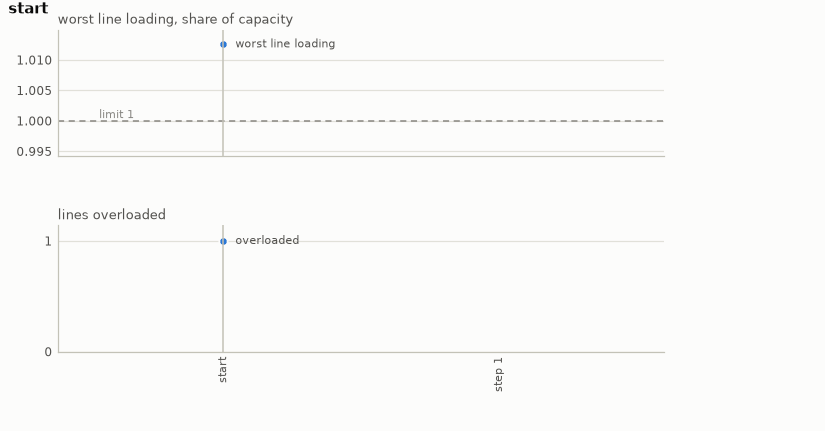

# Power grid

Restoring security to a transmission grid on Grid2Op after a line trips. The power the line was
carrying does not stop: it redistributes over every remaining line according to Kirchhoff's laws,
and some of them now carry more than they are rated for. Left alone, an overloaded line trips
too, which redistributes the flow again, and that is how a regional blackout happens. The
operator's move is to change the topology at a substation, rerouting the power without switching
anything off, in the two to four steps before the cascade.

- **Class:** `PowerGridEnv`
- **Import:** `from planiverse.environments.power_grid.environment import PowerGridEnv`
- **Source:** [`environment.py`](../../planiverse/environments/power_grid/environment.py)
- **Instances:** 100 scenarios, indices `0` to `99`: nine from N-1 analysis at the start of the series, then 91 the generator drew further into them
- **Generator:** `generate_instance(seed, chronic=None, line=None, max_offset=200, ...)`; see [Generating contingencies](#generating-contingencies)
- **Dependencies:** `grid2op`. The case and its time series ship inside it, so there is nothing to
  download.

## Context

The system is a transmission grid: substations joined by lines, with generators and loads
attached, and a demand that moves through the day along a recorded time series. At a substation
the equipment is split across two busbars, and the operator's move is to change the *topology*
(i.e., which busbar each piece of equipment is connected to). Reassigning which side each line,
generator and load sits on reroutes the power without switching anything off. That gives a
discrete action set, a few hundred distinct reconfigurations on the small case and sixty-six
thousand on a competition one, sitting on a transition function that is a nonlinear solve. The
problem is to bring every line back within its rating after a trip, before the overload it
caused takes another line with it.

The case, its time series and the power flow are Grid2Op's. [Grid2Op](https://github.com/Grid2Op/grid2op)
is the framework RTE, the French transmission system operator, uses for the L2RPN competitions.
The bundled case is its 14-bus sandbox (`l2rpn_case14_sandbox`: 20 lines, three time series,
209 topology actions), loaded with `test=True` so that the series inside the package are used
and nothing is downloaded. This is not a PDDL domain, for two reasons. First, the flow on every
line is the solution of the AC power-flow equations, found by Newton-Raphson at each step.
There is no way to write down that the effect of moving this line to busbar 2 is that line 17
now carries 1.08 of its rating. The only way to know is to solve the network, and a local
action has a global, numerical effect. Second, doing nothing is not safe, because the demand
time series keeps moving, so the problem is a moving target with a deadline. On chronic 1,
tripping line 6 gives a worst loading of 1.078, which climbs to 1.96 and then blacks the grid
out on the fourth step if the operator does nothing. The cost of the simulator is that every
successor is a power-flow solve, and an expansion that tries every relevant reconfiguration
takes seconds rather than microseconds.

The rules are four. First, the grid is the case on the instance's time series (i.e., its
*chronic*, Grid2Op's name for one recorded run of demand), at the instance's step, with the
instance's line tripped. It is seeded and pinned, so the same path always lands in the same
place. Overflow disconnection is left on, so a line that stays above its rating trips, and the cascade
it starts is what the operator is planning against. Second, a step is one decision, a
reconfiguration or doing nothing, after which the series advances one step and the flows are
re-solved. Third, a blackout is a dead end, and so is the horizon, step 10 counted with the
tripped grid as step 1. Fourth, the
grid is secure when every line is back within its rating with the grid still standing.

## Actions

| Action | Cost | Effect |
|---|---|---|
| `do_nothing` | 0 | the grid runs one step of the series as it is |
| `topology_N` | 1 | Grid2Op's topology action `N`, a busbar reassignment at one substation, then one step of the series |

Actions are indices into grid2op's `IdToAct` enumeration of the topology space, so a plan is a
list of integers and replays identically. `do_nothing` is action 0 and costs 0, while every
reconfiguration costs 1. `successors` offers reconfigurations at substations touching an
overloaded line, plus doing nothing. Every topology action is legal from every state, but
offering all 209 costs about thirty seconds a node, and the substations either end of the
overloading line are what an operator would look at.
`PowerGridEnv(restrict_to_overloads=False)` offers the lot, which is the honest setting and a
slow one. A goal and a dead end are both absorbing (i.e., no action leads out of them), so
`successors` returns `[]` and a plan cannot wander past the end.

Applying an action replays the path from the trip. A fresh Grid2Op environment is seeded, set
to the chronic, fast-forwarded to the offset and given the trip, and the path's actions are
stepped through it. Expanding a parent replays it once and then copies the environment per
child, so a path is never walked twice. Every child is an AC power-flow solve of about 50 ms,
and one expansion takes 8 to 19 seconds. The state a path leads to is memoised, since the
simulator is deterministic once pinned (see [Determinism](#determinism)).

## Planning problem

A `PowerGridState` holds the action path and what the solve says about it:

| Field | Meaning |
|---|---|
| `path` | the action ids taken; the whole state |
| `max_rho` | worst line loading; `1.0` is exactly the thermal rating |
| `rhos` | loading of every line |
| `blackout` | the episode ended |
| `step` | how far into the time series, counted from the trip |

Two states with the same path are the same state, so `__eq__` and `__hash__` are on the path.
The literals are `acted(i,id)`, `step(n)`, `max-loading(n)` bucketed into tenths,
`overloaded(line-n)`, and `secure` or `blackout`. Note that a blacked-out grid has no loadings
to report, and `max_rho` is infinite so it sorts last, so its numeric atoms are absent rather
than fabricated. With `H` the horizon (10, with the tripped grid at step 1; the `horizon`
argument of `PowerGridEnv`), the goal and the dead end are

```
goal(s)     ≡ ¬blackout(s) ∧ max_rho(s) < 1.0
terminal(s) ≡ blackout(s) ∨ step(s) ≥ H
```

A blackout is absorbing in the simulator too, since Grid2Op ends the episode, so there is
genuinely nothing further to plan from.

Note that the problem as an operator would state it is a trajectory problem (i.e., one whose
requirements hold over the whole run rather than at its end). The grid must stand at every step,
and it must be secure before the cascade arrives. We turn it into the goal above with the
reduction the epidemic and flood environments use, which [NOTES.md](../../NOTES.md) sets out in
full, in three moves. First, a constraint that must hold throughout becomes a dead end. The
first state that blacks out is terminal, so no plan through it exists, and a check over the
whole trajectory becomes a check at each state. Second, a quantity that accumulates becomes part
of the state and is bounded at the goal, and here the second move has little to do. Nothing
accumulates but the path, and what the goal bounds is a reading, the worst loading, rather than
a running total. Third, the horizon becomes time in the state. The step is a state variable
counted from the trip, so a contingency that begins `offset` steps into the series has the same
horizon as one that begins at its start. The horizon reached without security is a dead end,
since nothing can improve afterwards. The cost of the reduction is that the horizon is ours. Ten
steps is long enough to fix an overload and see it stay fixed and short enough that search
terminates, but it is a choice. The goal's threshold, on the other hand, is the physical rating,
so no reference policy is needed to set a target. The plan is also a plan for one pinned series
at one step, and whether it holds elsewhere is a separate measurement.

The progress measure the width planners take (`planiverse.benchmark.measures.power_grid`) is
the steps still to survive before the horizon, with a blackout worse than any of them. A
planner is thus pulled forward in time and away from paths that have already lost.

## An example

Instance `0` is chronic 0 at its start with line 11 tripped. After the trip the worst loading is
1.013, on line 9, and doing nothing leaves 1.006 a step later and a blackout on the second. Of
the case's 209 topology actions, 64 touch a substation at either end of line 9, so the initial
state has 65 successors with `do_nothing`. Two of them secure the grid: `topology_98` at
0.996 and `topology_103` at 0.991. Iterated BFWS, run as the benchmark runs it (i.e., with the
measure above and a width bound of 1000), solved it in 1 expansion and 7.7 seconds. Its
one-move plan is

```
topology_98
```

which brings the worst loading from 1.013 to 0.996, four thousandths under the rating. That is
enough, since the goal asks for every line under its rating and not for a margin; `topology_103`
would have left more room. The expansion is the whole cost: one power-flow solve for each of the
65 candidates.



The render draws the readings of each state over the plan rather than the state's text, since a
state here is a path and a row of loadings. The panels are the worst line loading against the
limit and the number of lines overloaded, step by step. A frame of the GIF is the chart up to
its state, so the animation grows a step at a time. The same plan is also a
[sheet](../renders/power_grid_chart.png), the whole plan on one figure. There the action that
produced each state runs along the bottom, the limit is a dashed line, and the goal is marked
where the plan ends. Both were generated by solving the instance and handing the trace to
`render_trace`:

```python
from planiverse.environments import make
from planiverse.benchmark import measures
from planiverse.planners.width import IteratedBFWS

env = make("power_grid")
env.set_index(0)                   # chronic 0, line 11 trips
state, info = env.reset()          # info: grid, chronic, offset, tripped_line, max_rho, overloaded, actions, ...
print(state)                       # step 1, 0 actions / worst line loading: 1.013 / overloaded: [9]

result = IteratedBFWS(max_width=1000, progress=measures.power_grid).solve(env)
trace = env.simulate(result.plan)

env.render_trace(trace, "power_grid_chart.gif")                                   # animated
env.render_trace(trace, "power_grid_chart.png", actions=result.plan, env=env)     # the sheet
env.close()
```

Stateful play, as opposed to expansion, goes through `step`, which returns the state and how
much the worst line loading came down. `successors(state)` returns the action and state pairs
for the relevant reconfigurations and doing nothing, and `get_actions()` lists all 209 topology
actions whatever the state. `env.render()` prints the history of `step` calls and returns it as
a list of strings. The readings each environment charts, and the panels they go on, are in
[`planiverse/rendering/readings.py`](../../planiverse/rendering/readings.py); `charts=False`
asks `render_trace` for the state's text instead, and [docs/rendering.md](../rendering.md)
covers the other output formats.

## Scenarios

`set_index(i)` picks a time series (i.e., a *chronic*, grid2op's name for one recorded run of
demand) together with the line that trips. The set came from N-1 analysis, meaning we tripped
every line of every chronic in turn.

| Index | Chronic | Line | Loading after trip | Blackout in | Solved at |
|---|---|---|---|---|---|
| 0 | 0 | 11 | 1.013 | 2 | 1 |
| 1 | 0 | 8 | 1.188 | 2 | 1 |
| 2 | 0 | 9 | 1.738 | 2 | 1 |
| 3 | 1 | 16 | 1.044 | 4 | 1 |
| 4 | 1 | 6 | 1.078 | 4 | 1 |
| 5 | 1 | 15 | 1.224 | 2 | 1 |
| 6 | 1 | 3 | 1.266 | 4 | 1 |
| 7 | 1 | 17 | 1.914 | 2 | 1 |
| 8 | 2 | 9 | 1.664 | 2 | 1 |

Every scenario here blacks out if it is ignored, which is what makes them instances at all. On
scenario 4, for instance, the trip leaves 1.078 with line 17 overloaded. Doing nothing leaves
1.072 a step later, then 1.96 and 1.98, and the grid blacks out on the fourth step, whereas
`topology_69` secures it at once at 0.921. Most overloads on this case clear themselves as
demand moves: tripping line 1 on chronic 0 gives a loading of 1.019 that is back under the
limit two steps later with no action whatsoever. An instance the null plan solves is not an
instance, so we dropped 32 of the 60 line and chronic combinations for that. Another 18 black
the grid out on the trip itself, which is not a planning problem either, and were dropped too.
`rho_after_trip` and `blackout_in` are measurements, recorded so that a scenario which stops
reproducing fails loudly rather than quietly becoming easy.

Every scenario here is solved by a single reconfiguration, which is a property of the domain as
bundled rather than a shortcoming of the setup, and we checked it rather than assuming it. Double
contingencies (N-2) were tried across all pairs of the interesting lines on two chronics.
Every one either blacks out immediately or causes no overload at all, so this 14-bus case has no
survivable N-2. The larger bundled cases behave the same way: `l2rpn_neurips_2020_track1` (36
substations, 59 lines, 66,811 topology actions) and `rte_case118_example` (118 substations, 186
lines, 72,144 actions) both still fix a single trip with one action.

So the challenge this environment poses is width rather than depth, in three parts. First, a
large action space, with 209 topology actions on the small case, 45 to 119 of them relevant to
any given overload, and tens of thousands on the bigger ones. Second, an expensive successor
function, since every child is an AC power-flow solve of about 50 ms and one expansion takes 8
to 19 seconds. Third, a hard deadline, two to four steps before the cascade. A heuristic that
avoids simulating all 119 candidates is worth more here than any amount of lookahead. For depth
instead, the [water distribution](water-distribution.md) environment has solution depths of 2
to 7.

Indices `9` to `99` were drawn by `generate_instance` at the seeds they record (`seed`) in
`SCENARIOS`: the same N-1 test, at a step into the time series (`offset`) rather than at its
start. The loading after the trip and the steps to blackout were measured the same way.

## Generating contingencies

`generate_instance` draws a contingency by the same N-1 test the bundled ones passed, selects
it, and returns it as a dict that `set_instance` accepts back:

```python
env = PowerGridEnv()
contingency = env.generate_instance(seed=7)     # or make("power_grid", seed=7)
# {'chronic': 1, 'line': 9, 'offset': 122, 'rho_after_trip': 1.64, 'blackout_in': 2}
state, info = env.reset()
```

| Option | Default | What it does |
|---|---|---|
| `chronic` | `None` | the time series, or one of the case's three at random |
| `line` | `None` | the line to trip, or one of the case's twenty at random |
| `max_offset` | 200 | how far into the series the trip may happen; the offset is drawn from `0` to this |
| `min_rho` | 1.0 | some line must be loaded above this after the trip |
| `blackout_within` | 6 | with the operator doing nothing, the grid must black out within this many steps |
| `solvable` | `True` | search each draw and keep only one with a plan |
| `search_limit` | 1 | expansions the check may spend per draw |
| `attempts` | 80 | draws before giving up with `GenerationError`; about one draw in eleven passes both tests |

The offset is what makes this more than a reshuffle of the bundled nine. The same line
tripped at a different point of the same series meets different demand, and the case's
three series are long. A draw is kept only if the trip leaves the grid standing but doomed,
overloaded now and blacked out within `blackout_within` steps of doing nothing. A grid
that heals itself is not an instance, and one that blacks out on the trip is not a planning
problem. It is then searched, and kept only if a plan was found: `witness` holds it and the
instance records `solved_at`, like the bundled scenarios. The default budget is one
expansion, which tries every relevant reconfiguration from the tripped grid: every bundled
scenario is solved by a single one, and each further expansion is another power-flow solve
per reconfiguration. `step` in the state counts from the trip, so the horizon is the same
wherever in the series it starts.

The draw is on grid2op's own case and time series (https://grid2op.readthedocs.io/). The
test is the N-1 contingency analysis of the L2RPN competitions (Marot et al., 2020,
https://arxiv.org/abs/2003.07339): trip one line, and see whether the grid stands but is doomed.

## Determinism

Grid2op is deterministic once the stochastic parts are pinned, and this environment pins them:
`env.seed(0)` and `set_id(chronic)` fix the time series, and the opponent is not enabled. We
verified this by replaying the same path twice and comparing every line's loading.

That makes the action path the state. `__eq__` and `__hash__` are on the path, results are
memoised on it, and `simulate` replaying from scratch is an independent check on `successors`
rather than a restatement of it. States hold the path rather than a simulator snapshot because a
grid2op environment copy is megabytes and a search holds thousands of states. Expanding replays
the parent once and then copies per child, so a path is never walked twice.

## Rendering

`str(state)` describes the grid in a few lines: the step, the actions taken, the worst line loading
and which lines are overloaded.

See [docs/rendering.md](../rendering.md) for the other output formats.

## Attribution

Built on [Grid2Op](https://github.com/Grid2Op/grid2op), the framework RTE, the French transmission
system operator, uses for the L2RPN competitions.

## Files

| Path | What |
|---|---|
| [`environment.py`](../../planiverse/environments/power_grid/environment.py) | `PowerGridEnv`, `PowerGridState`, `PowerGridAction` |
| [`tests/test_power_grid.py`](../../tests/test_power_grid.py) | Tests; the expensive ones are marked `slow` |
