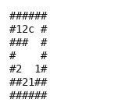

# Puzznic

This environment re-implements Taito's 1989 block-matching puzzle game in Python, so it needs no
emulator, no ROM, and no dependencies beyond the standard library.

The grid holds coloured blocks. The player steers a cursor, grabs a block, and drags it sideways.
Blocks fall under gravity, and when two or more of the same colour touch, they vanish. The level
is won when every block has been cleared. Matching is pairwise, so leaving a colour with exactly
one block on the board makes the level unwinnable (i.e., a dead end that no later move can undo).

This is the reference implementation of the Planiverse interface, since it is the only environment
that implements every method in the contract, `step`, `validate`, `get_actions` and `render`
included.

- **Class:** `PuzznicGame`
- **Import:** `from planiverse.environments.gameboy_py.puzznic import PuzznicGame`
- **Source:** [`planiverse/environments/gameboy_py/puzznic.py`](../../planiverse/environments/gameboy_py/puzznic.py)
- **Instances:** 128 levels, indices `0`–`127`, one per Game Boy round
- **Dependencies:** none
- **Sibling:** [`PuzznicGBEnv`](puzznic-gb.md) plays the real Game Boy cartridge in an emulator

## A solved instance



BFWS's plan for instance `0`: 12 moves, one frame per state. The same plan is also a
[contact sheet](../renders/puzznic.png), every frame on one image, captioned with the step
number, the action that produced it, and a note on the goal state.

Both were generated by solving the instance and handing the trace to `render_trace`:

```python
from planiverse.environments.gameboy_py.puzznic import PuzznicGame
from planiverse.benchmark import measures
from planiverse.planners.width import IteratedBFWS

env = PuzznicGame()
env.fix_index(0)
env.reset()

result = IteratedBFWS(max_width=1000, progress=measures.puzznic).solve(env)
trace = env.simulate(result.plan)

env.render_trace(trace, "puzznic.gif")                                   # animated
env.render_trace(trace, "puzznic.png", actions=result.plan, env=env)     # contact sheet
```

Frames are the state's own text, typeset: `render_trace` falls back to `str(state)` for
an environment with no screen to photograph. See
[docs/rendering.md](../rendering.md) for the other output formats.

## Quickstart

```python
from planiverse.environments.gameboy_py.puzznic import PuzznicGame

env = PuzznicGame()
env.fix_index(0)
state, info = env.reset()

print(state)
# ######
# #12c #
# ###  #
# #    #
# #2  1#
# ##21##
# ######

env.get_actions()
# ['left', 'right', 'up', 'down', 'left-hold', 'right-hold']

for action, successor in env.successors(state):
    print(action, sum(successor.score))
```

Stateful play, as opposed to expansion, goes through `step`:

```python
state, score = env.step('left')
env.render()          # prints the de-duplicated state history
```

## Levels

`fix_index(i)` selects level `i` from `PuzznicGame.levelsstr`, a list of 128 ASCII level strings
embedded in the module. Indices run from `0` to `127` and match the cartridge's rounds, so
`fix_index(7)` here and on [`puzznic_gb`](puzznic-gb.md) select the same board.

Level strings use this alphabet:

| Char | Meaning |
|---|---|
| `#` | Wall |
| (space) | Empty cell |
| `1`–`9` | A block; the digit is its colour |
| `0` | Empty cell, treated as a space |
| `c` | Cursor start position; the cell itself is empty |

Levels are rectangular and walled on all four sides. The outer ring is unreachable: bounds
checking is `0 <= pos < shape - 1` on both axes, so the cursor stays strictly inside.

We know of two differences from the cartridge. First, the cursor starts on the nearest empty cell
rather than on a block, because a `c` marks an empty cell and cannot be written on top of one, so
plans found here do not transfer to the cartridge move for move. Second,
`_check_and_remove_matches_` rescans the whole board after every step and clears every adjacent
same-type pair, whereas the cartridge leaves some such pairs untouched.

## State

`PuzznicState` holds the grid (a 2-D list of `Element` objects: `Wall`, `EmptySpace`, `Box`,
`Cursor`), the cursor, a `score` list and the `cleared_boxes` accumulated so far.

| Literal | When |
|---|---|
| `at(cursor, x, y)` | always |
| `at(box-L, x, y)` | per block `L` on the grid |
| `cleared(box-L, x, y)` | per block cleared so far, at the position it was cleared from |
| `all-boxes-matched(box-L)` | colour `L` has been fully cleared off the grid |
| `goal-reached` | in a goal state |
| `terminal-state` | in a dead-end state |
| `score(N)` | in a goal or terminal state |

State equality compares grid and cursor directly rather than literals, so score and cleared
history do not distinguish two otherwise identical positions during expansion. Note that a planner
keying its visited set on `literals` sees a finer distinction than `__eq__` gives, because the
literals carry `cleared(...)` history.

## Actions

The action set holds six cursor moves, each costing 1:

| Action | Effect |
|---|---|
| `left` / `right` / `up` / `down` | Move the cursor one cell |
| `left-hold` / `right-hold` | Move the cursor one cell, dragging the block under it |

A `-hold` with no block under the cursor is refused, and the cursor does not move either. When the
cursor is on a block, the block slides only if the destination is `EmptySpace`. There is no
`up-hold` or `down-hold`, because blocks slide sideways and cannot be lifted.

`_compute_successor_state_` runs a pipeline per action:

1. **Move.** `apply_action` moves the cursor and, for a hold, the block.
2. **Settle and clear, until stable.** Gravity drops every block with empty space below it, then
   `_check_and_remove_matches_` clears every block orthogonally adjacent to a same-colour block. A
   clear lets the blocks above fall, which can form a new match, so the two repeat until the grid
   stops changing.
3. **Score.** Each clear appends its points to `state.score`.

`successors` drops any successor equal to its parent, so a cursor move into a wall is not offered.

## Goal and terminal

- **Goal** (`is_goal`): no `Box` remains on the grid.
- **Terminal** (`is_terminal`): some colour has exactly one block left, so it can never be matched
  and the level is lost.

Both are absorbing (i.e., no action leads out of them): `_compute_successor_state_` returns the
state unchanged rather than expanding it. Note that a level holding a single block of some colour
is born terminal and ignores every action, which is worth knowing when hand-writing a level.

## Scoring

`state.score` is a list with one entry per clear rather than per action, so `sum(state.score)`
gives the total. We reconstructed the rules rather than taking them from the original arcade
formula, so treat them as this environment's own:

- 10 points per cleared block;
- if a single clear removes more than one distinct colour, the whole award is multiplied by `1.5 ×
  (number of distinct colours)`;
- 50 bonus points per colour that had more than two blocks in the clear.

`_compute_score_` takes the set of blocks a match actually cleared.

## Rendering

`str(state)` draws the grid in the level alphabet, with `c` for the cursor. `env.render()` prints
the de-duplicated history of `step` calls and returns it as a list of strings. Note that
consecutive identical states are collapsed, so the printed step numbers do not line up with plan
indices.

See [docs/rendering.md](../rendering.md) for the other output formats.

## Files

| Path | What |
|---|---|
| [`puzznic.py`](../../planiverse/environments/gameboy_py/puzznic.py) | `Element`/`Box`/`Cursor`/`Wall`/`EmptySpace`, `PuzznicState`, `Level`, `PuzznicGame` |
| [`tests/test_puzznic.py`](../../tests/test_puzznic.py) | Tests |
