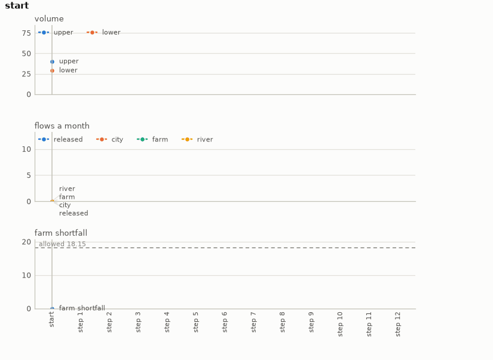

# Reservoir

Reservoir operations on pywr. Two reservoirs in series: the upper one fed by the hills and
emptied through a turbine at the release the operator sets, the lower one fed by the turbine
and the valley and supplying a river that must keep flowing, a city that must be supplied, and
a farm whose seasonal demand may be rationed. A decision a month for a year: the release, and
whether the farm gets its full demand or half. The goal is the year complete with the farm's
shortfall under the target and both reservoirs above their reserves at the end. Which demand
gets what each month is pywr's allocation by priority; when to hold water back and when to
let it through is the plan.

[pywr](https://github.com/pywr/pywr) (GPL-3.0-or-later; Tomlinson, Arnott and Harou 2020,
https://doi.org/10.1016/j.envsoft.2020.104635) is the water resource system simulator from the
University of Manchester used across the UK water industry: a network of storages, demands and
links whose flows are allocated each step by a linear programme over the nodes' priorities. It
is a dependency installed from PyPI; nothing of it is included here. Of the four operational
environments added together it is the one a numeric planner could model most nearly, since a
mass balance with priorities is a small linear system; it is here for what it is, a real
water-industry simulator with a year's worth of coupled decisions.

- **Import:** `from planiverse.environments.reservoir.environment import ReservoirEnv`
- **Source:** [`planiverse/environments/reservoir/environment.py`](../../planiverse/environments/reservoir/environment.py)
- **Instances:** 100 years, indices `0` to `99`, all drawn by the generator at recorded seeds
- **Generator:** `generate_instance(seed, ...)`; see [Generating years](#generating-years)
- **Dependency:** `pywr`

## A solved instance



BFWS's plan for instance `0`: 12 moves, drawn as the readings of each state over the plan. A
frame is the chart up to its state, so the GIF grows a step at a time. The same plan is also a
[sheet](../renders/reservoir_chart.png), the whole plan on one figure, with the action that produced
each state along the bottom, the target as a dashed line, and the goal marked where the plan ends.

Both were generated by solving the instance and handing the trace to `render_trace`:

```python
from planiverse.environments.reservoir.environment import ReservoirEnv
from planiverse.benchmark import measures
from planiverse.planners.width import IteratedBFWS

env = ReservoirEnv()
env.set_index(0)
env.reset()

result = IteratedBFWS(max_width=1000, progress=measures.reservoir).solve(env)
trace = env.simulate(result.plan)

env.render_trace(trace, "reservoir_chart.gif")                                   # animated
env.render_trace(trace, "reservoir_chart.png", actions=result.plan, env=env)     # the sheet
```

The chart shows the two volumes, the month's release and deliveries, and the farm's shortfall against the target, month by month. The readings each environment charts, and the panels they go on, are in
[`planiverse/rendering/readings.py`](../../planiverse/rendering/readings.py); `charts=False` asks
`render_trace` for the state's text instead. See [docs/rendering.md](../rendering.md) for the
other output formats.


## How a trajectory problem becomes a goal

| The trajectory asks for | The environment does |
|---|---|
| the river's minimum flow and the city's supply every month | `is_terminal`: a month that shorts either is a dead end |
| little rationing of the farm overall | the shortfall accumulates in the state and is bounded at the goal |
| reserves in hand at the end of the year | a condition on the final state |

The target is the least shortfall any fixed policy manages inside the constraints, and a draw
that a steady release all year already solves is thrown back. [NOTES.md](../../NOTES.md) sets
the reduction out in full.

## Quickstart

```python
from planiverse.environments.reservoir.environment import ReservoirEnv, ReservoirAction

env = ReservoirEnv()
env.set_index(0)
state, info = env.reset()          # info: year, target, reserves, generated
print(state)                       # month 0: upper 70, lower 28; ...

state, saved = env.step("release(6, full)")
for action, child in env.successors(state):
    print(action, child.upper, child.lower, child.farm_short)
```

## The rules

1. The network is built in code from the instance: hills into the upper reservoir, the turbine
   into the lower, the valley into the lower, and the river, the city, the farm and the sea off
   it. pywr allocates each month by cost: the river first, then the city, then the farm, with
   the reservoirs holding what is not taken and spilling only when full.
2. A month is one decision: `release(r, share)`, the turbine's flow `r` from 2 to 10 and the
   farm's share `full` or `half`. Rationing counts against the farm's full demand as shortfall.
3. A month in which the river gets less than its minimum or the city less than ninety per cent
   of its demand is a dead end.
4. The goal is the twelfth month done with the farm's shortfall under the target and both
   reservoirs at or above their reserves. The year ending otherwise is a dead end.

## State

`ReservoirState` holds the month, the two volumes, the shortfalls so far and the last month's
deliveries. Identity is the month, the volumes and the shortfalls: pywr is deterministic and
memoryless beyond its storages, so two release histories that leave the same water are one
state, and the environment replays the year from January to expand one, which takes a few
milliseconds.

```
month(4)
upper(60)
lower(25)
farm_short(3)
```

## Actions

Ten: each release in 2, 4, 6, 8, 10 with the farm on `full` or `half`, each costing 1.

## Years

The hundred years are the generator's own draws, embedded in the module as the plain data
`set_instance` takes (`inflow_upper`, `inflow_lower`, `city`, `farm`, `river`, `capacity`,
`initial`, `reserves`, `target`) with the seed each came from beside it, and the plan each was
accepted on is in `tests/data/reservoir_solutions.json`.

## Generating years

```python
env = ReservoirEnv()
year = env.generate_instance(seed=7)
print(env.witness, env.witness_expansions)     # the policy it was accepted on, and the policies measured
```

| Option | Default | What it does |
|---|---|---|
| `attempts` | 60 | draws before giving up with `GenerationError` |

Inflows are seasonal shapes with seeded noise; the demands, capacities, initial volumes and
reserves are drawn round them. The fixed policies are then run: each release all year with the
farm on full, each with the farm on half through the summer, and seasonal patterns that
release high in summer and low in winter. The target is the least shortfall any of them ends the
year with inside the constraints; a draw is thrown back when none does, or when a steady release
all year does as well as any, since then nothing needs deciding.

## Files

| File | Contents |
|---|---|
| [`environment.py`](../../planiverse/environments/reservoir/environment.py) | `ReservoirAction`, `ReservoirState`, `reference_plans`, `ReservoirEnv`, `YEARS` |
| [`tests/test_operational_four.py`](../../tests/test_operational_four.py) | Tests |
| [`tests/data/reservoir_solutions.json`](../../tests/data/reservoir_solutions.json) | The policy each year was accepted on |
