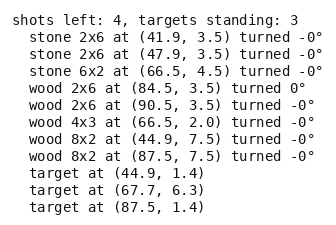

# Slingshot

A physics puzzle in the Angry Birds mould, on pymunk. A wall of blocks stands on the ground with
a few targets set on top of it, under a roof or behind a stone slab. The player has a handful of
shots from a slingshot on the left, each an angle and a power from a small set. The goal is every
target down before the shots run out. What a shot does is decided by a rigid-body simulation:
the bird flies under gravity, strikes the wall, and blocks topple, slide and break.

- **Import:** `from planiverse.environments.games.slingshot.environment import SlingshotEnv`
- **Source:** [`planiverse/environments/games/slingshot/environment.py`](../../planiverse/environments/games/slingshot/environment.py)
- **Instances:** 100 levels, indices `0` to `99`, all drawn by the generator at recorded seeds
- **Generator:** `generate_instance(seed, structures=None, targets=None, shots=None, ...)`; see [Generating levels](#generating-levels)
- **Dependency:** `pymunk`

## Context

The game is the genre's own, after the open Science Birds clone the
[AIBirds](https://aibirds.org/) competition is played on. Nothing here is taken from any
published title: the structures, the materials and the rules of breaking are ours, and so are
all the levels. A level is a stretch of ground a hundred units wide with the slingshot at the
left end and a wall at the far right. Two to four structures stand between them, each a tower
of blocks, a shelter (i.e., a roof on two pillars) or a stone slab. Three or four targets are
seated on top of a tower, under a roof or behind a slab. The player chooses each shot from six
angles and three powers, and has exactly as many shots as there are targets, so none may be
wasted. The difficulty is that a shot's effect is only known by playing it. A target under a
roof needs the roof broken, a target behind a slab needs a lob over it, and a target on a tower
needs the tower toppled. A bird that does one of these may bring a second target down with it,
as the example below shows.

The physics is [pymunk](https://www.pymunk.org/) (MIT), the Python binding of Chipmunk2D (MIT).
It is a dependency, and nothing of it is included here. We run a rigid-body engine rather than
write an action model because no add or delete list carries a toppling tower. A planner can see
the whole world and choose among eighteen shots, but the effect of a shot is a physics step, and
that is what keeps the environment out of PDDL. The cost is paid twice. An expansion plays
eighteen shots of up to six hundred engine steps each rather than looking anything up, which
comes to about a quarter of a second per expansion in the example below. The physics is also
only reproducible on one platform, which [Determinism](#determinism) sets out.

The rules are four. First, a shot launches a bird from the slingshot at `power` units per
second, `angle` degrees above the horizontal. The world is then stepped at sixty steps a second
until everything is at rest again, or ten simulated seconds pass. Second, a target breaks when a
collision dissipates at least `TARGET_BREAKS_AT` (60) units of kinetic energy in it, and a
wooden block breaks at `WOOD_BREAKS_AT` (400); stone never breaks, it only topples and slides.
Third, the bird is spent once the world is at rest, and a state is what still stands, where it
lies, and how many shots are left. Fourth, the goal is every target down, and a position with
targets standing and no shots left is a dead end.

The energies are the ones Chipmunk reports for each contact (`total_ke`), which is the engine's
own measure of how hard two bodies met. A resting contact dissipates none, so a tower does not
crumble under its own weight. The thresholds are ours, chosen so that a bird at full stretch
shatters wood and a target, a block falling from a tower's height breaks a target under it, and
stone shrugs everything off.

## Actions

| Action | Cost | Angle | Power | Effect |
|---|---|---|---|---|
| `shoot(angle, power)` | 1 | 20, 30, 40, 50, 60 or 70 degrees | 45, 60 or 75 units per second | a bird is fired and the world runs until it is at rest |

The alphabet is the same eighteen shots from every state; `get_actions()` lists them and
`SlingshotAction.parse` reads one back from its name. Note that a miss is a shot like any other.
It spends one of the shots left, and since the shots left are part of the state its successor
differs from its parent, so `successors` offers it. The only successor dropped is one equal to
its parent, which a spent shot never gives. A goal or dead-end state has no successors and
ignores every action.

Applying an action rebuilds the pymunk world from the state's record, with the ground, the far
wall and every body at rest. The bird is added at the launch point (8, 6) with the velocity the
angle and power give, and the world is then stepped at sixty steps a second. A collision handler
reads the energy of every contact, and a body whose threshold that energy reaches is removed on
the same step, so a broken roof is gone before whatever it held lands. The loop stops once every
body is slower than `AT_REST` (0.6 units per second) and barely turning, after at least thirty
steps, or after six hundred steps in any case. What is left, the bird excluded, is recorded with
positions rounded to a hundredth of a unit and angles to a thousandth of a radian. That record,
with one shot fewer, is the next state.

## Planning problem

A `SlingshotState` holds the bodies as a tuple of records, `("block", material, w, h, x, y,
angle)` or `("target", x, y)`, rounded as above, plus the shots left. Equality and hashing are
over the bodies and the shots left, so a position is the same position wherever it was reached
from; `depth` is bookkeeping. Before each expansion the world is rebuilt from the record at
rest, which is what makes expanding a state twice give the same children. The literals name each
body's cell on a two-unit grid, the shots left and the targets left, and the cells are what the
width-based planners' novelty tests see:

```
at(block-3, 27, 1)      block 3 lies in the cell 27 along, 1 up
at(target-7, 30, 0)
shots_left(2)
targets_left(1)
```

With `targets(s)` the targets standing in `s` and `shots(s)` the shots left, the goal and the
dead end are

```
goal(s)     ≡ targets(s) = 0
terminal(s) ≡ targets(s) > 0 ∧ shots(s) = 0
```

Both are absorbing (i.e., no action leads out of them): `successors` returns nothing for either
and `__advance__` returns the state unchanged.

The game as played is a real-time loop in which the wall keeps falling while the player aims,
and it is won or lost by what stands once the last bird is spent. We turn it into an
initial-to-goal problem in two moves. First, the loop between two decisions (the flight, the
impacts and the collapse, until the world is at rest) is folded into the action, as described
above. A state is therefore always a world at rest, and the planner never sees a block in
mid-air. Second, the game's win and loss conditions become the goal test and the dead-end test
on that resting world. The win is a count of the targets, and the loss is decided the moment the
last shot is spent with a target standing. What the reduction costs is the ten-second cap. A world
still moving after six hundred steps is recorded as it stands, so two expansions of the same
state still agree, but the record may hold a body not quite at rest. Every action costs 1, so a
plan is judged by its length. Since the shots given are exactly as many as the targets, a plan
has no shot to spare unless some shot brings down two targets at once.

The progress measure the width planners take (`planiverse.benchmark.measures.slingshot`) is
the number of targets still standing.

## An example

Instance `0` is seed 9000 drawn with three targets, so three shots. From left to right it holds
a wooden shelter at 43.6, two pillars under a roof, with a target under the roof, and a stone
slab at 61.7. A target lies at (71.4, 2.3) between the slab and a tower at 77.7, a stone base
under three wooden blocks. A second wooden shelter at 91.8 has a target under its roof: eleven
blocks and three targets in all.

```
shots left: 3, targets standing: 3
  stone 2x8 at (61.7, 4.5) turned -0°
  stone 6x2 at (77.7, 1.5) turned 0°
  wood 2x6 at (40.6, 3.5) turned 0°
  wood 2x6 at (46.6, 3.5) turned -0°
  wood 2x6 at (77.6, 13.4) turned 0°
  wood 2x6 at (77.7, 5.5) turned 0°
  wood 2x6 at (88.8, 3.5) turned 0°
  wood 2x6 at (94.8, 3.5) turned -0°
  wood 6x2 at (77.7, 9.5) turned -0°
  wood 8x2 at (43.6, 7.5) turned -0°
  wood 8x2 at (91.8, 7.5) turned -0°
  target at (43.6, 1.4)
  target at (71.4, 2.3)
  target at (91.8, 1.4)
```

Iterated BFWS, run as the benchmark runs it (i.e., with the measure above and a width bound of
1000), solved it in 6 expansions and 1.6 seconds. Its three-shot plan is

```
shoot(20,60), shoot(20,75), shoot(20,75)
```

The first shot, flat and at the middle power, lands on the near shelter and shatters it, which
breaks the target under its roof. The target between the slab and the tower goes down in the
same shot, so only the far shelter's target is left standing. The second shot, flat at full
power, reaches the tower that stands between the slingshot and that shelter and brings its three
wooden blocks down. The same shot again, with the tower gone, carries through to the far shelter
and breaks the last target.



The render is the state's own text, typeset, one frame per state: `render_trace` falls back to
`str(state)` for an environment with no screen to photograph. Here the text is the blocks and
targets with their positions, and the shots left. The same plan is also a
[contact sheet](../renders/slingshot.png), every frame on one image, captioned with the step
number, the action that produced it, and a note on the goal state. Both were generated by
solving the instance and handing the trace to `render_trace`:

```python
from planiverse.environments.games.slingshot.environment import SlingshotEnv, SlingshotAction
from planiverse.benchmark import measures
from planiverse.planners.width import IteratedBFWS

env = SlingshotEnv()
env.set_index(0)
state, info = env.reset()          # info: level, targets, shots, generated
print(state)                       # what stands, where, and the shots left
for action, child in env.successors(state):
    print(action, child.targets_left, "targets left")

result = IteratedBFWS(max_width=1000, progress=measures.slingshot).solve(env)
trace = env.simulate(result.plan)

env.render_trace(trace, "slingshot.gif")                                   # animated
env.render_trace(trace, "slingshot.png", actions=result.plan, env=env)     # contact sheet
```

Stateful play, as opposed to expansion, goes through `step`, which takes a `SlingshotAction`
such as `SlingshotAction(20, 60)` or its name and returns the state and the targets the shot
brought down. `env.render()` prints the history of `step` calls and returns it as a list of
strings. See [docs/rendering.md](../rendering.md) for the other output formats.

## Levels

The hundred levels are the generator's own draws, embedded in the module as the plain data
`set_instance` takes with the seed each came from beside it, and the plan each was accepted on
is in `tests/data/slingshot_solutions.json`. A level has two to four structures, each a tower
of two to four blocks, a shelter (a wooden roof on two pillars) or a stone slab. Three or four
targets are seated on top of a tower, under a roof or behind a slab, so that some need a lob
over, some a roof broken and some a tower toppled. The shots given are exactly as many as the
targets, so none may be wasted. Every level's shortest plan is at least three shots, since the
generator's breadth-first search has shown that no two shots flatten it. Half the levels have
three targets and half four, and the plan each was accepted on is three shots for 92 of them
and four for the other 8.

## Generating levels

`generate_instance` draws a level, selects it, and returns it as the dict `set_instance` takes
back:

```python
env = SlingshotEnv()
level = env.generate_instance(seed=7, structures=3, targets=2)
print(env.witness, env.witness_expansions)     # the plan it was accepted on, and the search's cost
state, info = env.reset()                       # info["generated"] is True
```

| Option | Default | What it does |
|---|---|---|
| `structures` | 2 to 4 at random | towers, shelters and slabs on the ground |
| `targets` | 3 or 4 at random | targets seated on or among them |
| `shots` | as many as the targets | shots the player gets |
| `min_plan_length` | 3 | the shortest plan must be at least this long, so a level two shots flatten is thrown back |
| `search_limit` | 600 | expansions the acceptance search may spend per draw |
| `attempts` | 60 | draws before giving up with `GenerationError` |

The draw is settled under gravity before it is played, so its opening is a fixed point of the
physics rather than a stack that shifts on the first step. Each draw is then searched
breadth-first over shots and kept only when a plan is found within `search_limit` expansions
and is at least `min_plan_length` shots long. The method is generate-and-test, which the
procedural content generation literature calls search-based PCG (Togelius, Yannakakis, Stanley
and Browne, 2011, https://doi.org/10.1109/TCIAIG.2011.2148116; Shaker, Togelius and Nelson,
*Procedural Content Generation in Games*, 2016, https://pcgbook.com/). Structure generation for
this genre is a track of the AIBirds competition (Stephenson and Renz, *Procedural Generation of
Levels for Angry Birds Style Physics Games*, AIIDE 2016,
https://ojs.aaai.org/index.php/AIIDE/article/view/12849).

## Determinism

pymunk is deterministic for the same sequence of operations on the same platform, and every
expansion rebuilds the world from the state's record, so a search closes properly. Across
platforms floating point can differ in the last places, and a level's stored plan is the test of
whether it still holds; `tests/test_slingshot.py` replays one level in ten.

## Files

| File | Contents |
|---|---|
| [`environment.py`](../../planiverse/environments/games/slingshot/environment.py) | `SlingshotAction`, `SlingshotState`, the physics (`build_space`, `shoot`), `draw_level`, `SlingshotEnv`, `LEVELS` |
| [`tests/test_slingshot.py`](../../tests/test_slingshot.py) | Tests |
| [`tests/data/slingshot_solutions.json`](../../tests/data/slingshot_solutions.json) | The plan each level was accepted on |
