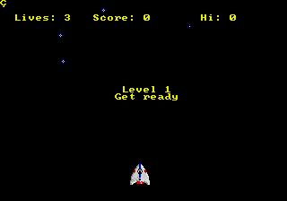

# Stable-Retro

One environment for any game [Stable-Retro](https://github.com/Farama-Foundation/stable-retro)
integrates: the Genesis, NES, SNES, Game Boy, Atari 2600 and the rest of its shelf of consoles.
Each game comes with a save state to start from and a list of RAM variables its integration
names. The environment adds what a planner needs and the Gym interface lacks: a way back to a
state (the emulator's save states) and a goal (a threshold on a variable, or a number of actions
survived). Nothing here reads a game but what its integration declares.

- **Class:** `RetroEnv`
- **Import:** `from planiverse.environments.games.emulated.stable_retro import RetroEnv`
- **Source:** [`planiverse/environments/games/emulated/stable_retro.py`](../../planiverse/environments/games/emulated/stable_retro.py)
- **Instances:** one per save state the integration ships; Airstriker ships one, `Level1`
- **Generator:** `generate_instance(seed, warmup=(0, 40), goal=None, solvable=False, search_limit=2000, attempts=20)`;
  see [Generating instances](#generating-instances)
- **Dependencies:** `stable-retro`, which includes the default game

## Context

Stable-Retro wraps a shelf of console emulators behind one Gym interface. Each game it
integrates has a save state to start from and a list of RAM variables (`data.json`: a score, a
lives counter, a position), with a reward and a done condition over them (`scenario.json`). That
is nearly a planning environment already. What it lacks is a way back to a state, which the
emulators' save states give (`em.get_state()` and `em.set_state()`). It also lacks a goal, which
is a threshold on one of the variables or a number of actions survived. The player's decisions
are the pad's buttons, and the difficulty is the game's own; what the environment adds is a
vocabulary small enough to search (six combinations for Airstriker rather than the 126 the
Genesis pad allows) and a goal the integration's variables can express. The cost is that a goal
is only as good as the variables. Airstriker names a score, a lives count and a game-over flag
and nothing about where the ship is. The honest state identity is therefore the console's whole
RAM, and a survival goal stands in for a score the game withholds for long stretches.

Stable-Retro ships one game with its package, *Airstriker* for the Genesis, which is freely
redistributable and is the default here. Every other integration needs a ROM you own, imported
into Stable-Retro with its own tool (`python -m stable_retro.import /path/to/roms`); nothing is
downloaded and nothing ships with this repository.

```python
from planiverse.environments import make

env = make("retro")                                  # Airstriker, from Level1
env = make("retro", game="SonicTheHedgehog-Genesis-v0", index=2)   # once its ROM is imported
state, info = env.reset()
```

`inttype=` passes a custom integration directory through (`stable_retro.data.Integrations`), for
a game you have written variables for yourself.

The rules are four. First, a bundled instance is one of the integration's save states, in sorted
order, from its first frame. Second, an action holds a button combination for `hold` frames
(four, the frame skip Stable-Retro's own baselines use), so the planner never sees the frames
between two decisions. Third, a state is the emulator's save state with the integration's
variables read off it, and two states are the same when their RAM is, or their variables are
under `identity="variables"`. Fourth, the goal and the dead end are specs over the variables,
the integration's done condition and the step count. A state where the dead end holds is a dead
end whether or not the goal holds too.

## Actions

An action is a button combination as Stable-Retro spells it (`LEFT+B`), or `nop`; a combination
is a set, so `B+LEFT` is `LEFT+B`. The vocabulary is `DEFAULT_ACTIONS[game]`, which for
Airstriker is six combinations, each costing 1:

| Action | Cost | Effect |
|---|---|---|
| `nop` | 1 | no button, four frames run |
| `LEFT`, `RIGHT` | 1 | the ship moves for four frames |
| `B` | 1 | the ship fires |
| `LEFT+B`, `RIGHT+B` | 1 | the ship fires while moving |

For a game the module has no entry for, the vocabulary is every combination the integration's
discrete action space allows, which is 126 on a Genesis pad, and `actions=` on the constructor
narrows it. Pressing holds the combination for `hold` frames. A name that is not a combination
of the pad's buttons is refused with `ValueError`, and actions can be given to `simulate` and
`step` as strings.

`successors` tries every action from the state's save state and drops the ones that change
nothing. Note that under a survival goal the step count is part of the state, so every action
changes it and none is dropped. One expansion is one save-state load and `hold` frames of
emulation per action. The Genesis core runs about a thousand steps a second, so an expansion
costs a few milliseconds, which is cheap beside a replayed simulator and dear beside a
re-implementation.

## Planning problem

A `RetroState` carries a save state (the emulator's, zlib-compressed; a megabyte for the
Genesis, which `Level1`'s first frame compresses to eleven kilobytes), the integration's
variables as integers, and a hash of the console's RAM. Its literals are:

| Literal | When |
|---|---|
| `var(name, value)` | per variable the integration names |
| `ram(hash)` | under `identity="ram"`, the default |
| `steps(n)` | only under a survival goal, since only then is the count part of the problem |
| `goal-reached`, `terminal-state` | in a goal state and in a dead-end state |

Two states are the same when their RAM is. That is the honest identity, and the default
(`identity="ram"`), because an integration's variables are usually a few counters that say
nothing about where things are. Airstriker names `score`, `lives` and `gameover`, and on those
alone every move from the start would fold into one state. `identity="variables"` does exactly
that fold, for a game whose variables do capture the position, and gives a much smaller, coarser
search space. The environment is deterministic given the save state and the inputs either way,
so a plan found under either identity replays. `state_identity` is `snapshot` in the registry:
the state is an emulator image.

A goal or dead-end spec is a dict with one of:

| Spec | Holds when |
|---|---|
| `{"variable": "score", "delta": 100}` | the variable has risen by `delta` since the instance's initial state |
| `{"variable": "score", "at_least": 500}` | `at_least`, `at_most` or `equals` on the variable |
| `{"variable": "lives", "drop": true}` | (dead end) the variable has fallen below its value at the initial state |
| `{"done": true}` | (dead end) the integration's own done condition (`scenario.json`) |
| `{"survive": 100}` | `survive` actions have been taken without a dead end |

The defaults are per game. The goal is `DEFAULT_GOALS[game]` if the module has one (Airstriker:
survive 100 actions, since it scores nothing for long stretches), else one point of `score` if
the integration has one, else survival. The dead end is `DEFAULT_TERMINALS[game]` if the module
has one, else the integration's done condition plus a lost life wherever the integration counts
lives. Airstriker's entry watches its `gameover` variable instead of `lives`. It sits at 9 while
the ship flies and falls the frame the ship is hit. `lives` counts the loss only after the wreck
has played out, twenty actions later, and a survival goal could otherwise be met inside that
wait. Relative specs (`delta`, `drop`) are measured from the instance's own initial state, after
any opening the generator played. With `G` the instance's goal spec, `T` its dead-end spec and
`holds(spec, s)` the reading the table gives, the goal and the dead end are

```
goal(s)     ≡ holds(G, s) ∧ ¬holds(T, s)
terminal(s) ≡ holds(T, s)
```

so a life lost on the hundredth action is not a hundred survived. For Airstriker, with `N` the
actions to survive (100) and `s₀` the instance's initial state, these read

```
goal(s)     ≡ steps(s) ≥ N ∧ ¬terminal(s)
terminal(s) ≡ done(s) ∨ gameover(s) < gameover(s₀)
```

A console game is a stream of frames that runs one way: the player presses, the game moves on,
and there is no returning to a frame already passed. We turn it into an initial-to-goal problem
in three moves, which are the emulator's version of the two the re-implemented games use. First,
the save state gives the way back. Every state carries the emulator's image, so any position can
be restored and expanded again, and the one-way stream becomes a graph. Second, the held
combination folds the frames between two decisions into one action: a press lasts `hold` frames,
so the planner never sees a frame in mid-press, only the position four frames on. Third, the
goal spec and the dead-end spec make the game's own win and loss conditions into the goal test
and the dead-end test on that position. They read as the integration's done condition, a
threshold on a variable, or a count of actions survived where the variables give nothing better.
The cost is coarseness. A press of four frames is the only press the planner can make, so a plan
is a plan at that granularity. A survival goal is a proxy for the game's own, and a plan is
open-loop for the one save state it was found from.

The progress measure the width planners take (`planiverse.benchmark.measures.emulated`) is what
the state says is left: the distance to the target value, or the actions still to survive.

## An example

Instance `0` is Airstriker from `Level1`, its first frame, with `gameover` at 9, `lives` at 3
and `score` at 0. Its actions are the six combinations above, its goal is to survive a hundred
actions, and its dead end is the done condition or a fall in `gameover`. Iterated BFWS, run as
the benchmark runs it (i.e., with the measure above and a width bound of 1000), solved it in 103
expansions and three seconds. Its hundred-move plan, with the runs of `nop` counted, is

```
nop ×56, LEFT, nop ×5, LEFT, nop ×7, B, nop ×7, B, nop ×21
```

which holds still for ninety-six of the hundred actions and spends four on staying alive: two
sidesteps as the first wave arrives and two shots once it has, which is what the fighters'
pattern needs. The shots score 20 points each, so the plan ends with `gameover` still 9, the
three lives intact and a score of 40, none of which the goal asked for.



The render is the console's own frames, one per state. `render_trace` is routed through
`frames`, which loads each state's save state and runs one frame, since a save state holds no
picture and the console draws its screen on its next frame. The same plan is also a [contact
sheet](../renders/retro.png), which keeps twelve of the hundred and one frames
(`max_states=12`), captioned with the step number, the action that produced it, and a note on
the goal state. Both were generated by solving the instance and handing the trace to
`render_trace`:

```python
from planiverse.environments.games.emulated.stable_retro import RetroEnv
from planiverse.benchmark import measures
from planiverse.planners.width import IteratedBFWS

env = RetroEnv()
env.set_index(0)
env.reset()

result = IteratedBFWS(max_width=1000, progress=measures.emulated).solve(env)
trace = env.simulate(result.plan)

env.render_trace(trace, "retro.gif")                                                # animated
env.render_trace(trace, "retro.png", actions=result.plan, env=env, max_states=12)   # contact sheet
```

Stateful play, as opposed to expansion, goes through `step`, which returns the state and how far
the progress measure fell (one per action under a survival goal). `render()` returns the
console's frames for the positions `step` played through, as arrays (see
[Rendering](#rendering)). See [docs/rendering.md](../rendering.md) for the other output formats.

## Generating instances

An instance is plain data:

```python
{"state": "Level1", "warmup": ["LEFT+B", "", "RIGHT"], "goal": {"survive": 100}, "terminal": {"done": true, "variable": "gameover", "drop": true}}
```

`set_index(i)` selects the integration's save states in sorted order, from their first frame;
`set_instance` takes a dict of this shape; `generate_instance` draws one:

```python
instance = env.generate_instance(seed=3)                          # a save state and an opening
instance = env.generate_instance(seed=3, warmup=(20, 60))         # a longer opening
instance = env.generate_instance(seed=3, goal={"variable": "score", "delta": 500})
instance = env.generate_instance(seed=3, solvable=True, search_limit=500)
```

Two things vary in a draw. First, the save state, when the integration ships several. Second, an
*opening*: a run of `warmup` (a range) actions from the vocabulary played from the save state,
so the problem starts somewhere in the level rather than at its first frame. A draw that is
already won or lost after its opening is redrawn. The opening is random play from the game's own
start, as in the no-op and random starts the Atari evaluation protocol uses to vary a
deterministic game (Mnih et al., 2015, https://doi.org/10.1038/nature14236). The instance itself
is one of the game's own stages or save states.

The emulator is deterministic given the save state and the inputs, and everything random in the
draw comes from `random.Random(seed)`. The same seed therefore gives the same instance and the
same initial state, in one process or another. The instance records its `seed` too.

With `solvable=True` the draw is searched, best-first under the goal's own measure, for up to
`search_limit` expansions, and only a solved draw is handed out, with the plan in `env.witness`.
This is off by default: a survival goal is deep, and an emulator expansion is not free.

## Rendering

`render()` returns the console's frames for the positions `step` played through, as `(height,
width, 3)` arrays. `render(target)` and `render_trace` write a trace as a GIF, a contact sheet
or a directory of PNGs of those frames. Each frame is captioned with its step, the action that
produced it and whether it is a goal or a dead end. The variables are `str(state)`.

## Caveats

Three things to know. First, Airstriker never scores under random play and loses a life every
three hundred frames or so, which is why its default goal is survival rather than score. A score
goal on it is a long search. Second, a save state is a megabyte. A visited set of ten thousand
states is a hundred megabytes or more after compression; the width planners' budgets are the way
to bound that. Third, Stable-Retro's `retro` import name is deprecated in favour of
`stable_retro`; the module takes either.

## One emulator per process

Stable-Retro allows one live emulator per process. Environments share it: constructing a second
`RetroEnv` is fine, whichever one is used next takes the emulator over, and the other reopens it
on its next call. Save states survive the handover, so a state expanded under one environment
still expands under the other. `close()` releases it.

## Files

| File | Contents |
|---|---|
| [`stable_retro.py`](../../planiverse/environments/games/emulated/stable_retro.py) | `DEFAULT_ACTIONS`, `DEFAULT_GOALS`, `DEFAULT_TERMINALS`, `RetroAction`, `RetroState`, `RetroEnv` |
| [`tests/test_emulated.py`](../../tests/test_emulated.py) | Tests, shared with the Game Boy environment |
