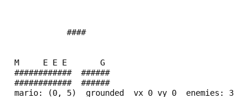

# Super Mario Land

A side-scrolling platformer in pure Python whose movement constants were fitted to
frame-by-frame measurements of the real cartridge. No emulator, no ROM, no dependencies
beyond the standard library.

- **Class:** `SuperMarioLandGame`
- **Import:** `from planiverse.environments.gameboy_py.super_mario_land import SuperMarioLandGame`
- **Source:** [`planiverse/environments/gameboy_py/super_mario_land.py`](../../planiverse/environments/gameboy_py/super_mario_land.py)
- **Instances:** 8 levels, indices `0`–`7`, plus any you supply yourself
- **Dependencies:** none
- **Counterpart:** [`SuperMarioLandGBEnv`](super-mario-land-gb.md) plays the real Game Boy cartridge

## A solved instance



BFWS's plan for instance `0`: 5 moves, one frame per state. The same plan is also a
[contact sheet](../renders/super_mario_land.png), every frame on one image, captioned with the step
number, the action that produced it, and a note on the goal state.

Both were generated by solving the instance and handing the trace to `render_trace`:

```python
from planiverse.environments.gameboy_py.super_mario_land import SuperMarioLandGame
from planiverse.benchmark import measures
from planiverse.planners.width import IteratedBFWS

env = SuperMarioLandGame()
env.fix_index(0)
env.reset()

result = IteratedBFWS(max_width=1000, progress=measures.super_mario_land).solve(env)
trace = env.simulate(result.plan)

env.render_trace(trace, "super_mario_land.gif")                                   # animated
env.render_trace(trace, "super_mario_land.png", actions=result.plan, env=env)     # contact sheet
```

Frames are the state's own text, typeset: `render_trace` falls back to `str(state)` for
an environment with no screen to photograph. See
[docs/rendering.md](../rendering.md) for the other output formats.

## What this is, and what it is not

This is the dependency-free counterpart to `super_mario_land_gb`, and it makes a **weaker
claim** than the other cartridge pairs in this library.

[`puzznic`](puzznic.md) and [`flipull`](flipull.md) are twins of their cartridges: their rules
were derived from the real hardware and reproduce it: exactly in Puzznic's case, partly in
Flipull's. **This is not a twin of Super Mario Land.** The levels are original, the enemies
are simplified, and there is no timer, score, power-up, dash button or press-length jump
control.

What it does share with the cartridge is the movement. The constants were fitted to
frame-by-frame measurements of `Super Mario Land (World) (Rev 1).gb` (the same dump the
[emulator environment](super-mario-land-gb.md)'s memory map was derived from), recording
Mario's screen position (`$C201`/`$C202`) and the on-ground flag (`$C20A`) once per frame
while driving scripted input. Two of the cartridge's mechanics are deliberately left out,
and the arc is fitted around their absence: press-length jump control (on the hardware, how
long `a` is held shapes the climb) and the `b` dash. Here a jump is one fixed arc (the
cartridge's full moving jump), and there is one horizontal speed, the cartridge's walk.

## The physics

Positions are in units, `TILE` (8) units to a tile; one unit is one Game Boy pixel, and one
tick is four Game Boy frames, which is what lets the measured values stay integral. Mario is
one tile square. Each tick, in this order:

1. **Horizontal.** `left`/`right` accelerate towards `SPEED` (4) by `ACCEL` (2) a tick, and
   `FRICTION` (2) slows you when nothing is held. The cartridge walks at a steady 1 pixel a
   frame and reaches it within about six frames of the press (4 units a tick, inside two
   ticks). Speed still carries: what you are travelling at when you leave a ledge is what you
   cross the gap at, and running into a wall takes your speed away.
2. **Jump.** Pressing `a` while standing sets `vy = JUMP_SPEED` (−12). That is the whole
   jump: no press-length control, by design.
3. **Gravity.** `vy += GRAVITY` (2), capped at `MAX_FALL` (12), the measured terminal fall
   of about 3 pixels a frame.
4. **Collision.** Resolved one axis at a time (horizontal, then vertical), so a corner never
   lets you through.

The arc against the cartridge, measured on the same four-frames-a-tick clock:

| | Cartridge (full moving jump) | This model |
|---|---|---|
| Rise | 33 px in 22 frames | 30 units in 5 ticks (20 frames) |
| Airborne | 49 frames | ~10 ticks (40 frames) |
| Horizontal carry | 46 px | ~40 units |

And the consequences, which is what you actually design levels against:

| | |
|---|---|
| Full jump | 3.75 tiles up |
| Widest gap clearable | 6 tiles |
| Tallest step up | 3 tiles |
| Runway to full speed | under 1 tile |

The cartridge's standing jump is lower than its moving jump (24 px against 33). The model
keeps one arc, fitted to the moving jump, because that is the one that decides what is
reachable.

## Death, and what counts as a stomp

Falling out of the level kills. So does touching a hazard, and so does meeting an enemy from
the side. Landing on one from above kills the *enemy* and bounces you, which makes a jump an
attack as well as a way across.

"From above" is judged on where Mario was **before** the vertical move, not where he ended up.
At `MAX_FALL` he crosses the whole of an enemy's upper half inside a single tick, so a test on
the landing position alone would never see him above it and would kill him on something he
plainly landed on.

## Actions

The vocabulary mirrors `super_mario_land_gb`'s `button,ticks` actions, minus `down` (there is
no ducking in this model) and minus `b` (there is no dash). 13 actions: four button
combinations held for 2, 6 or 12 ticks, plus `nop` for 4.

```
a+right,2   a+left,2   right,2   left,2
a+right,6   a+left,6   right,6   left,6
a+right,12  a+left,12  right,12  left,12
nop,4
```

The jump is one fixed arc, so a hold length decides how long a *direction* is held: the short
one is for fine positioning, the long one for covering ground.

`SuperMarioLandAction.cost()` charges 2 per tick for `a` and 1 for a direction, so a plan
can be scored by effort rather than by length.

## Quickstart

```python
from planiverse.environments.gameboy_py.super_mario_land import SuperMarioLandGame

env = SuperMarioLandGame()
env.fix_index(3)
state, info = env.reset()

print(state)
print(info)     # {'level': 3, 'width': 32, 'enemies': 3, 'goal': (30, 5)}

state, gained = env.step("right,12")     # returns tiles of ground gained
```

## Levels

`fix_index(i)` selects level `i`. The shipped levels were **generated and then measured**, the
same way Flipull's stages were: random terrain, explored by a planner, and kept only if the
flag can actually be reached, and ranked by how much search that took, so the set is a ramp
rather than eight variations on one board.

`MEASURED_EXPANSIONS` records what each level cost BFWS(w=2) when it was accepted, in the same
order:

| Level | 0 | 1 | 2 | 3 | 4 | 5 | 6 | 7 |
|---|---|---|---|---|---|---|---|---|
| Expansions | 5 | 6 | 7 | 15 | 16 | 17 | 92 | 406 |

That is data, not a promise: change a physics constant and the numbers move, which is
exactly what happened when the physics were refitted to the cartridge: the set was re-measured
and re-ordered, and one level whose route had depended on the removed short hop was reworked.
The numbers are there so the ramp is written down where it can be checked, and the tests
re-derive a route through every level, so one that stops being finishable fails the suite
instead of quietly wasting a planner's budget. Several candidates were dropped at exactly that
gate: tightening the stomp rule made three previously-solvable levels unreachable, and they
were cut rather than shipped.

Level strings use this alphabet:

| Char | Meaning |
|---|---|
| `#` | Solid ground |
| (space) | Air |
| `^` | Hazard; fatal to touch |
| `E` | An enemy's starting tile |
| `M` | Mario's starting tile |
| `G` | The flag |

`M`, `E` and `G` say where things begin, not what the terrain is, so they are stripped out of
the tile map during parsing. Enemies patrol horizontally and turn at a wall or at the edge of
whatever they are standing on, so one placed in mid-air just oscillates on the spot; the
tests check that none of the shipped levels does that.

You can supply your own:

```python
env = SuperMarioLandGame(levels=["""
        M    E        G
        ####   #########
"""])
env.fix_index(0)
```

## State representation

`SuperMarioLandState` holds the terrain, Mario's position and velocity, whether he is on the
ground, and where the living enemies are. Equality and hashing are over everything except
depth.

Enemy positions are carried in the state rather than derived from a tick counter. Keeping a
clock and computing them would be tidier, but then two identical configurations reached at
different times would compare unequal, search would never close anything, and the state space
would be infinite for no reason.

`literals` is a `frozenset` of strings:

```
at(mario, 12, 5)       Mario's tile
progress(12)           his column, which is the natural progress measure
speed(4)               horizontal velocity
falling(1)  grounded(0)
at(enemy, 19, 5)       each living enemy
enemies(2)
dead()                 only in a dead state
```

## Goals and dead ends

`is_goal` is Mario's box overlapping the flag tile, an overlap rather than an exact tile
match, because he moves up to `MAX_FALL` units in a tick and a test on tile coordinates alone
would let a fast fall drop straight past the flag and count as a miss.

`is_terminal` is **exact about death**. [`SuperMarioLandGBEnv`](super-mario-land-gb.md) cannot
tell you whether Mario died on contact: it has a proximity test over the object array, and
whether contact is fatal depends on a power-up byte the memory map never confirmed, so it
deliberately reports only the music track changing. Here death is defined, so a planner prunes
the moment it happens rather than playing on into a position that no longer exists.

It is **not** a test for whether the level is still winnable, and nothing here claims to be.
Mario can be alive in a pit he cannot jump out of, and no environment in this library detects
that; deciding it in general means solving the level. Dead states are pruned; stuck ones cost
the planner its budget, exactly as they would on the cartridge.

There is no timer and no score. The cartridge has both; this does not model them.

## Planning with it

```python
from planiverse.environments.gameboy_py.super_mario_land import SuperMarioLandGame
from planiverse.planners.width import BFWSSearch, Budget

env = SuperMarioLandGame()
env.fix_index(7)
_, info = env.reset()
result = BFWSSearch(width=2, progress=lambda s: info["width"] - s.tile_x).solve(
    env, Budget(max_expansions=200000, max_seconds=120))
print(result.status, len(result.plan))
```

`progress` on Mario's column is what makes this tractable, and it is worth being clear that it
is doing most of the work: a level whose only demand is "go right" is close to trivial for
BFWS. The shipped levels were selected for costing more than that (towers to climb, gaps that
need a well-timed jump from the very edge, enemies in the lane), but a run-and-jump level with
a distance-to-goal heuristic is an easier problem than Flipull, and the expansion counts show
it.
