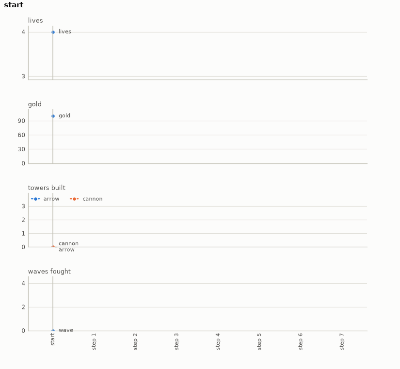

# Tower defence

A tower defence in the genre's own rules, written as small as they can be. Enemies march along a
path from an entrance to an exit, towers beside the path shoot them, and the player decides between
waves what to build with the gold the last wave paid. The player wins by being alive after the last
wave. A map is a path of cells with a few building slots beside it, two kinds of tower are on
offer, and a wave runs to its end once started. Nothing is taken from any published title, and the
environment needs no dependency.

- **Import:** `from planiverse.environments.games.tower_defence.environment import TowerDefenceEnv`
- **Source:** [`planiverse/environments/games/tower_defence/environment.py`](../../planiverse/environments/games/tower_defence/environment.py)
- **Instances:** 100 maps, indices `0` to `99`, all drawn by the generator at recorded seeds
- **Generator:** `generate_instance(seed, waves=None, slots=None, ...)`; see [Generating maps](#generating-maps)

## Context

A map is a path that wanders across a grid of twelve by eight cells from the left edge to the
right. Six to eight building slots lie beside it, and three to five escalating waves are to come.
What the player decides is where and when to build. Between waves any number of towers may be
built, one per action, each on a free slot and for its cost in gold, and then the next wave is
started. An arrow tower fires often and short; a cannon fires slowly, far and hard, for more than
twice the price. Gold comes from kills, a bounty each, and a life goes with every enemy that
reaches the exit. What a placement is worth is only known by running the wave. Range, rate, damage,
speed, hit points and the timing of arrivals all interact. The same tower in the same slot is worth
a lot against a slow thick wave and nothing against a fast thin one that is past it before it
reloads. That is what keeps the environment out of PDDL, and it is the same shape as the flood
environment: a decision now, a simulated period, and only then the bill. The cost is uneven across
the actions. A build is bookkeeping, whereas a `start` runs the wave tick by tick, up to four
thousand ticks. The wave is a short loop of integer arithmetic in a fixed order, though, so the
same decisions give the same outcome on any machine.

The rules are five. First, between waves the player may build any number of towers, one per action,
each on a free slot and for its cost in gold, and then start the next wave. Second, a wave is
`(count, hp, speed, spacing)`: `count` enemies with `hp` hit points enter `spacing` ticks apart and
walk the path at `speed` hundredths of a cell a tick. Third, each tick every tower that has
reloaded fires at the enemy furthest along the path within its range. An arrow tower costs 60,
reaches 1.6 cells, hits for 4 and reloads in 2 ticks; a cannon costs 140, reaches 2.8 cells, hits
for 24 and reloads in 6. Fourth, a kill pays the map's bounty, and an enemy that reaches the exit
costs a life. Fifth, the goal is to have fought every wave with a life left, and no lives is a dead
end.

## Actions

| Action | Cost | Gold | Range | Damage | Reload | Effect |
|---|---|---|---|---|---|---|
| `build(arrow, slot)` | 1 | 60 | 1.6 cells | 4 | 2 ticks | an arrow tower on a free slot |
| `build(cannon, slot)` | 1 | 140 | 2.8 cells | 24 | 6 ticks | a cannon on a free slot |
| `start` | 1 | | | | | the next wave is fought to its end |

Every action costs 1, so a plan is judged by its decisions and not by its gold. A build that the
gold or the slot does not allow (the slot taken, no such slot, or the gold short) changes nothing
and is not offered as a successor. `get_actions()` lists the whole alphabet for the selected map,
two builds per slot and `start`, and `TowerAction.parse` reads one back from its name; `START` is
the `start` action as a constant.

Applying a build is bookkeeping: the tower is added to the state's list and its cost taken from the
gold. Applying `start` runs the next wave tick by tick. Enemies enter `spacing` ticks apart until
the count is out and advance `speed` hundredths of a cell along the path each tick, and an enemy
past the path's end leaks and costs a life. Then each tower whose reload has run down picks the
enemy furthest along the path whose cell is within its range of the tower's slot, hits it for its
damage and reloads. An enemy with no hit points left is a kill and pays the bounty. The wave ends
when everyone due has entered and none is left on the path, or after four thousand ticks. The
state's wave count then rises by one, its gold by the bounties, and its lives fall by the leaks, to
no lower than zero.

## Planning problem

A `TowerState` holds the towers as `(slot, kind)` pairs, the gold, the lives, and how many waves
have been fought. Equality and hashing are over the four, so a position is the same position
wherever it was reached from; `depth` is bookkeeping. The path, the slots and the waves belong to
the instance rather than the state. The literals name the towers, the gold rounded down to a
multiple of twenty, the lives and the waves fought. The rounding is what the width-based planners'
novelty tests see, since every bounty would otherwise make a new gold value:

```
tower(arrow, 2)
gold(80)
lives(3)
waves_fought(1)
```

With `W` the map's number of waves, the goal and the dead end are

```
goal(s)     ≡ lives(s) > 0 ∧ wave(s) = W
terminal(s) ≡ lives(s) = 0
```

Both are absorbing (i.e., no action leads out of them): `successors` returns nothing for either and
`__advance__` returns the state unchanged.

The game as played is a real-time loop in which enemies walk and towers fire whether or not the
player is building. It is won or lost by the lives left when the last wave is over. We turn it into
an initial-to-goal problem in two moves. First, the loop between two decisions (a wave of ticks,
from the first enemy's entry to the last one's death or escape) is folded into the `start` action,
as described above. A state is therefore always a map between waves, and the planner never sees an
enemy on the path. Second, the game's win and loss conditions become the goal test and the dead-end
test on that state. The win is the wave count with a life left, and the loss is decided the moment
the lives reach zero. What the reduction costs is the freedom to build during a wave. A wave once
started runs to its end, so the planner cannot react to it, and a placement is judged only by the
wave count, the gold and the lives it leaves. Gold is kept on the state and bounds what can be
built, but it is not the objective, since every action costs 1 and a plan is judged by its length.

The progress measure the width planners take (`planiverse.benchmark.measures.tower_defence`) is
twenty less the waves fought, an upper bound on the waves still to fight since no map has more than
five. A state with no lives is pinned above any live one.

## An example

Instance `0` is seed 3000: a path of eighteen cells from the entrance at (0, 4) to the exit at (11,
2), which dips at column 3 and climbs at columns 9 and 10. Eight slots lie beside it, and the map
has four waves, 100 gold, 4 lives and a bounty of 5 a kill. The map, with the path as `=`, the
slots by their number, `E` the entrance, `X` the exit and the origin at the top left, is

```
............
..........6.
..........=X
====.235.==.
E..=======7.
0..==.4.....
....1.......
............
```

The waves are `(6, 13, 12, 10)`, `(8, 19, 14, 10)`, `(9, 28, 14, 10)` and `(10, 43, 17, 18)`. That
is six enemies of 13 hit points at first and ten of 43 at the last, each wave walking as fast as
the one before or faster. Iterated BFWS, run as the benchmark runs it (i.e., with the measure above
and a width bound of 1000), solved it in 10 expansions and under a tenth of a second. Its
seven-decision plan is

```
build(arrow,1), start, build(arrow,2), start, start, build(arrow,0), start
```

The first arrow tower goes on slot 1, under the dip at columns 3 and 4, for 60 of the 100 gold. The
first wave leaks one enemy and pays 25 for the five it kills. The second goes on slot 2, above the
straight along row 4, and leaves 5 gold; the second and third waves are fought with those two
alone, leak nothing and pay 40 and 45. The third goes on slot 0, next to the entrance, before the
last wave, which leaks nothing either, so the plan ends with 3 lives and 80 gold. Note that no
cannon is bought: the purse never reaches 140 at any point of the plan.



The render draws the readings of each state over the plan rather than the state's text, since a
state here is a line of numbers. The panels are the lives, the gold, the towers built of each kind
and the waves fought, decision by decision. A frame of the GIF is the chart up to its state, so the
animation grows a step at a time. The same plan is also a
[sheet](../renders/tower_defence_chart.png), the whole plan on one figure, with the action that
produced each state along the bottom and the goal marked where the plan ends. There is no dashed
target line here, since none of these readings has a target. Both were generated by solving the
instance and handing the trace to `render_trace`:

```python
from planiverse.environments.games.tower_defence.environment import TowerDefenceEnv, TowerAction, START
from planiverse.benchmark import measures
from planiverse.planners.width import IteratedBFWS

env = TowerDefenceEnv()
env.set_index(0)
state, info = env.reset()          # info: map, waves, slots, gold, lives, generated
print(state)                       # wave 0 fought, 4 lives, 100 gold; nothing built

result = IteratedBFWS(max_width=1000, progress=measures.tower_defence).solve(env)
trace = env.simulate(result.plan)

env.render_trace(trace, "tower_defence_chart.gif")                                   # animated
env.render_trace(trace, "tower_defence_chart.png", actions=result.plan, env=env)     # the sheet
```

Stateful play, as opposed to expansion, goes through `step`, which takes a `TowerAction` such as
`TowerAction("arrow", 2)` or `START` and returns the state and the lives lost since the last one.
The readings each environment charts, and the panels they go on, are in
[`planiverse/rendering/readings.py`](../../planiverse/rendering/readings.py); `charts=False` asks
`render_trace` for the state's text instead, and [docs/rendering.md](../rendering.md) covers the
other output formats.

## Maps

The hundred maps are the generator's own draws, embedded in the module as the plain data
`set_instance` takes with the seed each came from beside it, and the plan each was accepted on is
in `tests/data/tower_defence_solutions.json`. A map is a path that wanders up and down across a
twelve by eight grid, with six to eight building slots beside it. It has three to five waves, whose
hit points grow by two fifths to four fifths each wave. It comes with a starting purse of 100 to
140 gold, two to four lives and a bounty of 4 to 6 a kill. The purse buys one or two towers at the
start; the rest has to be earned, so the slots at the bends, where a tower sees the path twice, are
the ones that matter. The plan each map was accepted on runs from four to ten decisions.

## Generating maps

`generate_instance` draws a map, selects it, and returns it as the dict `set_instance` takes back:

```python
env = TowerDefenceEnv()
game = env.generate_instance(seed=7, waves=4)
print(env.witness, env.witness_expansions)     # the plan it was accepted on, and the search's cost
state, info = env.reset()                       # info["generated"] is True
```

| Option | Default | What it does |
|---|---|---|
| `waves` | 3 to 5 at random | waves to fight |
| `slots` | 6 to 8 at random | building slots beside the path |
| `search_limit` | 600 | expansions the acceptance search may spend per draw |
| `attempts` | 40 | draws before giving up with `GenerationError` |

A draw is kept only if every thoughtless plan loses it (starting every wave building nothing, and
filling the slots in order with arrows, or with cannons, whenever the gold allows). A best-first
search over decisions, guided by the waves left to fight and the lives lost, must then find a way
to win within `search_limit` expansions. The method is generate-and-test, which the procedural
content generation literature calls search-based PCG (Togelius, Yannakakis, Stanley and Browne,
2011, https://doi.org/10.1109/TCIAIG.2011.2148116; Shaker, Togelius and Nelson, *Procedural Content
Generation in Games*, 2016, https://pcgbook.com/).

## Files

| File | Contents |
|---|---|
| [`environment.py`](../../planiverse/environments/games/tower_defence/environment.py) | `TowerAction`, `TowerState`, the wave (`run_wave`), `draw_map`, `TowerDefenceEnv`, `MAPS` |
| [`tests/test_tower_defence.py`](../../tests/test_tower_defence.py) | Tests |
| [`tests/data/tower_defence_solutions.json`](../../tests/data/tower_defence_solutions.json) | The plan each map was accepted on |
