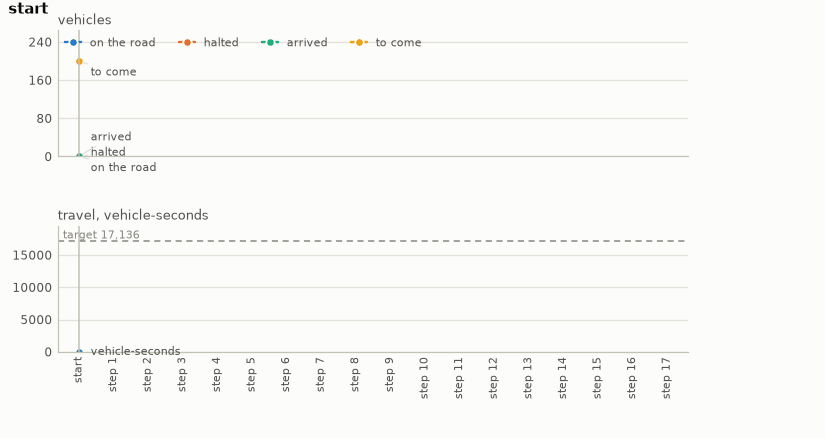

# Traffic signals

Signals on a SUMO grid. Three by three signalised junctions, a stub road off each edge of the
map, and a seeded morning of trips from one stub to another. A decision every thirty seconds:
switch one junction, a row, a column, all nine, or none. The goal is every trip through before
the horizon with the total travel time under the target, and the plan is the sequence of
switches that gets the morning there.

- **Import:** `from planiverse.environments.operational.traffic.environment import TrafficEnv`
- **Source:** [`planiverse/environments/operational/traffic/environment.py`](../../planiverse/environments/operational/traffic/environment.py)
- **Instances:** 100 mornings, indices `0` to `99`, all drawn by the generator at recorded seeds
- **Generator:** `generate_instance(seed, vehicles=None, spacing=None, horizon=None, ...)`; see [Generating mornings](#generating-mornings)
- **Dependencies:** `eclipse-sumo`, `libsumo`

## Context

The game here is the one a traffic control room plays. A grid of nine signalised junctions
takes a morning's trips, each from a stub road on one edge of the map to a stub on another.
Every thirty seconds we decide which signals to switch: one junction, a row of three, a column
of three, all nine, or none. A switch is three seconds of amber and then the other green. What
makes the decision hard is that the junctions are coupled. A green that clears one queue sends
its vehicles into the next block, where they meet a red and queue again. A queue that fills its
block spills back into the junction behind it and blocks the cross traffic there. The
car-following, the lane changing, the queues spilling back through the grid and the time each
trip takes are SUMO's. The effect of a switch is therefore only known by running the next
thirty seconds, which keeps the environment out of PDDL.

[SUMO](https://eclipse.dev/sumo/) (Eclipse Public License 2.0 with GPL-2.0-or-later as a
secondary licence; Lopez et al. 2018, https://doi.org/10.1109/ITSC.2018.8569938) is the Eclipse
Foundation's microscopic traffic simulator (i.e., one that moves every vehicle individually
rather than modelling flows). It is a dependency installed from PyPI as `eclipse-sumo` (the
binaries) and `libsumo` (the in-process binding); nothing of it is included here. The grid is
drawn by its `netgenerate` on first use and the trips by the environment from the instance's
seed. Running the vehicles individually is what gives the queues their spill-back and the trips
their times. It is also what makes a successor a replay of the morning rather than a
microsecond of arithmetic, as the next section says.

The rules are three. First, the grid is SUMO's `netgenerate` three-by-three grid with 150 m
blocks and 120 m stubs, one lane each way, every junction a static signal with a north-south and
an east-west green. The trips are the instance's: one departure every `spacing` seconds from a
seeded entry stub to a seeded exit stub on another side. SUMO runs them from a fixed seed with
teleporting off, so a vehicle stuck in a queue stays in it. Second, a decision is thirty
seconds. `switch(j)` puts junction `j` on amber for three seconds and then on the other green;
`switch(row1)`, `switch(col2)` and `switch(all)` do it to a row, a column or all nine at once;
`hold` changes nothing. Third, the goal is every vehicle arrived before the horizon with the
vehicle-seconds spent on the road (i.e., the number of vehicles on the road, summed over every
second of the morning) under the target. The horizon passing with vehicles left is a dead end,
and so is everyone arrived over the target.

## Actions

| Action | Cost | Junctions switched | Effect |
|---|---|---|---|
| `switch(j)`, `j` one of the nine junctions `A0` to `C2` | 1 | 1 | junction `j` goes amber for three seconds, then to its other green |
| `switch(row0)`, `switch(row1)`, `switch(row2)` | 1 | 3 | the row's three junctions do the same together |
| `switch(col0)`, `switch(col1)`, `switch(col2)` | 1 | 3 | the column's three junctions do the same together |
| `switch(all)` | 1 | 9 | every junction does the same together |
| `hold` | 1 | 0 | the signals stay as they are |

Seventeen actions in all, and `get_actions` offers all seventeen in every state, since a switch
is always legal: a junction switched twice is back on the green it started with. A name that is
not one of the seventeen leaves the state unchanged, and a goal or dead-end state has no
successors at all. Applying an action runs SUMO through the thirty seconds a second at a time,
amber first when anything switches and the greens for the rest. Each second it counts the
vehicles that arrive and the vehicles on the road, which is where the vehicle-seconds come
from. Note that the successor is not obtained by advancing a copy of the running simulation.
SUMO's saved state reloads with the route file re-read, so the environment replays the whole
morning from its first vehicle for every successor. This is what makes the same decisions
always give the same morning, and it is paid for in time. A morning of two hundred vehicles
takes a tenth of a second to replay, and an expansion is seventeen replays, which
[NOTES.md](../../NOTES.md) measured at 0.4 to 0.7 seconds.

## Planning problem

A `TrafficState` holds the decisions so far and the grid after them: the time, the vehicles
arrived, on the road, halted and still to depart, the vehicle-seconds spent, and the green
each junction shows. Two states are the same state when their decisions are the same,
because SUMO replays exactly from its seed and the same commands, so the decisions determine
every reading. The literals name each junction's green (`A` or `B`, its two phases) and the
decision count. They give the arrived, the running and the pending exactly, and the halted and
the vehicle-seconds in bands (fives for the halted, five hundreds for the travel). The bands are
what the width-based planners' novelty tests see:

```
green(B1, A)
decision(4)
arrived(31)
running(24)
pending(65)
halted(10)
travel(2500)
```

With `T` the horizon in seconds, `V` the target in vehicle-seconds and `left(s)` the vehicles on
the road or still to depart (i.e., `running(s) + pending(s)`), the goal and the dead end are

```
goal(s)     ≡ left(s) = 0 ∧ time(s) ≤ T ∧ travel(s) ≤ V
terminal(s) ≡ ¬goal(s) ∧ (time(s) ≥ T ∨ left(s) = 0)
```

Note that the problem as a control room would state it is not an initial-to-goal problem but a
trajectory problem (i.e., one whose requirements hold over the whole run rather than at its
end). Everyone must be through by the horizon, and the travel time over the whole morning must
be small. We turn it into the goal above with the reduction the epidemic, airspace and reservoir
environments share, which [NOTES.md](../../NOTES.md) sets out in full, in three moves. First, a
constraint that must hold throughout becomes a dead end: the horizon passing with vehicles still
on the road is terminal, and so is everyone arrived over the target, since nothing can then
improve. A check over the whole trajectory thus becomes a check at each state. Second, a
quantity that accumulates becomes part of the state and is bounded at the goal. The
vehicle-seconds are carried on the state, added to every second, and compared with the target once the grid is
clear. Third, the horizon becomes time in the state: the simulation clock is a state variable,
so "by the horizon" is a condition on a state rather than on a trajectory. The cost of the
reduction is that the goal depends on a target, and a target has to come from somewhere. Here
it is the least travel any fixed cycle achieves with a tenth in hand (see
[Generating mornings](#generating-mornings)), so every instance is solvable by construction.
The planner is asked to come within a tenth of a timer by switching where the queues are.

The progress measure the width planners take (`planiverse.benchmark.measures.traffic`) is the
vehicles still to get through the grid plus those halted in a queue right now. A signal that
leaves a queue standing is the thing to change.

## An example

Instance `0` is a morning of 200 vehicles, one every 2.0 seconds, with a horizon of 600 seconds
and a target of 17,136 vehicle-seconds. Iterated BFWS, run as the benchmark runs it (i.e., with
the measure above and a width bound of 1000), solved it in 23 expansions and 16.4 seconds. Its
seventeen-decision plan is

```
switch(A2), switch(all), switch(all), switch(all), switch(all), switch(all), switch(all),
switch(all), switch(all), switch(all), switch(all), switch(all), switch(all), switch(all),
switch(all), switch(all), switch(all)
```

which is the timer the morning was accepted on (every signal switched every decision) with one
early switch of its own, at junction `A2` alone. It clears the grid at 510 seconds with 15,476
vehicle-seconds, 103 fewer than the timer's 15,579 and well under the target. Note that the
search took 23 expansions once the state carried the queue (i.e., the halted count the measure
reads), and ran out of a fifteen-minute budget without it.



The render draws the readings of each state over the plan rather than the state's text, since a
state here is a handful of numbers. The panels are the vehicles on the road, halted, arrived and
still to come, and the vehicle-seconds against the target, decision by decision. A frame of the
GIF is the chart up to its state, so the animation grows a step at a time. The same plan is also
a [sheet](../renders/traffic_chart.png), the whole plan on one figure. There the action that
produced each state runs along the bottom, the target is a dashed line, and the goal is marked
where the plan ends. Both were generated by solving the instance and handing the trace to
`render_trace`:

```python
from planiverse.environments.operational.traffic.environment import TrafficEnv
from planiverse.benchmark import measures
from planiverse.planners.width import IteratedBFWS

env = TrafficEnv()
env.set_index(0)
state, info = env.reset()          # info: morning, vehicles, horizon, target, generated
print(state)                       # t=0s: 0 of 200 arrived, 0 on the road (0 halted), 200 to come; ...

result = IteratedBFWS(max_width=1000, progress=measures.traffic).solve(env)
trace = env.simulate(result.plan)

env.render_trace(trace, "traffic_chart.gif")                                   # animated
env.render_trace(trace, "traffic_chart.png", actions=result.plan, env=env)     # the sheet
env.close()                                                                    # shuts SUMO down
```

Stateful play, as opposed to expansion, goes through `step`, which takes an action or its name
(e.g., `"switch(B1)"`) and returns the state and the vehicles arrived since the last one.
`successors(state)` returns the action and state pairs for all seventeen actions, and `close()`
shuts the simulator down. The readings each environment charts, and the panels they go on, are
in [`planiverse/rendering/readings.py`](../../planiverse/rendering/readings.py); `charts=False`
asks `render_trace` for the state's text instead, and [docs/rendering.md](../rendering.md)
covers the other output formats.

## Mornings

The hundred mornings are the generator's own draws, embedded in the module as the plain data
`set_instance` takes (`seed`, `vehicles`, `spacing`, `horizon`, `target`) with the seed each came
from beside it. The plan each was accepted on is in `tests/data/traffic_solutions.json`.
Mornings have 120 to 240 vehicles, one every one to two seconds, and horizons of ten to fifteen
minutes.

## Generating mornings

`generate_instance` draws a morning, selects it, and returns it as the dict `set_instance` takes
back:

```python
env = TrafficEnv()
morning = env.generate_instance(seed=7, vehicles=160)
print(env.witness, env.witness_expansions)     # the cycle it was accepted on, and the cycles measured
```

| Option | Default | What it does |
|---|---|---|
| `vehicles` | 120, 160, 200 or 240 | the morning's trips |
| `spacing` | 1.0, 1.5 or 2.0 s | between departures |
| `horizon` | 600, 750 or 900 s | the deadline |
| `attempts` | 40 | draws before giving up with `GenerationError` |

A draw is measured by fixed cycles that switch every junction every one, two or three
decisions, and by holding the signals as they start. The target is the least travel any of them
clears the grid with before the horizon, with a tenth in hand. The draw is thrown back when none
does or when holding is already best, and the best cycle is the witness. The same seed and
options always give the same morning.

## Files

| File | Contents |
|---|---|
| [`environment.py`](../../planiverse/environments/operational/traffic/environment.py) | `TrafficAction`, `TrafficState`, the grid (`network`, `trips`), `TrafficEnv`, `MORNINGS` |
| [`tests/test_operational_four.py`](../../tests/test_operational_four.py) | Tests |
| [`tests/data/traffic_solutions.json`](../../tests/data/traffic_solutions.json) | The plan each morning was accepted on |
