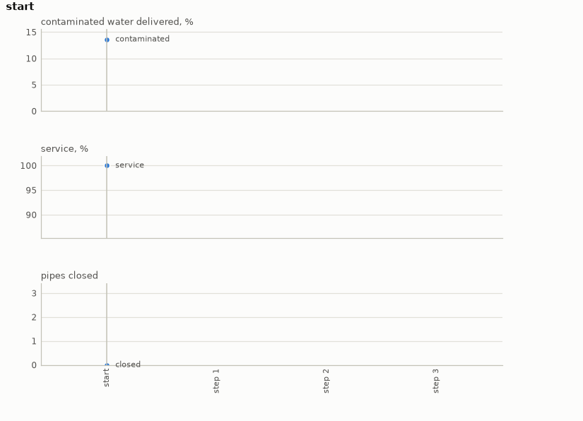

# Water distribution

Containing a contaminant in a drinking-water network on WNTR, one closed pipe at a time. A
contaminant enters at one junction, and every node downstream of it drinks a share. Which nodes
those are depends on where the water is flowing, and the operator's one move, closing a pipe,
reroutes the flow and changes the answer everywhere at once. The goal is to contain the
contamination without cutting off the customers, and that tension is the problem: every closed
pipe contains a little more and costs a little more service.

- **Class:** `WaterNetworkEnv`
- **Import:** `from planiverse.environments.water_network.environment import WaterNetworkEnv`
- **Source:** [`environment.py`](../../planiverse/environments/water_network/environment.py)
- **Instances:** 100 scenarios, indices `0` to `99`: nine chosen by hand from the source ranking, then 91 the generator drew
- **Generator:** `generate_instance(seed, network=None, min_baseline=0.1)`; see [Generating scenarios](#generating-scenarios)
- **Dependencies:** `wntr`. The benchmark networks ship inside it, so there is nothing to supply.

## Context

The system is a drinking-water distribution network: junctions where customers draw water, pipes
between them, and the tanks and reservoirs that feed them. The pressures and flows in it are the
solution of a nonlinear system over the whole network. A contaminant enters at one junction and is
carried with the water, so every node downstream of it drinks a share, and which nodes those are
depends on where the water flows. The operator's move is to close pipes. Closing a pipe reroutes
the flow, which changes who drinks the contaminant, but a network cannot deliver more water with
more pipes shut, so every closure also costs some service. The problem is to contain the
contamination without cutting the customers off.

The hydraulics, the transport and the networks are WNTR's. [WNTR](https://github.com/USEPA/WNTR)
(BSD) is the US EPA's Python interface to EPANET, and the `Net1`, `Net2` and `Net3` benchmark
networks ship inside it. Containment is read off EPANET's trace analysis (i.e., the share of the
water at each node, at each timestep, that came from the source junction), which is transport
computed on top of the hydraulic solution. This is not a PDDL domain, and not merely because
PDDL would be verbose here. Two properties, both measured on the shipped networks, rule it out.
First, effects are global. On `Net3`, closing a single pipe changes the pressure at 94 of the 97
nodes. The effect of `close pipe 123` is therefore not a set of facts to add and delete but an
instruction to re-solve the hydraulics and the transport and see what happens. Second, effects
are not monotone. On `Net1` with the source at node 12, closing pipe `110` makes the
contamination *worse*, because it pushes flow down a path that reaches more customers. A
delete-list cannot express that, and neither can a planner that assumes closing more pipes
contains more. A third property is softer: which pipes matter is not readable off the topology.
On `Net3` the source has four pipes on it, two of which carry essentially all the contamination
and two of which do nothing at all, and nothing structural distinguishes them. The cost of the
simulator is that every successor is a full hydraulic and transport solve, a few hundredths of
a second rather than a microsecond.

The rules are four. First, the network runs for twelve hours with the source as the trace node,
under pressure-driven demand (`demand_model = "PDD"`). That model delivers a junction's full
demand only above a required pressure and nothing at all below a minimum. Containment is the share
of all the water delivered in that window that came from the source, and service is the share
of the expected demand that was delivered. Second, a move closes one pipe for good, and the
network is re-solved with the closed set. Third, a state whose service has fallen below half is
a dead end. Fourth, the contamination is contained when at most 2 per cent of the delivered
water came from the source and at least 80 per cent of the demand is still met.

Pressure-driven demand, rather than the demand-driven default, is the choice that makes the
problem. Under the demand-driven model a node takes its full demand no matter how little
pressure is left, so closing pipes would look free and there would be no trade-off to plan
against. Note that a junction may have a *negative* demand, which is an injection into the
network rather than a customer drawing from it. Counted as written it drags the network's total
expected demand below zero and makes the service ratio meaningless, so both sides of the ratio
are clipped at zero.

## Actions

| Action | Cost | Effect |
|---|---|---|
| `close_pipe_P` | 1 | pipe `P` is closed for good, and the network is re-solved with it shut |

`WaterNetworkAction(pipe)` closes one pipe. That is the entire action set, and the entire
operator interface, with a cost of 1 each. The candidate pipes default to those within
`radius=2` hops of the source, because the full pipe list is a branching factor of 117 on
`Net3`, nearly all of it nowhere near the incident. `WaterNetworkEnv(radius=None)` offers every
pipe, which is the honest setting and a slow one. Note that the `Net2` investigation in
[Scenarios](#scenarios) used the unrestricted setting, so the restriction is not what made those
instances unsolvable. `successors` skips a candidate that is already closed and drops any
successor equal to its parent. It returns nothing from a goal or a dead end, so both are
absorbing (i.e., no action leads out of them), and `simulate` leaves such a state where it is.

Applying an action runs EPANET over the twelve-hour window with the new closed set, a hydraulic
solve and a trace solve together, and reads the two shares off the result. The result is
memoised on the closed set, since the same configuration is reached by many orderings and a
deterministic solve cannot give it two answers (see [Determinism](#determinism)).

## Planning problem

A `WaterNetworkState` holds the closed set and what the network does with it:

| Field | Meaning |
|---|---|
| `closed` | frozenset of closed pipe names; the whole state |
| `contaminated` | share of all delivered water that came from the source |
| `service` | share of expected demand actually delivered |
| `pressure_deficit` | mean shortfall below the required pressure |
| `depth` | plan length; not part of identity |

Two states with the same pipes shut are the same state, so `__eq__` and `__hash__` are on the
closed set alone. The literals name each closed pipe, and the two readings in twentieths:

```
closed(PIPE)
contaminated(N)      # bucketed into twentieths
service(N)
```

The two metrics are bucketed because a planner keyed on raw floats would treat every state as
novel. The closed set is what identifies the state, and the buckets are there for width-based
methods that measure novelty over atoms. With `G` the contamination goal (0.02), `S` the service
goal (0.80) and `F` the service floor (0.50), the three thresholds `WaterNetworkEnv` takes as
arguments, the goal and the dead end are

```
goal(s)     ≡ contaminated(s) ≤ G ∧ service(s) ≥ S
terminal(s) ≡ service(s) < F
```

Both halves of the goal are needed: closing every pipe at the source contains perfectly and is
not a solution. The dead end is sound because service is monotone in the closed set: a network
cannot deliver more water with more pipes shut, so a collapsed state can never recover.
Contamination is not monotone, which is why only one of the two can be used this way. Both are
absorbing, so `successors` returns `[]`.

Note that the problem as a water utility would state it is a trajectory problem (i.e., one whose
requirements hold over the whole run rather than at its end). The customers must keep their
water at every step, and the contamination must be contained by the end. We turn it into the
goal above with the reduction the grid and flood environments use, which
[NOTES.md](../../NOTES.md) sets out in full, in three moves. First, a constraint that must hold
throughout becomes a dead end. The first closure that drops service below the floor is terminal,
so no plan through it exists, and a check over the whole trajectory becomes a check at each
state. Second, a quantity that accumulates becomes part of the state and is bounded at the goal:
the closed set accumulates, the readings it determines are carried on the state, and the goal
bounds them. Third, the horizon becomes time in the state, and here the third move is not
needed. A closure is permanent, there is no clock, and the goal may be met at any depth, so
`depth` is carried for reporting only. The cost of the reduction is that the goal depends on
thresholds, and here they are constants of ours rather than what a reference policy achieves.
Nothing therefore guarantees that an instance is solvable, which is why every scenario carries
the depth a search actually solved it at, and why `Net2` is not one of them (see
[Scenarios](#scenarios)).

The progress measure the width planners take (`planiverse.benchmark.measures.water_network`) is
the share of delivered water that is contaminated. A planner is thus pulled towards
containment, and relies on the dead end to keep it from closing everything. Note that
[Shape of the search](#shape-of-the-search) says where that signal on its own is not enough.

## An example

Instance `0` is `Net1`, a network of 12 pipes, with the contaminant entering at junction 23.
With nothing closed, 13.6 per cent of the water delivered over the twelve hours came from the
source, and service is 100 per cent. Of the 12 pipes, 11 lie within two hops of the source and
are on offer. Iterated BFWS, run as the benchmark runs it (i.e., with the measure above and a
width bound of 1000), solved it in 3 expansions and half a second. Its three-closure plan is

```
close_pipe_111, close_pipe_113, close_pipe_22
```

which leaves 0.0 per cent of the delivered water contaminated at 86.4 per cent service. Closing
`111` and then `113` changes nothing the readings can see, since the contamination stays at 13.6
per cent after each. It is `22` together with `113` that cuts the source off from the customers
downstream of it. Closing those two alone gives the same readings, which is the depth-2
solution the bundled record refers to. The extra closure is the price of a best-first search
that stops at the first goal it reaches rather than the shortest plan.



The render draws the readings of each state over the plan rather than the state's text, since a
state here is a closed set and two numbers. The panels are the share of contaminated water
delivered, the service level and the pipes closed. A frame of the GIF is the chart up to its
state, so the animation grows a step at a time. The same plan is also a
[sheet](../renders/water_network_chart.png), the whole plan on one figure. There the action that
produced each state runs along the bottom and the goal is marked where the plan ends; none of
the three panels carries a target, so no dashed line is drawn. Both were generated by solving
the instance and handing the trace to `render_trace`:

```python
from planiverse.environments.water_network.environment import WaterNetworkEnv
from planiverse.benchmark import measures
from planiverse.planners.width import IteratedBFWS

env = WaterNetworkEnv()
env.set_index(0)                   # Net1, contaminant at junction 23
state, info = env.reset()          # info: network, source, pipes, candidates, contaminated, service, ...
print(state)                       # closed: nothing / contaminated delivered: 13.6% / service: 100.0%

result = IteratedBFWS(max_width=1000, progress=measures.water_network).solve(env)
trace = env.simulate(result.plan)

env.render_trace(trace, "water_network_chart.gif")                                 # animated
env.render_trace(trace, "water_network_chart.png", actions=result.plan, env=env)   # the sheet
env.close()                        # removes the simulator's scratch directory
```

Stateful play, as opposed to expansion, goes through `step`, which returns the state and the
contamination cut since the last one. `successors(state)` returns the action and state pairs for
the candidate pipes not yet closed, and `get_actions()` lists every candidate whatever the
state. `env.render()` prints the history of `step` calls and returns it as a list of strings.
The readings each environment charts, and the panels they go on, are in
[`planiverse/rendering/readings.py`](../../planiverse/rendering/readings.py); `charts=False`
asks `render_trace` for the state's text instead, and [docs/rendering.md](../rendering.md)
covers the other output formats.

## Scenarios

`set_index(i)` picks a network together with the junction the contaminant enters at. There are
nine chosen scenarios, ordered by how deep a solution is:

| Index | Network | Source | Contaminated with nothing closed | Solved at depth |
|---|---|---|---|---|
| 0 | Net1 | 23 | 13.6% | 2 |
| 1 | Net3 | 123 | 61.9% | 2 |
| 2 | Net3 | 199 | 41.4% | 2 |
| 3 | Net3 | 121 | 56.3% | 2 |
| 4 | Net1 | 21 | 30.0% | 3 |
| 5 | Net3 | 119 | 56.2% | 3 |
| 6 | Net1 | 12 | 40.8% | 4 |
| 7 | Net1 | 22 | 28.7% | 4 |
| 8 | Net1 | 11 | 80.1% | 7 |

`solved_at` is a measurement rather than an estimate: it is the shallowest depth at which a
solution was actually found. We record it because an instance whose goal nobody has reached is a
poor benchmark entry, since a planner cannot tell "unreachable" from "not found yet". Every
scenario here has been solved.

We tried `Net2` and dropped it for exactly that reason. Its sources sit on trunk mains that cannot
be rerouted around, and a width-16 beam search to depth 8 with every one of its 40 pipes available
plateaued at 36% contamination and stopped improving. Rather than ship an instance that is
probably unsolvable, we left it out.

The sources are not arbitrary either. `rank_sources(network_file)` runs every junction of a
network as the source and reports how much of the delivered water ends up contaminated, and we
chose the scenarios off that ranking. The function is kept so the choice can be re-derived rather
than taken on trust.

Index 8 is the interesting one. `Net1` with the source at node 11 contaminates 80% of everything
delivered, and it is solvable. We proved that exhaustively over the full powerset of its 12 pipes,
finding exactly three feasible closures at depth 7, one of which reaches zero contamination at
100% service. A width-16 beam search to depth 8 does not find it. It is also where the obvious
heuristic fails, since ranking states by contamination alone marches straight into "close
everything", giving contamination zero, service zero, and the goal failed.

Indices `9` to `99` were drawn by `generate_instance` at the seeds they record (`seed`) in
`SCENARIOS`, by the same two tests the nine above were chosen by. Each carries its measured
baseline and the depth it was solved at.

## Generating scenarios

`generate_instance` draws a scenario the way the bundled ones were chosen, selects it, and
returns it as a dict that `set_instance` accepts back:

```python
env = WaterNetworkEnv()
scenario = env.generate_instance(seed=7)     # or make("water_network", seed=7)
# {'network': 'Net3.inp', 'source': '61', 'baseline': 0.488}
state, info = env.reset()
```

| Option | Default | What it does |
|---|---|---|
| `network` | `None` | the network to draw on: `Net1.inp` or `Net3.inp` at random, or a name from WNTR's library, or a path to an EPANET `.inp` file of your own |
| `min_baseline` | 0.1 | the share of delivered water the source must contaminate with nothing closed |
| `solvable` | `True` | search each draw and keep only one with a plan |
| `search_limit` | 150 | expansions the check may spend per draw |
| `min_plan_length` | 1 | reject a draw whose shortest plan is shorter |
| `attempts` | 40 | junctions tried before giving up with `GenerationError` |

The source is a junction drawn at random and kept only if, with nothing closed, at least
`min_baseline` of the delivered water comes from it, the same test `rank_sources` applies.
A source that poisons a few per cent of the network is not a containment problem. The draw is
then searched breadth-first, and kept only if a plan was found: `witness` holds it and the
instance records `solved_at`, the way every bundled scenario carries the depth it was solved
at. Every expansion costs one hydraulic solve per candidate pipe, so the default budget
covers every two-closure plan on the shipped networks and the shallower three-closure ones.
A source that needs a deeper plan, like bundled scenario 8, is rejected unless the limit is
raised. `Net2` is not drawn on by default because no source on it has been solved (see
[Scenarios](#scenarios)); `set_instance({"network": "Net2.inp", "source": ...})` still
loads one.

The draw is on the networks WNTR ships and its own water quality simulation
(https://wntr.readthedocs.io/), so a generated scenario is a real network with a real
source; the test is breadth-first search over closures.

## Determinism

The design rests on determinism, so we tested it rather than assuming it: the same set of closed
pipes simulates bit-identically every time, at a maximum absolute pressure difference of `0.0`
across repeated runs. Three consequences follow. First, the closed set is a sufficient statistic
for the state. Two states with the same pipes shut are the same state, so `__eq__` and
`__hash__` are on the closed set alone and search can close over them. Second, results are
memoised on the closed set. Third, `simulate` re-runs from scratch, so it is an independent
check on `successors`.

`depth` is deliberately not part of state identity. With a step counter in there no successor
could ever equal its parent, and the self-loop filter would be dead code.

## Shape of the search

The shape to know before pointing a planner at this is a branching factor between 6 and 22 and
solution depths between 2 and 7. A successor costs about 0.03 to 0.05 s, since each one is a
full hydraulic and transport solve. An expansion pays that once per candidate pipe, so instance 0's
three expansions took half a second. Caching on the closed set does most of the work, because
the same configuration is reached by many orderings.

The heuristic to write is not "minimise contamination", which fails on index 8 as described above.
It has to trade contamination against service, and the useful signal is that service is monotone
while contamination is not. Service can be bounded from the closed set alone, whereas containment
has to be simulated for.

## Rendering

`str(state)` describes the network in a few lines: which pipes are closed, the share of
contaminated water delivered, and the service level.

See [docs/rendering.md](../rendering.md) for the other output formats.

## Attribution

Built on [WNTR](https://github.com/USEPA/WNTR), the US EPA's Python interface to EPANET (BSD). The
`Net1`, `Net2` and `Net3` benchmark networks ship with it.

## Housekeeping

`EpanetSimulator.run_sim()` writes `temp.inp`, `temp.bin` and `temp.rpt` into the current working
directory unless told otherwise, and expansion runs it hundreds of times. This environment routes
all of it into a temp directory, and `close()` removes it.

Note that `wntr` imports `pkg_resources`, which setuptools removed in version 81; on an
install with a newer setuptools, pin `setuptools<81`.

## Files

| Path | What |
|---|---|
| [`environment.py`](../../planiverse/environments/water_network/environment.py) | `WaterNetworkEnv`, `WaterNetworkState`, `WaterNetworkAction`, `rank_sources` |
| [`tests/test_water_distribution.py`](../../tests/test_water_distribution.py) | Tests |
